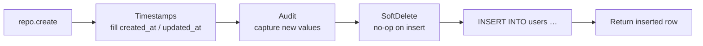

import ModuleBadge from '@site/src/components/ModuleBadge';

# titan-database

<ModuleBadge origin="official" pkg="@omnitron-dev/titan-database" status="stable" />

Kysely-based typed query builder with decorator-driven repository
configuration, declarative migrations, row-level security, plugin
system (soft-delete / timestamps / audit), multi-dialect (Postgres /
MySQL / SQLite), and `AsyncLocalStorage`-based transaction context so
nested calls participate in the active transaction without parameter
threading.

```bash
pnpm add @omnitron-dev/titan-database
```

## Quickstart

### Single connection

```typescript
import { TitanDatabaseModule } from '@omnitron-dev/titan-database';

@Module({
  imports: [
    TitanDatabaseModule.forRoot({
      connection: {
        dialect:      'postgres',
        connection:   env.DATABASE_URL,
        pool:         { min: 2, max: 20 },
        migrationsPath: './migrations',
        coerceBigint: true,
      },
    }),
  ],
})
class AppModule {}
```

### Multiple named connections

```typescript
TitanDatabaseModule.forRoot({
  connections: {
    primary: { dialect: 'postgres', connection: env.PRIMARY_URL },
    analytics: { dialect: 'postgres', connection: env.ANALYTICS_URL },
  },
})
```

### `forFeature` — repository registration

```typescript
@Module({
  imports: [
    TitanDatabaseModule.forRoot({ connection: { dialect: 'postgres', connection: env.DATABASE_URL } }),
    TitanDatabaseModule.forFeature([UsersRepository, OrdersRepository]),
  ],
  providers: [UsersService],
})
class UsersModule {}
```

`forFeature` registers repository classes, wires them into the
container under per-repo tokens, and ensures decorator-driven plugins
(soft-delete, timestamps, audit) bind correctly at boot.

### Async configuration

```typescript
TitanDatabaseModule.forRootAsync({
  imports:    [ConfigModule],
  useFactory: (config: ConfigService) => ({
    connection: {
      dialect:    'postgres',
      connection: config.get('database.url'),
      pool:       config.get('database.pool'),
    },
  }),
  inject: [ConfigService],
})
```

## `DatabaseModuleOptions`

| Option         | Type                                                                 |
| -------------- | -------------------------------------------------------------------- |
| `connection`   | `DatabaseConnection` — single connection                             |
| `connections`  | `Record<string, DatabaseConnection>` — multiple named                |
| `kysera`       | `{ core?, repository?, plugins? }` — Kysera integration config       |
| `plugins`      | `PluginsConfiguration` — global soft-delete / timestamps / audit     |

## `DatabaseConnection`

| Field             | Type                                                              |
| ----------------- | ----------------------------------------------------------------- |
| `name?`           | `string`                                                          |
| `dialect`         | `'postgres' \| 'mysql' \| 'sqlite'`                               |
| `connection`      | `string \| ConnectionConfig` — URL or config object               |
| `pool?`           | `{ min, max, acquireTimeoutMillis, idleTimeoutMillis }`           |
| `debug?`          | `boolean`                                                         |
| `plugins?`        | `string[]` — plugin names                                         |
| `migrationsPath?` | `string`                                                          |
| `seedsPath?`      | `string`                                                          |
| `coerceBigint?`   | `boolean` — parse PG `BIGINT` as JS `number` if safe (default `true` for PG) |

## Repository pattern — `TransactionAwareRepository<DB, Table>`

```typescript
import { Repository, SoftDelete, Timestamps, Audit } from '@omnitron-dev/titan-database';
import { TransactionAwareRepository } from '@omnitron-dev/titan-database';

interface Database {
  users: UsersTable;
}

@Repository('users')
@SoftDelete({ column: 'deleted_at' })
@Timestamps({ createdAt: 'created_at', updatedAt: 'updated_at' })
@Audit({ table: 'audit_logs', captureOldValues: true })
export class UsersRepository extends TransactionAwareRepository<Database, 'users'> {
  async findByEmail(email: string) {
    return this.executor.selectFrom('users')
      .where('email', '=', email)
      .selectAll()
      .executeTakeFirst();
  }
}
```

### Inherited methods

| Method                                          | Purpose                                       |
| ----------------------------------------------- | --------------------------------------------- |
| `find(id)`                                      | Fetch by primary key                          |
| `findMany(options)`                             | Paginated list                                |
| `findByCondition(where)`                        | Dynamic `WHERE` with operators                |
| `create(data)`                                  | Insert                                        |
| `update(id, data)`                              | Update                                        |
| `delete(id)`                                    | Hard delete (or soft if `@SoftDelete` set)    |
| `paginate(offset, limit)`                       | Offset pagination                             |
| `paginateCursor(options)`                       | Cursor-based pagination                       |

### Protected accessors

| Member                         | Purpose                                                |
| ------------------------------ | ------------------------------------------------------ |
| `executor`                     | Current executor — transaction-aware                   |
| `inTransaction`                | `true` if running inside a transaction context         |
| `transaction`                  | Current `Transaction<DB>` if any                       |
| `hasSoftDelete`                | Plugin flag (set by `@SoftDelete`)                     |
| `softDeleteColumn`             | Column name (default `'deletedAt'`)                    |

## `DatabaseManager`

```typescript
import { DATABASE_MANAGER, type IDatabaseManager } from '@omnitron-dev/titan-database';

@Service({ name: 'reports' })
class ReportsService {
  constructor(@Inject(DATABASE_MANAGER) private readonly db: IDatabaseManager) {}

  @Public()
  async summary() {
    return this.db.runInTransaction(async () => {
      const users = await this.db.getConnection().selectFrom('users').selectAll().execute();
      // …
    });
  }
}
```

| Method                                          | Purpose                                              |
| ----------------------------------------------- | ---------------------------------------------------- |
| `getConnection(name?)`                          | Get named or default `Kysely<unknown>` instance      |
| `getExecutor<DB>(name?)`                        | Plugin-aware executor (used by repositories)         |
| `runInTransaction<T>(fn, options?)`             | Run within a transaction; nested calls reuse it      |
| `closeAll()`                                    | Async cleanup of every connection (called on shutdown) |
| `getPoolMetrics(name?)`                         | Connection pool stats                                |

## Transaction context

The module uses `AsyncLocalStorage` to track the active transaction
per request. Repository calls inside `runInTransaction` automatically
use the transaction; no plumbing required.

```typescript
import {
  runInTransaction,
  getExecutor,
  getCurrentTransaction,
  isInTransactionContext,
} from '@omnitron-dev/titan-database';

await runInTransaction(db, async () => {
  await this.usersRepo.create({ email: 'ada@example.com' });   // uses the transaction
  await this.auditRepo.create({ kind: 'user.created' });        // same transaction
}, { name: 'signup' });
```

### Helpers

| Function                                  | Purpose                                                 |
| ----------------------------------------- | ------------------------------------------------------- |
| `runInTransaction(db, fn, options?)`      | Open a new transaction and run `fn` inside it           |
| `getExecutor(db)`                         | Return either current transaction or the base connection |
| `getCurrentTransaction()`                 | Current transaction or `undefined`                      |
| `isInTransactionContext()`                | Boolean check                                           |
| `getTransactionContext()`                 | Full context: depth, started-at, name, connection name  |

## Decorators

### Repository / plugins

```typescript
import { Repository, SoftDelete, Timestamps, Audit, Migration }
  from '@omnitron-dev/titan-database';
```

| Decorator                              | Effect                                                     |
| -------------------------------------- | ---------------------------------------------------------- |
| `@Repository(table \| config)`         | Mark a class as a repository; can pass `{ table, connection?, softDelete?, timestamps?, audit?, rls? }` |
| `@SoftDelete({ column?, includeDeleted?, tables? })` | Soft-delete behaviour — column defaults to `'deletedAt'` |
| `@Timestamps({ createdAt?, updatedAt? })` | Auto-managed timestamp columns                          |
| `@Audit({ table?, captureOldValues?, captureNewValues? })` | Row-level audit logging                  |
| `@Migration({ version, description?, dependencies?, connection?, transactional?, timeout? })` | Mark a class as a migration |

### Row-level security

```typescript
import { Policy, Allow, Deny, Filter, BypassRLS } from '@omnitron-dev/titan-database';
```

| Decorator                                                            | Effect                                          |
| -------------------------------------------------------------------- | ----------------------------------------------- |
| `@Policy({ table?, skipFor?, defaultPolicy? })`                      | Class-level RLS configuration                   |
| `@Allow({ operations: [...], priority?, name? })`                    | Allow rule for the listed operations            |
| `@Deny({ operations: [...], priority?, name? })`                     | Deny rule (evaluated before allow)              |
| `@Filter({ operations?, name? })`                                    | Method returns a WHERE-clause predicate         |
| `@BypassRLS()`                                                       | Skip RLS (requires admin / system context)      |

Example:

```typescript
@Repository('orders')
@Policy({ skipFor: ['admin'] })
class OrdersRepository extends TransactionAwareRepository<Database, 'orders'> {
  @Filter({ operations: ['select'] })
  tenantFilter(ctx: ExecutionContext) {
    return { tenant_id: ctx.tenantId };
  }

  @Allow({ operations: ['insert', 'update'] })
  ownerWrite(ctx: ExecutionContext, row: Row) {
    return row.user_id === ctx.auth.userId;
  }
}
```

### Injection

| Decorator                                | Effect                                  |
| ---------------------------------------- | --------------------------------------- |
| `@InjectConnection(name?)`               | Inject a named connection               |
| `@InjectDatabaseManager()`               | Inject the `DatabaseManager`            |
| `@InjectRepository(RepoClass)`           | Inject a repository instance            |

## Migrations

```typescript
import { Migration } from '@omnitron-dev/titan-database';

@Migration({ version: '20260101_001', description: 'create users table' })
export class CreateUsersTable {
  async up(db: Kysely<any>) {
    await db.schema.createTable('users')
      .addColumn('id', 'uuid', (c) => c.primaryKey())
      .addColumn('email', 'text', (c) => c.notNull().unique())
      .addColumn('created_at', 'timestamptz', (c) => c.defaultTo('now()'))
      .execute();
  }

  async down(db: Kysely<any>) {
    await db.schema.dropTable('users').execute();
  }
}
```

Migrations discovered via the configured `migrationsPath`; run in
`version` order. `dependencies` enforces partial ordering. With
`transactional: true` (the default), each migration runs in its own
transaction and rolls back on failure.

## Plugin lifecycle ordering



For deletes, soft-delete intercepts first: it issues an UPDATE that
sets `deleted_at` instead of a DELETE; the audit plugin captures the
before/after.

## Tokens

| Token                                  | Purpose                                                |
| -------------------------------------- | ------------------------------------------------------ |
| `DATABASE_MANAGER`                     | `DatabaseManager`                                      |
| `DATABASE_MODULE_OPTIONS`              | Resolved options bundle                                |
| `DATABASE_CONNECTION`                  | Default `Kysely<unknown>`                              |
| `DATABASE_HEALTH_INDICATOR`            | Health indicator for `titan-health`                    |
| `getDatabaseConnectionToken(name?)`    | Token for a named connection                           |
| `getRepositoryToken(RepoClass)`        | Token for a specific repository instance               |

## Lifecycle

`TitanDatabaseModule` implements:

- `async onStop(app)` — `manager.closeAll()` to release every
  connection. Crucial during dev with file watchers — without this,
  rapid restarts exhaust PG connection slots.

## Plugin registry

For applications that build their own repositories without
inheriting from the base class, register table-level plugins
explicitly:

```typescript
import { registerTablePlugins } from '@omnitron-dev/titan-database';

registerTablePlugins('users', [
  /* soft-delete plugin instance */,
  /* timestamps plugin instance */,
]);
```

## Anti-patterns

- **Manual transaction threading.** Don't pass `tx` as a parameter
  through every layer. Use `runInTransaction`; repository calls
  pick up the transaction from the async context.
- **Naked DELETE on soft-delete tables.** Use the repo's `delete()`
  — the plugin transforms it into an UPDATE setting `deleted_at`.
- **Forgetting `migrationsPath`.** Without it, the migration runner
  has nothing to discover.
- **Using `@BypassRLS` casually.** It exists for system flows
  (cron-driven cleanups, admin scripts) — every use case needs a
  written justification.
- **Sharing one connection across very different workloads.** OLTP
  and analytics traffic on one pool starves each other. Use
  multiple named connections.

## Inter-module dependencies

- Uses [`@kysera/*`](https://github.com/kysera) — core / repository
  / rls / soft-delete / timestamps / audit / executor / infra /
  migrations.
- Peer deps on the drivers you use: `pg`, `mysql2`, `better-sqlite3`.
- Optional health indicator integrates with [`titan-health`](./health.mdx).

## See also

- [`titan-health`](./health.mdx) — `DatabaseHealthIndicator` exported by this module
- [Best Practices / Performance](../best-practices/performance.md) — N+1, projection, indexing
