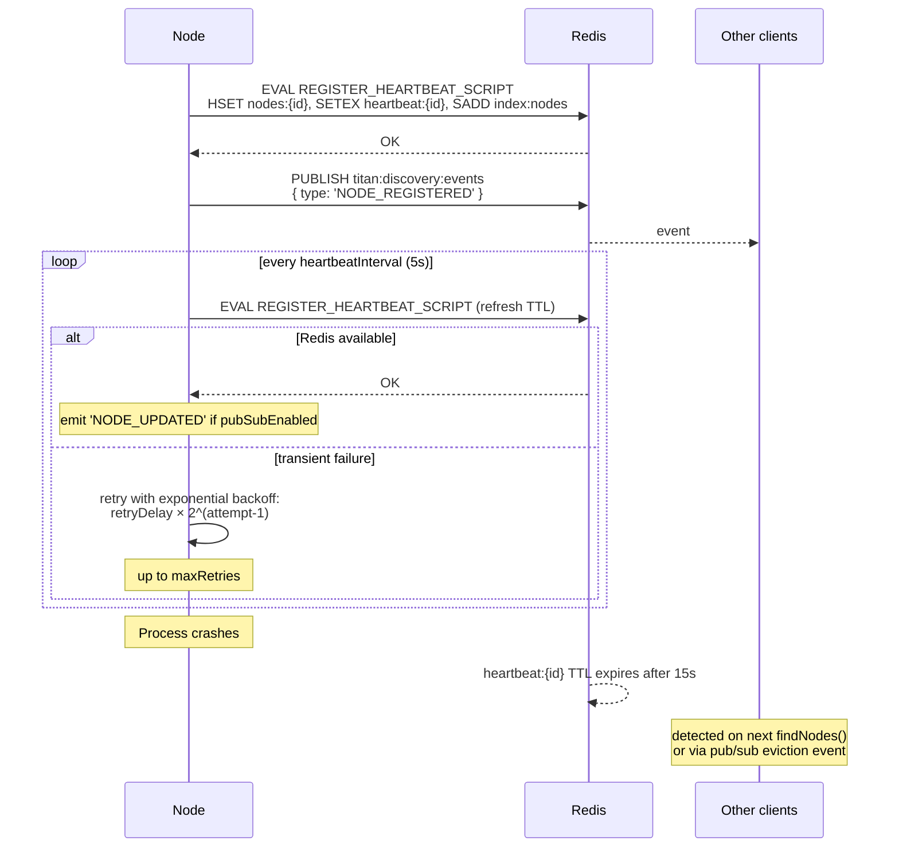
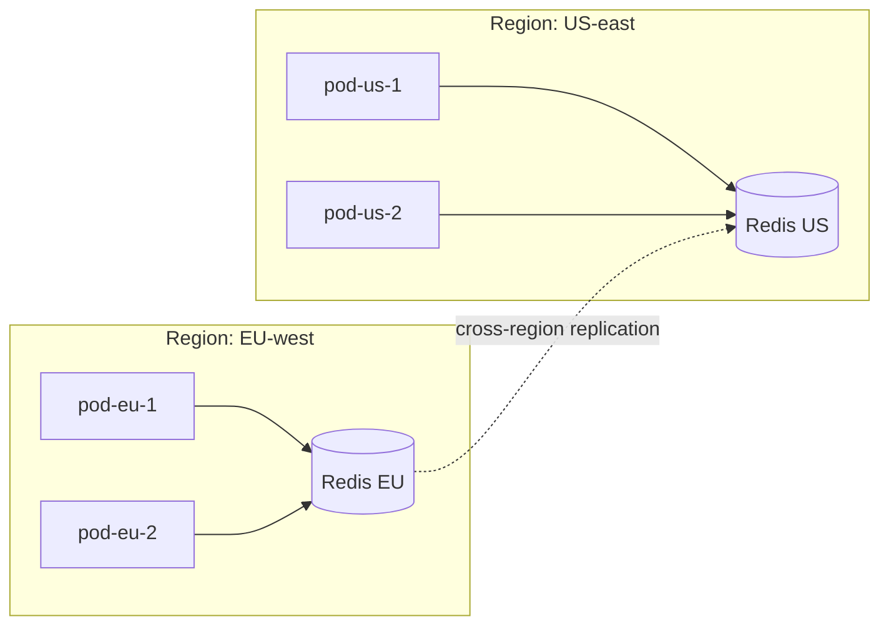

import ModuleBadge from '@site/src/components/ModuleBadge';

# titan-discovery

<ModuleBadge origin="official" pkg="@omnitron-dev/titan-discovery" status="stable" />

Redis-backed service discovery with TTL-based heartbeats, pub/sub
event broadcasting, automatic Netron integration so clients can
resolve services without hard-coded URLs, atomic Lua-script
registration to avoid races, and exponential-backoff retry on
heartbeat failures.

```bash
pnpm add @omnitron-dev/titan-discovery @omnitron-dev/titan-redis
```

## When you need it

- **Dynamic service topology.** Pods come and go (autoscaling,
  rolling deploys); discovery keeps the routing table current.
- **Service-to-service resolution.** Caller queries
  `users@1.0.0` without knowing which pods host it.
- **Health-aware routing.** Unhealthy nodes drop out of the registry
  automatically when heartbeats stop and the TTL expires.

## Quickstart

```typescript
import { DiscoveryModule } from '@omnitron-dev/titan-discovery';
import { TitanRedisModule } from '@omnitron-dev/titan-redis';

@Module({
  imports: [
    TitanRedisModule.forRoot({ config: { url: env.REDIS_URL } }),
    DiscoveryModule.forRoot({
      heartbeatInterval:       5_000,
      heartbeatTTL:            15_000,
      pubSubEnabled:           true,
      pubSubChannel:           'titan:discovery:events',
      clientMode:              false,
      redisPrefix:             'titan:discovery',
      maxRetries:              3,
      retryDelay:              1_000,
      enableNetronIntegration: true,
    }),
  ],
})
class AppModule {}
```

## `DiscoveryOptions`

| Option                       | Type                                  | Default                            |
| ---------------------------- | ------------------------------------- | ---------------------------------- |
| `heartbeatInterval`          | `number` (ms)                         | `5_000`                            |
| `heartbeatTTL`               | `number` (ms)                         | `15_000`                           |
| `pubSubEnabled`              | `boolean`                             | `false`                            |
| `pubSubChannel`              | `string`                              | `'titan:discovery:events'`         |
| `clientMode`                 | `boolean` (no register, only consume) | `false`                            |
| `redisPrefix`                | `string`                              | `'titan:discovery'`                |
| `maxRetries`                 | `number`                              | `3`                                |
| `retryDelay`                 | `number` (ms)                         | `1_000`                            |
| `redisUrl`                   | `string`                              | —                                  |
| `redisOptions`               | `any`                                 | —                                  |
| `enableNetronIntegration`    | `boolean`                             | `true`                             |

> `heartbeatTTL` must be ≥ `3 × heartbeatInterval`. A missed-
> heartbeat ratio of 3 strikes balance between premature ejection
> (`TTL < 2×`) and slow recovery (`TTL > 5×`).

## `DiscoveryService` — the API

```typescript
import { DISCOVERY_SERVICE_TOKEN, type IDiscoveryService }
  from '@omnitron-dev/titan-discovery';

@Service({ name: 'admin@1.0.0' })
class AdminService {
  constructor(@Inject(DISCOVERY_SERVICE_TOKEN) private readonly disco: IDiscoveryService) {}

  @Public()
  async listInstances() {
    return this.disco.findNodesByService('users', '1.0.0');
  }
}
```

### Registration

| Method                                                                            | Purpose                                          |
| --------------------------------------------------------------------------------- | ------------------------------------------------ |
| `registerNode(nodeId, address, services)`                                         | Manually register this node                      |
| `deregisterNode(nodeId)`                                                          | Manually deregister                              |
| `registerService(service)`                                                        | Announce a new service this node hosts           |
| `unregisterService(serviceName)`                                                  | Drop a service from this node                    |
| `updateNodeAddress(nodeId, address)`                                              | Change the reachable URL                         |
| `updateNodeServices(nodeId, services)`                                            | Replace the service list                         |
| `updateAddress(address)`                                                          | Self-update (uses `this.nodeId`)                 |
| `updateServices(services)`                                                        | Self-update services                             |

### Discovery

| Method                                       | Returns                          |
| -------------------------------------------- | -------------------------------- |
| `getActiveNodes()`                           | `Promise<NodeInfo[]>`            |
| `findNodesByService(serviceName, version?)`  | `Promise<NodeInfo[]>`            |
| `findNodes()`                                | `Promise<NodeInfo[]>` (filtered) |
| `getAllNodes()`                              | `Promise<NodeInfo[]>` (incl. expired) |
| `isNodeActive(nodeId)`                       | `Promise<boolean>`               |
| `nodeExists(nodeId)`                         | `Promise<boolean>`               |
| `getNodeInfo(nodeId)`                        | `Promise<NodeInfo \| null>`      |

### Events

```typescript
this.disco.onEvent((event) => {
  // { type: 'NODE_REGISTERED' | 'NODE_UPDATED' | 'NODE_DEREGISTERED',
  //   nodeId, address, services, timestamp }
});
this.disco.offEvent(handler);
```

When `pubSubEnabled: true`, registration / update events propagate
**immediately** via Redis pub/sub. With pub/sub disabled, peers see
changes only on their next `getActiveNodes` / `findNodesByService`
call — fine for periodic sync, too slow for fast failover.

## Redis key layout

The module owns four namespaces under `redisPrefix` (default
`titan:discovery`):

| Key                                      | Type   | Purpose                                                    |
| ---------------------------------------- | ------ | ---------------------------------------------------------- |
| `titan:discovery:nodes:{nodeId}`         | Hash   | Node metadata: address, services, timestamp                |
| `titan:discovery:heartbeat:{nodeId}`     | String | TTL-keyed marker — its existence means "node alive"        |
| `titan:discovery:index:nodes`            | Set    | Index of all known nodeIds (cleaned on expiry)             |
| `titan:discovery:events` (pub/sub)       | —      | Notification channel for `pubSubEnabled: true`             |

A node is considered active iff its `heartbeat:{nodeId}` key still
exists. The Lua script that publishes a heartbeat refreshes both
the node hash and the heartbeat marker atomically with the same
TTL — no half-state.

## How it works



The Lua script makes registration atomic:
`HSET nodes:{id}` + `SETEX heartbeat:{id}` + `SADD index:nodes`
succeed together or not at all. **No partial state in the
registry.**

## Heartbeat retry behaviour

When a heartbeat fails (Redis hiccup, network blip), the service
retries with exponential backoff:

| Attempt | Delay before retry                          |
| ------- | ------------------------------------------- |
| 1       | `retryDelay × 1` (1 s by default)          |
| 2       | `retryDelay × 2` (2 s)                      |
| 3       | `retryDelay × 4` (4 s)                      |
| ...     | `retryDelay × 2^(attempt-1)`               |

After `maxRetries` exhaustions, the heartbeat is dropped and a
warning is logged. The next periodic tick (5 s later by default)
attempts again — so a sustained Redis outage causes node ejection
once the TTL elapses without a successful refresh.

## TTL tuning guide

| Scenario                              | `heartbeatInterval` | `heartbeatTTL` | Why                                                |
| ------------------------------------- | :-----------------: | :------------: | -------------------------------------------------- |
| Default (general use)                 | 5 s                 | 15 s           | Detect a dead pod within 15 s                      |
| Fast failover (e.g., trading)         | 1 s                 | 3 s            | 3 s ejection; ~3× Redis ops/s/pod                  |
| Quiet IoT fleet                       | 30 s                | 120 s          | Tolerates slow networks; node loss takes 2 min     |
| Aggressive autoscaling                | 2 s                 | 6 s            | Scale-down decisions reflect topology in 6 s       |
| Sluggish managed Redis (high p99)     | 10 s                | 60 s           | Survives Redis latency spikes without ejection     |

Rules of thumb:

- **`heartbeatTTL ≥ 3 × heartbeatInterval`** — anything tighter
  ejects healthy nodes during a single Redis hiccup.
- **`heartbeatTTL ≤ 10 × heartbeatInterval`** — anything looser
  is barely better than no heartbeat at all.
- **Pods × `1 / heartbeatInterval` = baseline Redis ops/s.** With
  100 pods at 5 s interval, that's 20 ops/s — trivial. With 100
  pods at 1 s interval, it's 100 ops/s — still cheap but plan
  Redis sizing.

## Multi-region topology



For multi-region, two patterns work:

1. **One Redis per region, no cross-replication.** Each region
   has its own discovery registry. Clients within a region see
   only local services. Cross-region calls go through an explicit
   ingress, not discovery. Simpler, lower latency, smaller blast
   radius.
2. **Cross-region replicated Redis (or managed Redis Global).**
   Every region sees every node. Watch for clock skew —
   `timestamp` on `NodeInfo` becomes lossy across regions; use
   `findNodesByService` not "newest first" sorting.

Pattern (1) is almost always the right answer unless you have a
strong reason to want a single global view.

## Sentinel / cluster mode

`titan-discovery` consumes whatever `Redis` client
`titan-redis` provides — sentinel and cluster modes work
transparently. The Lua script and pub/sub channel route correctly
in cluster mode because all four keys/channels share the same
prefix (`titan:discovery:*`) and therefore the same hash slot when
hashtags are used.

If you operate in cluster mode, configure `redisPrefix` with a
hash-tag wrapper:

```typescript
DiscoveryModule.forRoot({
  redisPrefix: '{titan:discovery}',     // Force all keys to one slot
});
```

This guarantees the Lua script's multi-key atomicity holds in
cluster mode.

## Netron integration

When `enableNetronIntegration: true` (default), the module
registers a `NetronDiscoveryIntegration` service that subscribes to
two Netron events:

| Netron event                  | Discovery action                              |
| ----------------------------- | --------------------------------------------- |
| `NETRON_EVENT_SERVICE_EXPOSE` | `discovery.registerService({ name, version })` |
| `NETRON_EVENT_SERVICE_UNEXPOSE` | `discovery.unregisterService(name)`           |

This means **you don't call `registerService` manually** in normal
apps — exposing a `@Service` via Netron auto-announces it.

```typescript
@Service('users@1.0.0')
class UsersService {
  @Public() async findById(id: string) { /* … */ }
}

// In your app:
await app.expose(usersService);
// → Netron emits NETRON_EVENT_SERVICE_EXPOSE
// → titan-discovery registers `users@1.0.0` on this node
// → other peers' findNodesByService('users','1.0.0') sees this node
```

The integration also re-registers existing services when itself
starts up (`registerExisting: true`, default).

## Client mode

For pods that only consume the registry (don't host services —
gateways, admin UIs, schedulers):

```typescript
DiscoveryModule.forRoot({
  clientMode:              true,
  enableNetronIntegration: true,
})
```

In client mode:
- No heartbeat publishes; the pod never appears in the registry.
- The pub/sub subscriber still runs — events are received as normal.
- Lookups (`findNodesByService`, `getActiveNodes`) work as normal.
- `registerNode` / `registerService` raise no error but do nothing
  observable to peers.

## Failure scenarios — what happens, what to alert on

| Scenario                              | Discovery behaviour                                   | What to alert on                       |
| ------------------------------------- | ----------------------------------------------------- | -------------------------------------- |
| Pod crashes                           | Heartbeat stops; TTL expires after `heartbeatTTL`; eventually evicted | Eviction in `cleanupInactiveNodes` log |
| Pod hangs (no heartbeat work loop)    | Same as crash                                         | Process-level liveness probe           |
| Redis briefly unavailable             | Heartbeat retries with backoff; usually recovers      | Sustained `heartbeat failed` warnings  |
| Redis sustained outage > TTL          | All pods get evicted from each other's views          | Critical pager event                   |
| Cluster split (network partition)     | Each side ejects the other; recovers when partition heals | Sudden registry-size drop          |
| Pub/sub channel mis-configured        | Events don't propagate; discovery still works via polling | `pubSubEnabled` mismatch in config |
| Many pods, slow `heartbeatInterval`   | Stale registry; new pods take long to be seen         | Set `heartbeatInterval` < `5_000`      |

## Tokens

| Token                                  |
| -------------------------------------- |
| `DISCOVERY_SERVICE_TOKEN`              |
| `DISCOVERY_OPTIONS_TOKEN`              |
| `REDIS_TOKEN` (re-exported)            |
| `NETRON_DISCOVERY_INTEGRATION_TOKEN`   |

> `LOGGER_TOKEN` re-export from `discovery/types.ts` is **internal-
> only** to avoid circular deps. Always import `LOGGER_TOKEN` from
> `@omnitron-dev/titan/module/logger`.

## Lifecycle

`DiscoveryModule` implements:

- `async onStart(app)` — `DiscoveryService.onStart()` opens
  pub/sub if enabled, registers this node, starts heartbeat;
  `NetronDiscoveryIntegration` binds to Netron events.
- `async onStop(app)` — `DiscoveryService.onStop()` stops heartbeat,
  deregisters this node (best-effort), closes pub/sub.

Service-level hooks (run in dependency order from the module hooks):

- `onInit()` — resolve dependencies, prepare scripts.
- `onStart()` — open pub/sub, register node, start heartbeat timer.
- `onStop()` — graceful shutdown: stop timer, attempt deregister,
  unsubscribe.
- `onDestroy()` — final cleanup.

In `clientMode: true`, `onStart` still opens pub/sub (so events
arrive) but skips registration and heartbeat.

## Performance notes

- **Heartbeat cost.** One Lua script EVAL per pod per
  `heartbeatInterval`. At default 5 s, 100 pods → 20 EVAL/s
  cluster-wide. Each script touches three keys.
- **Lookup cost.** `findNodesByService` reads `index:nodes` (SMEMBERS)
  then `getNodeInfo` for each (HGETALL). Cache the result client-
  side if you call it on the hot path — the registry doesn't
  change every request.
- **Pub/sub cost.** Each registration/update event is one PUBLISH
  + N SUBSCRIBE callbacks where N is the number of subscribed
  pods. Negligible at hundreds of pods.

## Anti-patterns

- **Long `heartbeatInterval`.** Slow node-loss detection. Pick
  intervals such that `heartbeatTTL = 3 × heartbeatInterval`.
- **Putting business state in `services`.** The `ServiceInfo`
  list is identity / version metadata. Don't pack request counts,
  feature flags, or per-request metadata into it.
- **Treating discovery as authoritative for routing.** Discovery
  tells you *who exists*; the load balancer / multi-backend client
  decides *which to call*. Pair with
  [Netron multi-backend](../netron/multi-backend.md).
- **Manual `registerNode` from app code.** The Netron integration
  handles it. Manual registration is for unusual topologies (sidecar
  registrants, gateway-mediated nodes).
- **Sharing Redis with high-cardinality unrelated keyspaces.**
  Discovery touches a small fixed set of keys. If your app's main
  Redis is hot, dedicate a separate DB index for discovery to keep
  the keyspace pristine.
- **`heartbeatTTL` set to less than 2 × interval.** Single Redis
  hiccup ejects healthy nodes — exactly the time your app needs
  the registry most.

## See also

- [Netron / Multi-backend](../netron/multi-backend.md) — pairs with discovery
- [`titan-redis`](./redis.mdx) — backing store
- [`titan-health`](./health.mdx) — health drives heartbeat
- [Module map](./module-map.mdx#where-redis-sits) — Redis DB split recommendation
- [Observability matrix](./observability-matrix.mdx#titan-discovery) — what discovery emits and logs
