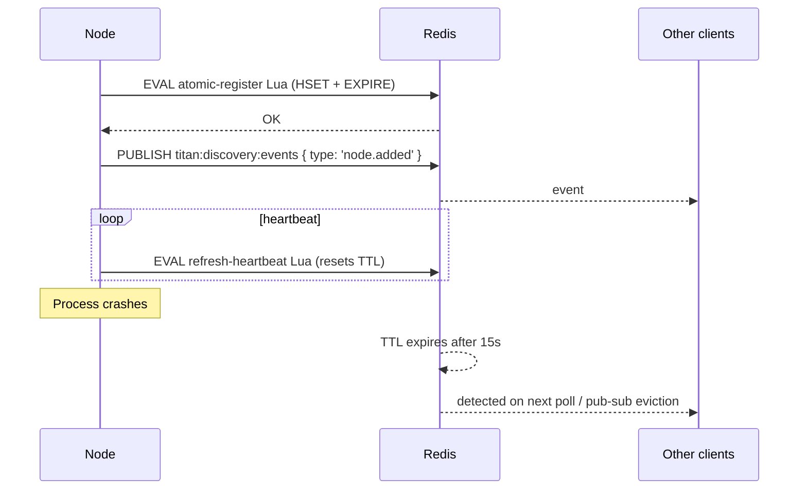

import ModuleBadge from '@site/src/components/ModuleBadge';

# titan-discovery

<ModuleBadge origin="official" pkg="@omnitron-dev/titan-discovery" status="stable" />

Redis-backed service discovery with TTL-based heartbeats, pub/sub
event broadcasting, automatic Netron integration so clients can
resolve services without hard-coded URLs, and atomic Lua-script
registration to avoid races.

```bash
pnpm add @omnitron-dev/titan-discovery @omnitron-dev/titan-redis
```

## When you need it

- **Dynamic service topology.** Pods come and go (autoscaling,
  rolling deploys); discovery keeps the routing table current.
- **Service-to-service resolution.** Caller queries
  `users@1.0.0` without knowing which pods host it.
- **Health-aware routing.** Unhealthy nodes drop out of the registry
  automatically when heartbeats stop.

## Quickstart

```typescript
import { DiscoveryModule } from '@omnitron-dev/titan-discovery';
import { TitanRedisModule } from '@omnitron-dev/titan-redis';

@Module({
  imports: [
    TitanRedisModule.forRoot({ config: { url: env.REDIS_URL } }),
    DiscoveryModule.forRoot({
      heartbeatInterval:       5_000,
      heartbeatTTL:            15_000,
      pubSubEnabled:           true,
      pubSubChannel:           'titan:discovery:events',
      clientMode:              false,
      redisPrefix:             'titan:discovery',
      enableNetronIntegration: true,
    }),
  ],
})
class AppModule {}
```

## `DiscoveryModuleOptions`

| Option                       | Type                        | Default                            |
| ---------------------------- | --------------------------- | ---------------------------------- |
| `heartbeatInterval`          | `number` (ms)               | `5_000`                            |
| `heartbeatTTL`               | `number` (ms)               | `15_000`                           |
| `pubSubEnabled`              | `boolean`                   | `false`                            |
| `pubSubChannel`              | `string`                    | `'titan:discovery:events'`         |
| `clientMode`                 | `boolean` (no register, only consume) | `false`                  |
| `redisPrefix`                | `string`                    | `'titan:discovery'`                |
| `maxRetries`                 | `number`                    | `3`                                |
| `retryDelay`                 | `number` (ms)               | `1_000`                            |
| `redisUrl`                   | `string`                    | —                                  |
| `redisOptions`               | `any`                       | —                                  |
| `enableNetronIntegration`    | `boolean`                   | `true`                             |

> `heartbeatTTL` must be a multiple of `heartbeatInterval` (≥3×).
> A missed-heartbeat ratio of 3 strikes balance between premature
> ejection and slow recovery.

## `DiscoveryService` — the API

```typescript
import { DiscoveryService, DISCOVERY_SERVICE_TOKEN }
  from '@omnitron-dev/titan-discovery';

@Service({ name: 'admin' })
class AdminService {
  constructor(@Inject(DISCOVERY_SERVICE_TOKEN) private readonly disco: DiscoveryService) {}

  @Public()
  async listInstances() {
    return this.disco.findNodesByService('users', '1.0.0');
  }
}
```

### Registration

| Method                                                                            | Purpose                                          |
| --------------------------------------------------------------------------------- | ------------------------------------------------ |
| `registerNode(nodeId, address, services)`                                         | Manually register this node                      |
| `deregisterNode(nodeId)`                                                          | Manually deregister                              |
| `registerService(name, version?)`                                                 | Announce a new service this node hosts           |
| `updateNodeAddress(nodeId, address)`                                              | Change the reachable URL                         |
| `updateNodeServices(nodeId, services)`                                            | Replace the service list                         |

### Discovery

| Method                                       | Returns                          |
| -------------------------------------------- | -------------------------------- |
| `getActiveNodes()`                           | `Promise<NodeInfo[]>`            |
| `findNodesByService(serviceName, version?)`  | `Promise<NodeInfo[]>`            |
| `isNodeActive(nodeId)`                       | `Promise<boolean>`               |

### Events

```typescript
this.disco.onEvent((event) => {
  // { type: 'node.added' | 'node.removed' | 'node.updated', node, service?, ts }
});
this.disco.offEvent(handler);
```

When `pubSubEnabled: true`, registration changes propagate
immediately via Redis pub/sub instead of waiting for the next
heartbeat poll.

## How it works



The Lua script makes registration atomic: HSET (node data) +
EXPIRE (heartbeat TTL) succeed together or not at all. No partial
state in the registry.

## Netron integration

When `enableNetronIntegration: true`, registered services are also
announced to the local Netron peer; clients calling
`queryInterface<UsersService>('users@1.0.0')` can resolve a URL via
the registry without an explicit URL configuration.

## Client mode

For pods that only consume the registry (don't host services):

```typescript
DiscoveryModule.forRoot({
  clientMode:              true,
  enableNetronIntegration: true,
})
```

Skips registration; subscribes to events; resolves on demand.

## Tokens

| Token                                  |
| -------------------------------------- |
| `DISCOVERY_SERVICE_TOKEN`              |
| `REDIS_TOKEN` (re-exported)            |
| `DISCOVERY_OPTIONS_TOKEN`              |
| `NETRON_DISCOVERY_INTEGRATION_TOKEN`   |

## Lifecycle

`DiscoveryModule` implements:

- `async onStart(app)` — `DiscoveryService.onStart()` opens
  pub/sub if enabled, registers this node, starts heartbeat;
  Netron integration binds.
- `async onStop(app)` — `DiscoveryService.onStop()` stops heartbeat,
  deregisters, closes pub/sub.

## Anti-patterns

- **Long `heartbeatInterval`.** Slow node-loss detection. Pick
  intervals such that `heartbeatTTL = 3 × heartbeatInterval`.
- **Putting business state in `services`.** The service list is
  identity / version metadata. Don't pack request counts or
  feature flags into it.
- **Treating discovery as authoritative for routing.** Discovery
  tells you *who exists*; the load balancer / multi-backend client
  decides *which to call*. Pair with [Netron multi-backend](../netron/multi-backend.md).
- **Manual `registerNode` from app code.** The Netron integration
  handles it. Manual registration is for unusual topologies.

## See also

- [Netron / Multi-backend](../netron/multi-backend.md) — pairs with discovery
- [`titan-redis`](./redis.mdx) — backing store
- [`titan-health`](./health.mdx) — health drives heartbeat
