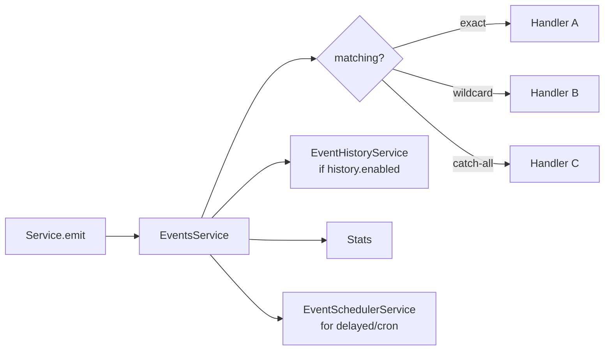

import ModuleBadge from '@site/src/components/ModuleBadge';

# titan-events

<ModuleBadge origin="official" pkg="@omnitron-dev/titan-events" status="stable" />

Typed event bus with wildcard / namespaced patterns, decorator-based
listeners, async / serial / reduce emit modes, event history with
replay, transactions, schema validation, delayed and cron-scheduled
events, and rich metrics.

```bash
pnpm add @omnitron-dev/titan-events
```

## When you need it

- **In-process domain events.** Decouple services that should react
  to each other (e.g., `user.created` → send welcome email →
  update analytics) without direct calls.
- **Wildcard fan-out.** Subscribe to `order.*` to capture every
  order-lifecycle event with one handler.
- **Cross-module orchestration.** A workflow listens to multiple
  modules' events without becoming a hard dependency of any of them.
- **Pub/sub-style replay.** A late-joining consumer pulls the
  recent event history and catches up.

> For cross-process delivery use [`titan-notifications`](./notifications.mdx)
> over Rotif or a real message broker. `titan-events` is in-process.

## Quickstart

```typescript
import { EventsModule } from '@omnitron-dev/titan-events';

@Module({
  imports: [
    EventsModule.forRoot({
      wildcard:     true,
      delimiter:    '.',
      maxListeners: 100,
      history:      { enabled: true, maxSize: 1_000 },
      metrics:      { enabled: true, slowThreshold: 100 },
      concurrency:  10,
    }),
  ],
})
class AppModule {}
```

```typescript
import { OnEvent, EVENTS_SERVICE_TOKEN, EventsService }
  from '@omnitron-dev/titan-events';

@Service({ name: 'users' })
class UsersService {
  constructor(@Inject(EVENTS_SERVICE_TOKEN) private readonly events: EventsService) {}

  @Public()
  async create(input: CreateInput) {
    const user = await this.repo.create(input);
    await this.events.emitAsync('user.created', { id: user.id, email: user.email });
    return user;
  }
}

@Injectable()
class WelcomeMailer {
  @OnEvent({ event: 'user.created', async: true })
  async onCreated(payload: { id: string; email: string }) {
    await this.mailer.send(payload.email, 'Welcome');
  }
}
```

## `IEventsModuleOptions`

| Option              | Type                                                              | Default       |
| ------------------- | ----------------------------------------------------------------- | ------------- |
| `wildcard`          | `boolean` — enable `*` / `**` patterns                            | `true`        |
| `delimiter`         | `string` — namespace separator                                    | `'.'`         |
| `maxListeners`      | `number`                                                          | `100`         |
| `verboseMemoryLeak` | `boolean`                                                         | —             |
| `history`           | `{ enabled, maxSize?, ttl? }`                                     | `maxSize: 1_000` |
| `metrics`           | `{ enabled, slowThreshold?, sampleRate? }`                        | `slowThreshold: 100ms`, `sampleRate: 1.0` |
| `onError`           | `(error, event, data) => void`                                    | —             |
| `schemas`           | `Record<string, ZodSchema>` — event payload schemas               | —             |
| `concurrency`       | `number` — max concurrent async handlers                          | `10`          |
| `isGlobal`          | `boolean`                                                         | `true`        |

Also exported: `forRootAsync({ useFactory, inject? })`.

## `EventsService` — the API

### Emit modes

```typescript
// Sync — fire-and-forget; returns true if any listener accepted
this.events.emit('user.created', payload);

// Async — concurrent listeners; resolves when all handlers complete
const results = await this.events.emitAsync('user.created', payload);

// Serial — listeners run one after another; resolves with their results
const results = await this.events.emitSerial('user.created', payload);

// Reduce — pipe payload through listeners, each transforming the previous result
const final = await this.events.emitReduce('user.transform', input, initialValue);
```

| Method                                                  | Returns                                          |
| ------------------------------------------------------- | ------------------------------------------------ |
| `emit<T>(event, data?, options?)`                       | `boolean`                                        |
| `emitAsync<T>(event, data?, options?)`                  | `Promise<any[]>` — handler return values         |
| `emitSerial<T>(event, data?, options?)`                 | `Promise<any[]>`                                 |
| `emitReduce<T, R>(event, data, initialValue, options?)` | `Promise<R>`                                     |

### Subscribe / unsubscribe

| Method                                                              | Returns                          |
| ------------------------------------------------------------------- | -------------------------------- |
| `subscribe(event, handler, options?)`                               | `IEventSubscription`             |
| `once(event, handler, options?)`                                    | `IEventSubscription`             |
| `subscribeMany(events[], handler, options?)`                        | `IEventSubscription[]`           |
| `subscribeAll(handler, options?)`                                   | `IEventSubscription`             |
| `unsubscribe(event, handler?)`                                      | `void`                           |
| `unsubscribeAll()`                                                  | `void`                           |
| `waitFor<T>(event, timeout?, filter?)`                              | `Promise<T>`                     |

### Introspection / patterns

| Method                                  | Purpose                                                 |
| --------------------------------------- | ------------------------------------------------------- |
| `getListenerCount(event)`               | Number of listeners on an event                         |
| `getEventNames()`                       | All known event names                                   |
| `hasListeners(event)`                   | Existence check                                         |
| `getStatistics(event?)`                 | Per-event or whole-bus statistics                       |
| `getEventsInNamespace(namespace)`       | Events under `namespace.*`                              |
| `filterEventsByPattern(pattern)`        | Match events against a glob                             |
| `getListenersByPattern(pattern)`        | Listeners matching a pattern                            |
| `emitToPattern<T>(pattern, data?, options?)` | Emit to every event matching pattern               |
| `removeListenersByPattern(pattern)`     | Bulk unsubscribe by pattern                             |

### Transactions

```typescript
const tx = this.events.beginTransaction();

tx.emit('order.created', order);
tx.emit('audit.log',     { kind: 'order.created', orderId: order.id });

if (everythingOk) {
  await tx.commit();   // every emit fires
} else {
  tx.rollback();       // nothing fired
}
```

Useful for "either all of these events fire or none" semantics
within a single request scope.

## Decorators

### `@OnEvent(options)`

```typescript
@OnEvent({
  event:         'user.*',
  async:         true,
  priority:      10,
  timeout:       5_000,
  filter:        (data) => data.tenantId === 'enterprise',
  transform:     (data) => normalizeUser(data),
  errorBoundary: true,
  onError:       (err, data) => log.warn('handler failed', { err, data }),
})
async onUserChange(data: UserEvent) { /* … */ }
```

### `@OnceEvent(options)` — fire once then unsubscribe

```typescript
@OnceEvent({ event: 'app.ready' })
async warmCaches() { /* … */ }
```

### `@OnAnyEvent()` — wildcard catch-all

### `@EmitEvent(options)` — emit when a method runs

```typescript
@EmitEvent({
  event:         'user.created',
  after:         true,
  includeArgs:   false,
  includeResult: true,
  mapResult:     (user) => ({ id: user.id, email: user.email }),
})
async create(input: CreateInput) { /* … */ }
```

Method's return value is auto-emitted via the configured mapper.

### `@ScheduleEvent(options)`

```typescript
@ScheduleEvent({ delay: 24 * 60 * 60 * 1000 })   // 24h delay
async welcomeFollowup() { /* … */ }

@ScheduleEvent({ cron: '0 9 * * *' })
async dailyReport() { /* … */ }
```

### `@BatchEvents(options)`

Coalesce many emits into one delivery — useful when a tight loop
would otherwise fire thousands of identical events.

### `@OnModuleEvent(event)` — listen to framework module events

### `@EventEmitter(namespace?)` — class-level emitter binding

## Wildcard semantics

With `wildcard: true`:

```typescript
@OnEvent({ event: 'user.*' })       // user.created, user.deleted (one segment)
@OnEvent({ event: 'user.**' })      // any nested suffix
@OnEvent({ event: 'order.*.shipped' })  // order.{id}.shipped
```

Pattern resolution is cached, so wildcards are O(1) per emit at
runtime.

## Other services exposed

| Service                       | Token                                | Purpose                                |
| ----------------------------- | ------------------------------------ | -------------------------------------- |
| `EventsService`               | `EVENTS_SERVICE_TOKEN`               | Main API (above)                       |
| `EventBusService`             | `EVENT_BUS_SERVICE_TOKEN`            | Inter-module bus                       |
| `EventHistoryService`         | `EVENT_HISTORY_SERVICE_TOKEN`        | Query + replay history                 |
| `EventSchedulerService`       | `EVENT_SCHEDULER_SERVICE_TOKEN`      | Delayed / cron scheduling              |
| `EventValidationService`      | `EVENT_VALIDATION_SERVICE_TOKEN`     | Schema validation                      |
| `EVENT_EMITTER_TOKEN`         | —                                    | Raw underlying emitter                 |
| `EVENT_METADATA_SERVICE_TOKEN`| —                                    | Metadata propagation                   |
| `EVENT_DISCOVERY_SERVICE_TOKEN`| —                                   | Decorator discovery                    |

## Lifecycle

`EventsService` implements `onInit`, `onStart`, `onStop`,
`onDestroy`. The module honours them via the standard Titan lifecycle.



## Anti-patterns

- **Treating in-process events as durable.** They aren't. Restart →
  in-flight handlers gone. For at-least-once delivery, use
  `titan-notifications` over Rotif.
- **Heavy work in sync `emit`.** Sync emit blocks the publisher.
  Use `emitAsync` for I/O-bound handlers; reserve sync for
  metrics/audit-style side effects.
- **Schema-less events at scale.** A typo in an event name silently
  drops the listener. Use the `schemas` option for production-
  critical events.
- **`subscribeAll` for analytics.** Captures every event in the
  process — easy to leave running and blow the listener budget.
  Prefer scoped patterns.

## See also

- [`titan-notifications`](./notifications.mdx) — for cross-process
  durable delivery
- [`titan-scheduler`](./scheduler.mdx) — for full cron/interval
  semantics (events module has lighter-weight scheduled emission)
