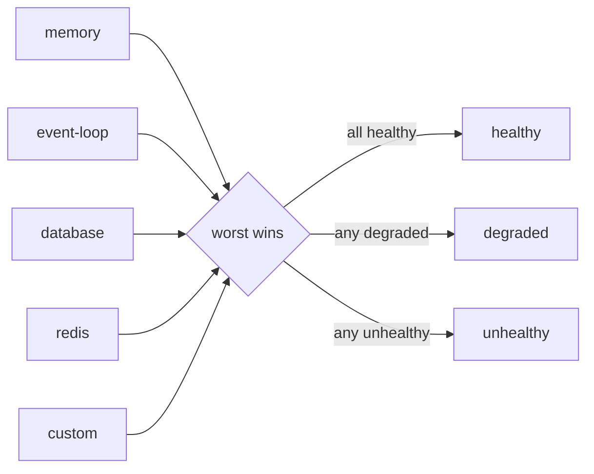

import ModuleBadge from '@site/src/components/ModuleBadge';

# titan-health

<ModuleBadge origin="official" pkg="@omnitron-dev/titan-health" status="stable" />

Centralised health-check system with built-in indicators (memory,
event loop, disk, database, Redis), Kubernetes-style probes (live,
ready, full), TTL caching, timeout-guarded execution, and a Netron
RPC endpoint for remote inspection.

```bash
pnpm add @omnitron-dev/titan-health
```

## When you need it

- **Kubernetes liveness / readiness probes.** Distinguish "process
  is alive" from "ready to accept traffic" from "every dependency
  is up".
- **Operator dashboards.** A single endpoint returns per-indicator
  status the web console / CLI can render.
- **Auto-degradation triggers.** Subscribe to `health:changed` and
  remove the pod from rotation on unhealthy.

## Quickstart

```typescript
import { TitanHealthModule } from '@omnitron-dev/titan-health';

@Module({
  imports: [
    TitanHealthModule.forRoot({
      enableMemoryIndicator:    true,
      enableEventLoopIndicator: true,
      enableDiskIndicator:      true,
      enableDatabaseIndicator:  true,
      databaseConnection:       db,             // any object with execute/raw/query
      enableRedisIndicator:     true,
      redisClient:              redis,          // any object with .ping()
      memoryThresholds:         { heapDegradedThreshold: 0.8, heapUnhealthyThreshold: 0.95 },
      eventLoopThresholds:      { degradedThreshold: 50, unhealthyThreshold: 200 },
      timeout:                  5_000,
      enableCaching:            true,
      cacheTtl:                 1_000,
      enableRpcService:         true,
      version:                  '1.0.0',
    }),
  ],
})
class AppModule {}
```

Async configuration via `forRootAsync({ useFactory, inject?, imports?, isGlobal? })`.

## `HealthModuleOptions`

| Option                       | Type                                                                                  | Default       |
| ---------------------------- | ------------------------------------------------------------------------------------- | ------------- |
| `enableMemoryIndicator`      | `boolean`                                                                             | `true`        |
| `enableEventLoopIndicator`   | `boolean`                                                                             | `true`        |
| `enableDiskIndicator`        | `boolean`                                                                             | `false`       |
| `enableDatabaseIndicator`    | `boolean`                                                                             | `false`       |
| `databaseConnection`         | `{ execute?, raw?, query? }`                                                          | —             |
| `enableRedisIndicator`       | `boolean`                                                                             | `false`       |
| `redisClient`                | `{ ping(), info?, status?, isReady? }`                                                | —             |
| `timeout`                    | `number` (ms)                                                                         | `5_000`       |
| `enableCaching`              | `boolean`                                                                             | `false`       |
| `cacheTtl`                   | `number` (ms)                                                                         | `1_000`       |
| `enableRpcService`           | `boolean` — expose Netron RPC                                                         | `true`        |
| `version`                    | `string`                                                                              | —             |
| `isGlobal`                   | `boolean`                                                                             | `false`       |
| `indicators`                 | `Array<new (...args) => IHealthIndicator>` — custom indicator classes                 | —             |
| `memoryThresholds`           | `{ heapDegradedThreshold, heapUnhealthyThreshold }` (0..1 ratio)                      | —             |
| `eventLoopThresholds`        | `{ degradedThreshold, unhealthyThreshold }` (ms)                                      | —             |
| `diskThresholds`             | `DiskThresholds`                                                                      | —             |
| `databaseOptions`            | `DatabaseIndicatorOptions`                                                            | —             |
| `redisOptions`               | `RedisIndicatorOptions`                                                               | —             |

## `HealthService` — the API

```typescript
import { HEALTH_SERVICE_TOKEN, type HealthService } from '@omnitron-dev/titan-health';

@Service({ name: 'admin' })
class AdminService {
  constructor(@Inject(HEALTH_SERVICE_TOKEN) private readonly health: HealthService) {}

  @Public()
  async status() {
    return this.health.check();
  }
}
```

### Aggregate health

| Method                          | Returns                                          | Use case                                |
| ------------------------------- | ------------------------------------------------ | --------------------------------------- |
| `check()`                       | `Promise<HealthCheckResult>` (full report)       | `/healthz` full JSON                    |
| `isHealthy()`                   | `Promise<boolean>`                               | Generic check                           |
| `isAlive()`                     | `Promise<boolean>`                               | Kubernetes **liveness** probe           |
| `isReady()`                     | `Promise<boolean>`                               | Kubernetes **readiness** probe          |
| `checkOne(name)`                | `Promise<HealthIndicatorResult>`                 | Per-indicator inspection                |
| `getUptime()`                   | `number` (ms)                                    | Operational metrics                     |
| `invalidateCache()`             | `void`                                           | Force re-check (skip TTL cache)         |

### Indicator registry

| Method                                | Purpose                                          |
| ------------------------------------- | ------------------------------------------------ |
| `registerIndicator(indicator)`        | Add an indicator at runtime                      |
| `unregisterIndicator(name)`           | Remove                                           |
| `getIndicators()`                     | All registered names                             |
| `getIndicator(name)`                  | Lookup by name                                   |
| `hasIndicator(name)`                  | Existence check                                  |
| `getIndicatorCount()`                 | Count                                            |
| `clearIndicators()`                   | Remove all                                       |

## Built-in indicators

| Class                          | What it checks                                                  |
| ------------------------------ | --------------------------------------------------------------- |
| `MemoryHealthIndicator`        | Heap usage vs `heapDegradedThreshold` / `heapUnhealthyThreshold` |
| `EventLoopHealthIndicator`     | Event loop lag (ms)                                             |
| `HighResEventLoopIndicator`    | High-resolution event loop lag (sub-ms)                         |
| `DiskHealthIndicator`          | Free disk space                                                 |
| `DatabaseHealthIndicator`      | Database connectivity via `execute`/`raw`/`query` shape         |
| `RedisHealthIndicator`         | Redis connectivity via `.ping()`                                |
| `CompositeHealthIndicator`     | Combine multiple indicators with worst-status wins              |

## Custom indicators

Implement the indicator interface:

```typescript
import { Injectable } from '@omnitron-dev/titan';
import type { IHealthIndicator, HealthIndicatorResult }
  from '@omnitron-dev/titan-health';

@Injectable()
class StripeHealthIndicator implements IHealthIndicator {
  name = 'stripe';

  constructor(private readonly stripe: Stripe) {}

  async check(): Promise<HealthIndicatorResult> {
    try {
      await this.stripe.balance.retrieve();
      return { status: 'healthy' };
    } catch (e) {
      return { status: 'degraded', message: String(e) };
    }
  }
}
```

Register via the `indicators: [StripeHealthIndicator]` option on
`forRoot`, or call `health.registerIndicator(...)` at runtime.

## Aggregation rule



- All `healthy` → `healthy`
- Any `degraded`, none `unhealthy` → `degraded`
- Any `unhealthy` → `unhealthy`

## Kubernetes probes — typical wiring

```yaml
livenessProbe:
  httpGet:    { path: /healthz, port: 3000 }
  initialDelaySeconds: 5
  periodSeconds:       10

readinessProbe:
  httpGet:    { path: /readyz, port: 3000 }
  initialDelaySeconds: 0
  periodSeconds:       3
```

`/healthz` → `isAlive()`; `/readyz` → `isReady()`. Detailed JSON
report typically served under `/healthz/full` or via the Netron RPC
endpoint.

## `HealthRpcService`

When `enableRpcService: true` (default), a Netron service is
auto-registered:

```typescript
const healthSvc = await client.queryInterface<HealthRpcService>('health@1.0.0');

await healthSvc.check();   // HealthResponse
await healthSvc.live();    // LivenessResponse
await healthSvc.ready();   // ReadinessResponse
```

This is what the Omnitron CLI and web console call for remote
inspection — no need to expose extra HTTP routes.

## TTL caching

Set `enableCaching: true` + `cacheTtl: 1000` to coalesce repeated
checks within a 1-second window. Useful when many components ask
for health simultaneously (probe + dashboard + auto-degrade
listener). Call `invalidateCache()` to force re-check.

## Tokens

| Token                                   |
| --------------------------------------- |
| `HEALTH_SERVICE_TOKEN`                  |
| `HEALTH_MODULE_OPTIONS_TOKEN`           |
| `HEALTH_RPC_SERVICE_TOKEN`              |
| `MEMORY_HEALTH_INDICATOR_TOKEN`         |
| `EVENT_LOOP_HEALTH_INDICATOR_TOKEN`     |
| `DISK_HEALTH_INDICATOR_TOKEN`           |
| `DATABASE_HEALTH_INDICATOR_TOKEN`       |
| `REDIS_HEALTH_INDICATOR_TOKEN`          |

## Lifecycle

The module manages indicator setup directly; `HealthService` itself
is not strictly lifecycle-bound. The RPC service registers as part
of standard Netron exposure.

## Anti-patterns

- **Heavy probes.** Indicators run frequently (every few seconds).
  Keep them to cheap pings (`SELECT 1`, `PING`, `process.memoryUsage`).
- **Treating every dependency as critical.** A cache being slow does
  not block reads. Use `degraded` for non-fatal hiccups.
- **No `timeout`.** An indicator that hangs blocks the whole probe.
  Configure a `timeout` ≤ probe period.
- **Collapsing liveness and readiness.** Slow boot → liveness fails
  → pod restarts before warming completes. Always separate the two.

## See also

- [Application / Health](../application/health.md) — conceptual guide
- [`titan-database`](./database.mdx) — provides `DatabaseHealthIndicator`
- [`titan-redis`](./redis.mdx) — its `RedisHealthIndicator` is
  superseded by this module's version when both are loaded
