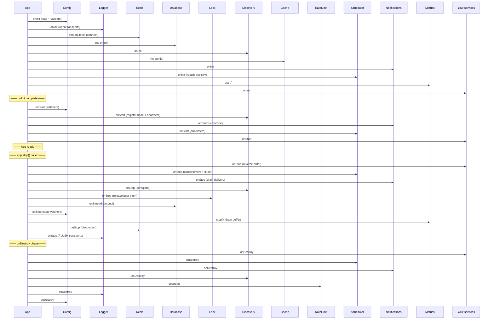

import ModuleBadge from '@site/src/components/ModuleBadge';

# Lifecycle reference

Knowing **when** during boot/shutdown each module runs which hook
is the difference between a clean restart and a half-drained
buffer. This page documents the lifecycle behaviour of every
official module — verified against source — so you can predict
where a `console.log('foo')` in your `onStart` will run.

## The four phases

Recap of [Application lifecycle](../application/lifecycle.md):

| Phase           | Fires when                                                            |
| --------------- | --------------------------------------------------------------------- |
| `onInit`        | After construction, before any `onStart` fires                       |
| `onStart`       | Once every `onInit` finished; in dependency order                    |
| `onStop`        | On `app.stop()`; in **reverse** dependency order                     |
| `onDestroy`     | Final cleanup phase after `onStop`                                    |

Modules are not obliged to implement all four — most use just one
or two. The table below shows what each official module actually
does.

## Lifecycle behaviour by module

<ModuleBadge origin="official" pkg="@omnitron-dev/titan-*" />

### `titan-auth`

| Hook         | What it does                                                |
| ------------ | ----------------------------------------------------------- |
| `onInit`     | —                                                           |
| `onStart`    | —                                                           |
| `onStop`     | —                                                           |
| `onDestroy`  | —                                                           |

`titan-auth` is **lifecycle-passive**. The JWT service has no
long-lived resources to set up or tear down beyond the JWKS HTTP
client it opens lazily on first use.

### `titan-cache`

| Hook         | What it does                                                |
| ------------ | ----------------------------------------------------------- |
| `onInit`     | —                                                           |
| `onStart`    | —                                                           |
| `onStop`     | L2 adapter (Redis) is released when its owning client closes |
| `onDestroy`  | —                                                           |

L1 (in-memory LRU/LFU) lives in JS heap. L2 (Redis) is owned by
`titan-redis` and shuts down with that module.

### `titan-database`

| Hook         | What it does                                                |
| ------------ | ----------------------------------------------------------- |
| `onInit`     | —                                                           |
| `onStart`    | Connection pool warmed up on first query (lazy)             |
| `onStop`     | **Drains and closes** the connection pool                   |
| `onDestroy`  | —                                                           |

The `onStop` matters: a clean drain prevents in-flight queries
from being killed mid-transaction.

### `titan-discovery`

Implemented on both the module and the service.

| Hook         | Module (`DiscoveryModule`)              | Service (`DiscoveryService`)                           |
| ------------ | --------------------------------------- | ------------------------------------------------------ |
| `onInit`     | —                                       | Resolves Redis client; prepares scripts                |
| `onStart`    | Triggers service start                  | Opens pub/sub; registers this node; starts heartbeat   |
| `onStop`     | Triggers service stop                   | Stops heartbeat; deregisters; closes pub/sub           |
| `onDestroy`  | —                                       | Final cleanup                                          |

In `clientMode: true`, registration is skipped but pub/sub still
opens on `onStart` so the node receives events.

### `titan-events`

Each sub-service has its own `onInit` / `onDestroy`; the
orchestrator `EventsService` adds `onStart` / `onStop`.

| Hook         | What happens                                                |
| ------------ | ----------------------------------------------------------- |
| `onInit`     | History / metadata / scheduler / validation services initialise their stores |
| `onStart`    | Bus subscribes; persisted scheduled jobs are re-armed       |
| `onStop`     | Drain in-flight emissions; flush history                    |
| `onDestroy`  | Release all listener references                             |

### `titan-health`

| Hook         | What it does                                                |
| ------------ | ----------------------------------------------------------- |
| `onInit`     | Registers configured indicators                             |
| `onStart`    | —                                                           |
| `onStop`     | —                                                           |
| `onDestroy`  | —                                                           |

Checks are *pull-driven* — Kubernetes probes invoke `check()` on
demand. No background loop runs.

### `titan-lock`

| Hook         | What it does                                                |
| ------------ | ----------------------------------------------------------- |
| `onInit`     | —                                                           |
| `onStart`    | —                                                           |
| `onStop`     | Best-effort: releases locks currently held by this process  |
| `onDestroy`  | —                                                           |

> Releasing locks on `onStop` is best-effort because the process
> may already be in a degraded state. Always set a lock TTL so
> abandoned locks self-expire.

### `titan-metrics`

Uses **explicit** `start()` / `stop()` methods rather than the
lifecycle interface, called from module setup.

| Method       | What it does                                                |
| ------------ | ----------------------------------------------------------- |
| `start()`    | Starts periodic collection (process, system, RPC); kicks off flush interval |
| `stop()`     | Drains the buffer to storage; stops collection; calls `cleanup()` |

The module calls `start()` during initialisation and `stop()`
during shutdown — you don't have to wire it up by hand.

### `titan-notifications`

| Hook         | What it does                                                |
| ------------ | ----------------------------------------------------------- |
| `onInit`     | Builds channel registry; resolves transports                |
| `onStart`    | Producer connects to messaging transport; worker subscribes to queues |
| `onStop`     | Stop consuming new messages; drain in-flight delivery       |
| `onDestroy`  | Disconnect transport; release channel resources             |

`forWorker(...)` registrations subscribe to the messaging transport
on `onStart` — the producer (registered via `forRoot`) opens its
publisher connection in the same phase.

### `titan-pm`

| Hook         | What it does                                                |
| ------------ | ----------------------------------------------------------- |
| `onInit`     | Initialise registry / spawner / health checker / metrics    |
| `onStart`    | Start any auto-start processes from config                  |
| `onStop`     | Send `SIGTERM` to every child; wait for the configured grace period; `SIGKILL` survivors |
| `onDestroy`  | Final reap of any stragglers                                |

Crash-supervised children stop in the **opposite** order they
started — gives you a chance to drain a worker before its
dependencies disappear.

### `titan-ratelimit`

Uses an explicit `destroy()` method called during module shutdown.

| Method       | What it does                                                |
| ------------ | ----------------------------------------------------------- |
| `destroy()`  | Stops the periodic cleanup timer on in-memory storage; closes Redis storage client |

### `titan-redis`

| Hook         | What it does                                                |
| ------------ | ----------------------------------------------------------- |
| `onModuleInit` | Establishes the connection(s) configured via `forRoot` / `forFeature` |
| `onStop`     | Disconnects all named clients gracefully                    |

`onModuleInit` is the legacy name in `titan-redis` — functionally
equivalent to `onInit` in newer modules.

### `titan-scheduler`

| Hook         | What it does                                                |
| ------------ | ----------------------------------------------------------- |
| `onInit`     | Resolve persistence backend; rebuild registry from store    |
| `onStart`    | Schedule all registered jobs; arm cron timers / intervals   |
| `onStop`     | Cancel pending timers; flush in-flight to persistence       |
| `onDestroy`  | Release listeners; close persistence backend                |

The split matters: `onInit` rebuilds the *registry*, `onStart`
actually *arms* the timers. Don't expect jobs to fire between
those two.

### `titan-telemetry-relay`

Not a module — instantiated directly. Lifecycle is manual:

| Method       | What it does                                                |
| ------------ | ----------------------------------------------------------- |
| `start()`    | Open WAL; start flush interval; start aggregator subscriptions |
| `stop()`     | Stop flush; drain WAL; close aggregator                    |

When integrated into an app via DI, wrap it in a thin lifecycle
adapter:

```typescript
@Injectable()
class TelemetryRelayAdapter implements OnStart, OnStop {
  constructor(private readonly relay: TelemetryRelayService) {}
  async onStart() { await this.relay.start(); }
  async onStop()  { await this.relay.stop();  }
}
```

## Built-in modules

<ModuleBadge origin="built-in" pkg="@omnitron-dev/titan" subpath="config + logger" />

### `config`

| Hook         | What it does                                                |
| ------------ | ----------------------------------------------------------- |
| `onInit`     | Load all `sources` in order; deep-merge; validate against `schema` |
| `onStart`    | If `watchForChanges: true`, start file watchers             |
| `onStop`     | Stop file watchers                                          |
| `onDestroy`  | Release schema reference                                    |

If validation fails in `onInit`, the app aborts boot with the
underlying Zod error — no partial start.

### `logger`

| Hook         | What it does                                                |
| ------------ | ----------------------------------------------------------- |
| `onInit`     | Open transports (file, network, console)                    |
| `onStart`    | —                                                           |
| `onStop`     | **Flush** all transports before draining (critical: lossy without this) |
| `onDestroy`  | Close transport handles                                     |

The flush in `onStop` is why graceful shutdown matters for
observability — `SIGKILL` skips it and you lose the last few
seconds of logs.

## Putting it together — full boot/shutdown timeline



## Practical rules

- **Long-running background work belongs in `onStart`, not
  `onInit`.** Hooks at `onInit` should be fast — they block every
  later module from initialising.
- **Resources opened in `onInit` should close in `onDestroy`.**
  Resources started in `onStart` should stop in `onStop`. Mixing
  them causes subtle leaks.
- **`onStop` runs in reverse dependency order.** Your services
  drain before the modules they depend on. Don't rely on Redis
  inside an `onStop` if your service's `onStop` was already
  followed by Redis disconnecting.
- **Don't throw in `onStop` / `onDestroy`.** A throw aborts the
  remaining cleanup chain. Catch + log, let the process exit.
- **Heavy CPU work in `onStart` blocks readiness.** If you must
  precompute, do it in a background task started from `onStart`
  and gate readiness on a separate flag.

## See also

- [Application / Lifecycle](../application/lifecycle.md) — framework-level explanation
- [Application / Shutdown](../application/shutdown.md) — signals, timeouts, graceful drain
- [Module map](./module-map.mdx) — dependency order determines lifecycle order
- [Options patterns](./options-patterns.mdx) — when `onInit` factories run
