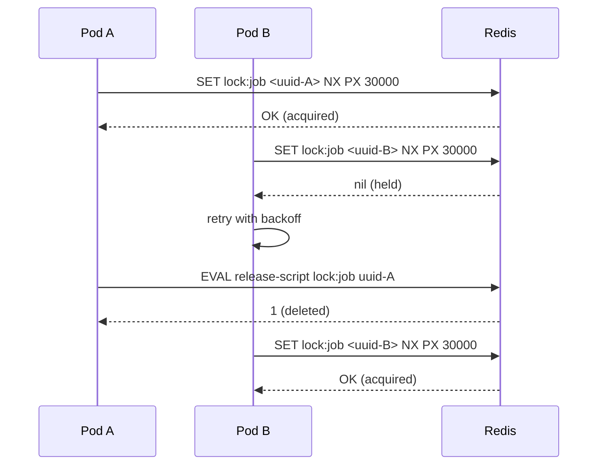

import ModuleBadge from '@site/src/components/ModuleBadge';

# titan-lock

<ModuleBadge origin="official" pkg="@omnitron-dev/titan-lock" status="stable" />

Distributed locks over Redis with UUIDv7 ownership, Lua-script-based
atomic compare-and-delete release, TTL leasing with auto-extend,
configurable retries with exponential backoff, and per-operation
failure tracking to suppress log spam under sustained contention.

Requires [`titan-redis`](./redis.mdx) (peer dependency).

```bash
pnpm add @omnitron-dev/titan-lock @omnitron-dev/titan-redis
```

## When you need it

- **Exactly-once jobs across a fleet** — multiple pods running the
  same scheduler; only one should execute a given run.
- **Critical sections across processes** — write a payment, drain a
  queue, allocate a unique resource.
- **Coordinated migrations** — only one pod runs the schema upgrade.

## Quickstart

```typescript
import { TitanLockModule } from '@omnitron-dev/titan-lock';
import { TitanRedisModule } from '@omnitron-dev/titan-redis';

@Module({
  imports: [
    TitanRedisModule.forRoot({ config: { url: env.REDIS_URL } }),
    TitanLockModule.forRoot({
      defaultTtl:        30_000,        // ms
      keyPrefix:         'lock',
      defaultRetries:    3,
      defaultRetryDelay: 100,            // ms — exponential backoff applied per attempt
    }),
  ],
})
class AppModule {}
```

Async config:

```typescript
TitanLockModule.forRootAsync({
  imports:    [ConfigModule],
  useFactory: (config: ConfigService) => ({
    defaultTtl:        config.get('locks.ttl'),
    redisClientName:   config.get('locks.redisNamespace'),
  }),
  inject: [ConfigService],
})
```

## `ILockModuleOptions`

| Option              | Type       | Default     |
| ------------------- | ---------- | ----------- |
| `defaultTtl`        | `number` (ms) | `30_000` |
| `keyPrefix`         | `string`   | `'lock'`    |
| `defaultRetries`    | `number`   | `3`         |
| `defaultRetryDelay` | `number` (ms) | `100`    |
| `redisClientName`   | `string`   | —           |
| `isGlobal`          | `boolean`  | `false`     |

## `DistributedLockService` — the API

```typescript
import { DistributedLockService, LOCK_SERVICE_TOKEN } from '@omnitron-dev/titan-lock';

@Service({ name: 'billing' })
class BillingService {
  constructor(@Inject(LOCK_SERVICE_TOKEN) private readonly locks: DistributedLockService) {}

  @Public()
  async charge(invoiceId: string) {
    return this.locks.withLock(`invoice:${invoiceId}`, async () => {
      return this.processCharge(invoiceId);
    }, { ttl: 30_000, retries: 3 });
  }
}
```

### Low-level — explicit acquire / release

| Method                                              | Returns               | Purpose                                         |
| --------------------------------------------------- | --------------------- | ----------------------------------------------- |
| `acquireLock(key, ttlMs)`                           | `string \| null`      | Lock ID (UUIDv7) on success; `null` if held    |
| `releaseLock(key, lockId)`                          | `boolean`             | `true` if released; `false` if not owner        |
| `extendLock(key, lockId, ttlMs)`                    | `boolean`             | `true` if extended; `false` if not owner        |
| `isLocked(key)`                                     | `boolean`             | Is the key currently held by anyone?            |
| `getLockTtl(key)`                                   | `number` (ms)         | Remaining TTL; `-1` no expiry, `-2` not exists  |

```typescript
const lockId = await this.locks.acquireLock('jobs:cleanup', 60_000);
if (!lockId) return; // someone else has it

try {
  await doWork();

  // Halfway through, the work is taking longer than expected — extend.
  await this.locks.extendLock('jobs:cleanup', lockId, 60_000);

  await finishWork();
} finally {
  await this.locks.releaseLock('jobs:cleanup', lockId);
}
```

### High-level — `withLock`

```typescript
async withLock<T>(
  key: string,
  fn: () => Promise<T>,
  options?: {
    ttl?:                number;     // ms (default: module defaultTtl)
    retries?:            number;     // attempts (default: module defaultRetries)
    retryDelay?:         number;     // ms (default: module defaultRetryDelay)
    exponentialBackoff?: boolean;    // default: true — delay × (attempt + 1)
    skipOnLockFailure?:  boolean;    // default: false — return undefined instead of throwing
  },
): Promise<T | undefined>
```

```typescript
// Skip if someone else has the lock (idempotent scheduled task)
const result = await this.locks.withLock('cleanup', () => cleanup(), {
  ttl:               60_000,
  retries:           5,
  retryDelay:        200,
  skipOnLockFailure: true,
});
if (result === undefined) {
  this.logger.info('skipped — another instance is running cleanup');
}
```

## `@WithDistributedLock` decorator

Wraps a method with auto acquire / release. Returns `undefined` if
another instance holds the lock — perfect for scheduled jobs that
should run on exactly one pod per fleet.

```typescript
import { Cron, CronExpression } from '@omnitron-dev/titan-scheduler';
import { WithDistributedLock } from '@omnitron-dev/titan-lock';

@Injectable()
class ScheduledTasksService {
  constructor(
    @Inject(LOCK_SERVICE_TOKEN)   private readonly __lockService__: IDistributedLockService,
    @Inject(LOGGER_SERVICE_TOKEN) private readonly loggerModule:    ILoggerModule,
  ) {}

  @Cron(CronExpression.EVERY_30_SECONDS)
  @WithDistributedLock('jobs:poll-queue', 25_000)
  async pollQueue() {
    // Exactly one pod runs this per 30s window.
  }
}
```

> **Wiring requirement.** The decorator looks up the lock service on
> the instance under the property name `__lockService__`. Inject it
> there. Optionally inject `loggerModule` or `logger` for debug
> output; the decorator falls back to console otherwise.

`Lock` is exported as an alias for `WithDistributedLock`.

## Lock semantics



### Embedded Lua scripts

`releaseLock` and `extendLock` use Lua to make the
"check-then-delete" / "check-then-extend" atomic:

```lua
-- release: only delete if I own the lock
if redis.call("get", KEYS[1]) == ARGV[1] then
  return redis.call("del", KEYS[1])
else
  return 0
end
```

```lua
-- extend: only refresh TTL if I own the lock (uses pexpire — ms)
if redis.call("get", KEYS[1]) == ARGV[1] then
  return redis.call("pexpire", KEYS[1], ARGV[2])
else
  return 0
end
```

The lock ID is a UUIDv7 generated per acquire. Ownership cannot be
forged. If a holder dies before releasing, the TTL expires the key
and another acquirer takes over.

## Failure tracking

Each operation (`acquireLock`, `releaseLock`, `extendLock`,
`isLocked`) has its own `FailureTracker` keyed by lock name. The
tracker categorises a stream of failures (first / continuing /
persistent / suppress / recovery) and only logs at the matching
level. Outcome: a single noisy lock under contention does not flood
your logs with thousands of identical warnings.

## Tokens

| Token                           |
| ------------------------------- |
| `LOCK_SERVICE_TOKEN`            |
| `LOCK_OPTIONS_TOKEN`            |
| `DEFAULT_LOCK_PREFIX` (= `'lock'`) |

## Anti-patterns

- **Using locks where idempotency would do.** A lock is coordination
  state. If your work is idempotent (write with a unique constraint,
  upsert, etc.), prefer that over a lock.
- **Long-held locks across slow I/O.** A 60 s lock around a network
  call is a 60 s window for staleness. Either extend periodically
  (`extendLock`) or break the work into smaller transactions.
- **Forgetting `try/finally` with manual acquire.** A crash between
  `acquireLock` and `releaseLock` leaves the lock held until TTL.
  Use `withLock` whenever you can.
- **TTL too short for the work.** Lock expires mid-job; another
  process picks it up; both run; you've broken mutual exclusion.
  Pick TTL = (max expected duration × 2) and extend if needed.
- **TTL too long.** A crashed holder leaves work blocked until the
  TTL expires. Keep TTL small; extend on heartbeat.

## See also

- [`titan-scheduler`](./scheduler.mdx) — pair with `@WithDistributedLock`
- [`titan-redis`](./redis.mdx) — the underlying client
- [Resilience / Circuit Breaker](../resilience/circuit-breaker.md) —
  pair with locks when the locked work touches a flaky backend
