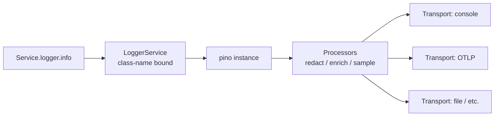

import ModuleBadge from '@site/src/components/ModuleBadge';

# LoggerModule

<ModuleBadge origin="built-in" pkg="@omnitron-dev/titan" subpath="/module/logger" status="stable" />

Structured pino-based logging with four levels, child loggers with
bound context, pluggable transports and processors, automatic
per-service binding, decorator-based property injection, and
method-level auto-instrumentation. **Auto-loaded** as a core module
by every Titan application (unless `disableCoreModules: true`).
No extra install required — ships inside `@omnitron-dev/titan`.

## When you need it

- **Every backend service.** A structured logger is non-negotiable
  for production.
- **Per-call context propagation.** Trace IDs, request IDs, user
  IDs attached to every log line automatically via child loggers.
- **Multiple destinations.** Console for dev, JSON for production
  ingestion, custom transports for ClickHouse / Loki / OTLP.
- **Selective redaction.** Strip auth headers and PII before they
  hit the transport.

## Quickstart

```typescript
import {
  LoggerModule, ConsoleTransport, RedactionProcessor,
} from '@omnitron-dev/titan/module/logger';

@Module({
  imports: [
    LoggerModule.forRoot({
      level:      'info',
      transports: [
        new ConsoleTransport({ pretty: process.env.NODE_ENV !== 'production' }),
      ],
      processors: [
        new RedactionProcessor({
          paths: ['password', 'token', 'headers.authorization', 'creditCard.*'],
        }),
      ],
    }),
  ],
})
class AppModule {}
```

## The `ILogger` interface

```typescript
interface ILogger {
  // Levels — only four
  debug(msg: string | object, meta?: Record<string, any>): void;
  info(msg: string | object,  meta?: Record<string, any>): void;
  warn(msg: string | object,  meta?: Record<string, any>): void;
  error(msg: string | object | Error, meta?: Record<string, any>): void;

  // Child logger with bound context — inherits transports + processors,
  // adds the supplied fields to every log line through it
  child(meta: Record<string, any>): ILogger;

  // Escape hatch — underlying pino instance for advanced options
  pino?: any;
}
```

> **Four levels only.** Map "trace"-style content to `debug` and
> pair `error` with explicit shutdown for "fatal" cases. The
> framework deliberately avoids `trace` / `fatal` distinct levels
> to keep handler logic simple.

## Usage in a service

```typescript
import { Service, Public } from '@omnitron-dev/titan';
import { LoggerService } from '@omnitron-dev/titan/module/logger';

@Service({ name: 'users' })
class UsersService {
  constructor(private readonly logger: LoggerService) {}

  @Public()
  async findById(id: string) {
    this.logger.info('findById', { id });
    try {
      return await this.repo.findById(id);
    } catch (e) {
      this.logger.error('repo failed', { id, error: e });
      throw e;
    }
  }
}
```

The injected `LoggerService` is **automatically bound** to the
service's class name, so every log line carries
`{ service: 'UsersService', ... }`.

## Per-request child loggers

For request-scoped context (trace IDs, user IDs):

```typescript
@Public()
async findById(id: string, @Context() ctx: NetronContext) {
  const log = this.logger.child({
    traceId:   ctx.traceId,
    userId:    ctx.auth?.userId,
    requestId: ctx.requestId,
  });

  log.info('findById', { id });
  return this.repo.findById(id);
}
```

→ See [Logging / Child Loggers](../logging/child-loggers.md) for
the full reference.

## Decorators

```typescript
import { Logger, Log, Monitor } from '@omnitron-dev/titan/module/logger';
```

### `@Logger()` — property injection

```typescript
@Service({ name: 'users' })
class UsersService {
  @Logger() private readonly logger!: ILogger;

  @Public()
  async findById(id: string) {
    this.logger.info('findById', { id });
  }
}
```

### `@Log()` — method auto-logging

```typescript
@Public()
@Log()                                  // logs entry + exit at debug
async findById(id: string) { /* … */ }

@Public()
@Log({ level: 'info', args: true, result: false })
async create(input: CreateInput) { /* … */ }
```

### `@Monitor()` — performance instrumentation

```typescript
@Public()
@Monitor()                              // logs duration + outcome
async heavyComputation(input: Input) { /* … */ }
```

## Services and helpers

| Symbol                | Purpose                                                |
| --------------------- | ------------------------------------------------------ |
| `LoggerService`       | DI-injected wrapper around an `ILogger`               |
| `ConsoleTransport`    | Built-in transport — stdout / stderr                  |
| `RedactionProcessor`  | Built-in processor — redact secret paths              |
| `createNullLogger()`  | Returns an `ILogger` that discards everything (tests) |
| `isLogger(value)`     | Type guard                                            |

## Custom transports

A transport receives log records and writes them somewhere:

```typescript
import type { ITransport } from '@omnitron-dev/titan/module/logger';

class OtlpTransport implements ITransport {
  constructor(private readonly endpoint: string) {}

  async write(record: any): Promise<void> {
    await fetch(this.endpoint, {
      method: 'POST',
      body:   JSON.stringify(record),
    });
  }
}

LoggerModule.forRoot({
  transports: [
    new ConsoleTransport({ pretty: false }),
    new OtlpTransport('https://otel.internal/v1/logs'),
  ],
})
```

→ See [Logging / Transports](../logging/transports.md).

## Custom processors

A processor transforms a log record before transports see it. The
`RedactionProcessor` is the canonical example; custom ones can add
trace context, scrub PII, sample to reduce volume:

```typescript
import { currentTrace } from '@omnitron-dev/titan/tracing';
import type { ILogProcessor } from '@omnitron-dev/titan/module/logger';

const TraceContextProcessor: ILogProcessor = {
  process(record) {
    const trace = currentTrace();
    if (trace) {
      record.traceId = trace.traceId;
      record.spanId  = trace.spanId;
    }
    return record;
  },
};

LoggerModule.forRoot({ processors: [TraceContextProcessor] });
```

→ See [Logging / Processors](../logging/processors.md).

## Pipeline



## Tokens

| Token                       | Purpose                              |
| --------------------------- | ------------------------------------ |
| `LOGGER_TOKEN`              | Default `ILogger`                    |
| `LOGGER_SERVICE_TOKEN`      | `LoggerService` wrapper              |
| `LOGGER_OPTIONS_TOKEN`      | Resolved options                     |
| `LOGGER_TRANSPORTS_TOKEN`   | Registered transports                |
| `LOGGER_PROCESSORS_TOKEN`   | Registered processors                |

## Hot-reloading the level

The logger subscribes to `config:changed` for `logging.level` (when
ConfigModule is loaded). Edit `config/local.yaml` while the dev
server is running:

```yaml
logging:
  level: debug
```

… and the next log line uses the new level — no restart.

## Anti-patterns

- **`console.log` in services.** Bypasses the framework — no
  per-service context, no level, no transport routing. Always use
  the injected logger.
- **Logging in tight loops.** A `debug` log inside a 100 K-iteration
  loop floods the transport even if it's filtered out. Hoist the
  log outside the loop, or sample.
- **PII in logs without redaction.** Always wire
  `RedactionProcessor` for any transport shipping off-host.
- **Synchronous transports blocking the event loop.** Custom
  transports must be async / non-blocking.

## See also

- [Logging / Overview](../logging/overview.md) — conceptual guide
- [Logging / Transports](../logging/transports.md) — destinations
- [Logging / Processors](../logging/processors.md) — transform pipeline
- [Logging / Child Loggers](../logging/child-loggers.md) — bound context
- [Tracing](../tracing.md) — automatic correlation with log lines
