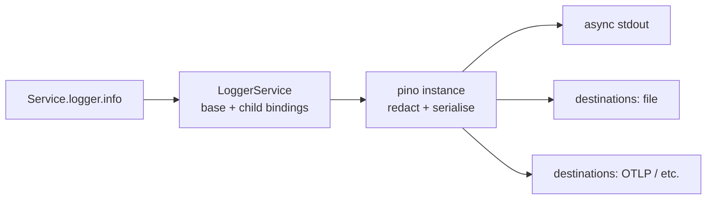

import ModuleBadge from '@site/src/components/ModuleBadge';

# LoggerModule

<ModuleBadge origin="built-in" pkg="@omnitron-dev/titan" subpath="/module/logger" status="stable" />

Structured pino-based logging with six levels, child loggers with
bound context, pino-native redaction, extra-stream fan-out, automatic
per-service binding, decorator-based property injection, and
method-level auto-instrumentation. **Auto-loaded** as a core module
by every Titan application (unless `disableCoreModules: true`).
No extra install required — ships inside `@omnitron-dev/titan`.

The logger always writes **structured JSON**, one record per line, to
an async stdout destination (or a pino `multistream` over stdout plus
any extra `destinations` you supply). It is built on
[pino](https://getpino.io); its JSON is what log shippers (Loki, ELK,
Datadog) expect.

## When you need it

- **Every backend service.** A structured logger is non-negotiable
  for production.
- **Per-call context propagation.** Trace IDs, request IDs, user
  IDs attached to every log line automatically via child loggers.
- **Multiple destinations.** Async stdout for ingestion, plus extra
  `destinations` streams (file, socket, ClickHouse / Loki / OTLP sink).
- **Selective redaction.** Strip auth headers and PII via pino's
  native `redact` before they hit the output.

## Quickstart

```typescript
import { createWriteStream } from 'node:fs';
import { LoggerModule } from '@omnitron-dev/titan/module/logger';

@Module({
  imports: [
    LoggerModule.forRoot({
      level: 'info',
      // pino-native redaction — the real, working mechanism (forwarded
      // straight to pino). Supports path syntax + `*` wildcards.
      redact: ['password', 'token', 'headers.authorization'],
      // Optional: fan structured JSON out to extra streams besides
      // stdout (stdout is always included as the first stream).
      destinations: [
        { stream: createWriteStream('/var/log/myapp/app.log'), level: 'info' },
      ],
    }),
  ],
})
class AppModule {}
```

> **No pretty-print, no transport hot path.** The logger always emits
> JSON. For human-friendly local output, pipe the process through
> [`pino-pretty`](https://github.com/pinojs/pino-pretty)
> (`node dist/main.js | npx pino-pretty`) — there is no in-process
> pretty renderer (the `prettyPrint` option is inert; see below).
> Likewise, extra log sinks go through `destinations`, not through
> `transports`: a registered `ITransport`'s `write()` is never called
> on the log path (see [Extra destinations](#extra-destinations-the-real-fan-out)).

## The `ILogger` interface

Pino-style, **object-first** signatures (the bound object comes first,
then an optional message). Six levels, plus level introspection and a
timing helper:

```typescript
interface ILogger {
  // Six levels — object-first (obj, msg?, ...args) or (msg, ...args)
  trace(obj: object, msg?: string, ...args: any[]): void;
  trace(msg: string, ...args: any[]): void;
  debug(obj: object, msg?: string, ...args: any[]): void;
  debug(msg: string, ...args: any[]): void;
  info(obj: object,  msg?: string, ...args: any[]): void;
  info(msg: string,  ...args: any[]): void;
  warn(obj: object,  msg?: string, ...args: any[]): void;
  warn(msg: string,  ...args: any[]): void;
  error(obj: object, msg?: string, ...args: any[]): void;
  error(msg: string, ...args: any[]): void;
  fatal(obj: object, msg?: string, ...args: any[]): void;
  fatal(msg: string, ...args: any[]): void;

  // Child logger with bound context — inherits the parent's pino
  // config (level, redact, destinations) and adds the supplied
  // bindings to every log line through it
  child(bindings: object): ILogger;

  // Timing helper — returns a stop() that logs the elapsed duration
  time(label?: string): () => void;

  // Level introspection / control
  isLevelEnabled(level: LogLevel): boolean;
  setLevel(level: LogLevel): void;
  getLevel(): LogLevel;
}
```

> **Object-first calls.** Because signatures are Pino-style, pass
> structured context as the first argument and the message second:
> `logger.error({ err, userId }, 'repo failed')`. The single-arg
> string form `logger.info('done')` also works.

## Usage in a service

Inject the **`ILogger`** via `LOGGER_TOKEN` (the convenient alias the
module derives from the root logger) — or use the `@Logger()` property
decorator (below). The DI-injected `LoggerService` is the *module*
(`ILoggerModule`: `create` / `child` / `setLevel` / …), not an
`ILogger`; reach a logger via `loggerService.logger` or
`loggerService.create(name)`.

```typescript
import { Service, Public, Inject } from '@omnitron-dev/titan';
import { LOGGER_TOKEN, type ILogger } from '@omnitron-dev/titan/module/logger';

@Service({ name: 'users' })
class UsersService {
  constructor(@Inject(LOGGER_TOKEN) private readonly logger: ILogger) {}

  @Public()
  async findById(id: string) {
    this.logger.info({ id }, 'findById');         // object first, message second
    try {
      return await this.repo.findById(id);
    } catch (e) {
      this.logger.error({ id, err: e }, 'repo failed');
      throw e;
    }
  }
}
```

For a per-service tag, bind it with a child logger
(`this.logger.child({ service: 'UsersService' })`) — there is no
automatic class-name binding.

## Per-request child loggers

For request-scoped context (trace IDs, user IDs):

```typescript
@Public()
async findById(id: string, @Context() ctx: NetronContext) {
  const log = this.logger.child({
    traceId:   ctx.traceId,
    userId:    ctx.auth?.userId,
    requestId: ctx.requestId,
  });

  log.info({ id }, 'findById');
  return this.repo.findById(id);
}
```

→ See [Logging / Child Loggers](../logging/child-loggers.md) for
the full reference.

## Decorators

```typescript
import { Logger, Log, Monitor } from '@omnitron-dev/titan/module/logger';
```

### `@Logger()` — property injection

```typescript
@Service({ name: 'users' })
class UsersService {
  @Logger() private readonly logger!: ILogger;

  @Public()
  async findById(id: string) {
    this.logger.info({ id }, 'findById');
  }
}
```

### `@Log()` — method auto-logging

```typescript
@Public()
@Log()                                  // logs entry + exit at debug
async findById(id: string) { /* … */ }

@Public()
@Log({ level: 'info', includeArgs: true, includeResult: false })
async create(input: CreateInput) { /* … */ }
```

Options: `level` (`'trace'|'debug'|'info'|'warn'|'error'`),
`includeArgs`, `includeResult`, `message`. The method's instance must
expose a logger (a `logger` / `_logger` / `log` property) or the
decorator silently no-ops.

### `@Monitor()` — performance instrumentation

```typescript
@Public()
@Monitor()                              // logs duration + outcome
async heavyComputation(input: Input) { /* … */ }
```

## Services and helpers

| Symbol                | Purpose                                                |
| --------------------- | ------------------------------------------------------ |
| `LoggerService`       | DI-injected logger manager (`ILoggerModule`): `create` / `child` / `setLevel` / `logger` getter |
| `ConsoleTransport`    | Built-in `ITransport`; ctor takes an optional `ILogger` (positional), test-oriented. Its `write()` is **not** driven on the log path — use `destinations` for real sinks |
| `RedactionProcessor`  | Built-in `ILogProcessor`; redacts dotted paths (positional `string[]`). **Inert as a processor** — the service never runs processors; use the `redact` option for real redaction |
| `createNullLogger()`  | Returns an `ILogger` that discards everything (tests) |
| `isLogger(value)`     | Type guard                                            |

## Extra destinations (the real fan-out)

To send the same JSON log lines somewhere besides stdout — a file, a
socket, an OTLP/Loki sink — register a writable stream via
`destinations`. Pino writes to it directly through `multistream`;
stdout is always included as the first stream, and each user stream is
async-wrapped so a slow consumer can't stall the hot path
(`logger.service.ts:203-249`, `:23-44`):

```typescript
import { Writable } from 'node:stream';

class OtlpSink extends Writable {
  constructor(private readonly endpoint: string) { super(); }
  _write(chunk: Buffer, _enc: BufferEncoding, cb: (e?: Error | null) => void) {
    fetch(this.endpoint, { method: 'POST', body: chunk }).then(() => cb(), cb);
  }
}

LoggerModule.forRoot({
  destinations: [
    { stream: new OtlpSink('https://otel.internal/v1/logs'), level: 'info' },
  ],
})
```

> **`ITransport` is not a log sink today.** The `ITransport` interface
> (`{ name, write, flush? }`) and `ConsoleTransport` are exported, and
> you can register transports via `forRoot({ transports })` /
> `addTransport`, but the service **never calls a transport's
> `write()`** on the log path — logging goes straight through pino.
> Only `flush()` is awaited, on shutdown via `LoggerService.flush()`
> (`logger.service.ts:423-425`). Treat `ITransport` as a flush-lifecycle
> hook, not a sink; for real fan-out use `destinations` (above). There
> is **no `FileTransport`** and no built-in rotation — use a rotating
> `destinations` stream, or ship stdout with an OS-level log shipper.

→ See [Logging / Transports](../logging/transports.md).

## Redaction and enrichment

Redaction is real and works — through **pino's native `redact`
option**, which `LoggerService` forwards straight to pino when it
builds the root logger (`logger.service.ts:186`). It runs inside pino's
serialisation, on the hot path, for every line including child loggers.
Use pino path syntax (`*` wildcards, bracket notation), and the object
form for a custom censor:

```typescript
LoggerModule.forRoot({
  redact: ['password', 'token', 'apiKey', 'headers.authorization', '*.creditCard'],
})
```

The list can also come from `ConfigService` under `logger.redact`
(read at startup, `logger.service.ts:318`). Titan redacts nothing by
default (`redact: config.redact || []`) — set the list per app.

For the other shaping needs, the supported, wired extension points are:

- **Static fields on every line** → `base`
  (`forRoot({ base: { region, version } })`) or `setContext(...)`, both
  of which flow into pino's bindings.
- **Per-request context** (trace ID, user ID) → a **child logger** —
  see [Per-request child loggers](#per-request-child-loggers). This is
  the idiomatic, fully-wired way to attach contextual fields.
- **Filtering by level** → set the level (`forRoot({ level })` or
  `setLevel`); pino drops below-threshold records before serialising.

> **`ILogProcessor` is inert today.** The `ILogProcessor` interface
> (`{ process(log) }`) and `RedactionProcessor` are exported, and you
> can register processors via `forRoot({ processors })` /
> `addProcessor`, but the service **never calls `process()`** on the
> log path (grep-confirmed; logging goes straight through pino).
> So a `RedactionProcessor` registered as a processor does **not**
> redact — use the `redact` option above (it is also more capable:
> wildcards, custom censor). The processor classes are usable only if
> you call `process()` yourself.

→ See [Logging / Processors](../logging/processors.md).

## Pipeline


```mermaid
flowchart LR
  Code[Service.logger.info]
  Code --> Bind[LoggerService<br/>base + child bindings]
  Bind --> Pino[pino instance<br/>redact + serialise]
  Pino --> Out1[async stdout]
  Pino --> Out2[destinations: file]
  Pino --> Out3[destinations: OTLP / etc.]
```

The fan-out is pino's `multistream` over stdout plus any `destinations`
streams; redaction happens inside pino's serialisation. Registered
`processors`/`transports` are **not** on this path (see above).

## Tokens

| Token                       | Purpose                              |
| --------------------------- | ------------------------------------ |
| `LOGGER_TOKEN`              | Default `ILogger`                    |
| `LOGGER_SERVICE_TOKEN`      | `LoggerService` wrapper              |
| `LOGGER_OPTIONS_TOKEN`      | Resolved options                     |
| `LOGGER_TRANSPORTS_TOKEN`   | Registered transports                |
| `LOGGER_PROCESSORS_TOKEN`   | Registered processors                |

## Setting the level from config / at runtime

When ConfigModule is loaded, the logger reads its initial settings from
the `logger.*` namespace **once at construction** — `logger.level`,
`logger.redact`, `logger.base`, and so on (`logger.prettyPrint` is read
too, but it is **inert** — see the redaction/pretty notes above):

```yaml
logger:
  level: debug
```

There is **no live `config:changed` subscription** — editing the file
at runtime does not re-level an already-constructed logger. To change
the level on a running process, call `setLevel()` imperatively on the
`LoggerService` (or any `ILogger`):

```typescript
loggerService.setLevel('debug');   // or: logger.setLevel('debug')
```

## Anti-patterns

- **`console.log` in services.** Bypasses the framework — no
  per-service context, no level, no JSON formatting. Always use
  the injected logger.
- **Logging in tight loops.** A `debug` log inside a 100 K-iteration
  loop floods the output even if it's filtered out. Hoist the
  log outside the loop, or raise the level.
- **PII in logs without redaction.** Set the `redact` option (pino
  native) for anything shipping off-host — not a `RedactionProcessor`,
  which the service never runs.
- **Synchronous `destinations` streams blocking the event loop.** Each
  user stream is async-wrapped, but a stream that does a blocking
  syscall in `_write` still stalls; keep extra sinks async / non-blocking.

## See also

- [Logging / Overview](../logging/overview.md) — conceptual guide
- [Logging / Transports](../logging/transports.md) — async stdout + `destinations`
- [Logging / Processors](../logging/processors.md) — redaction via `redact`
- [Logging / Child Loggers](../logging/child-loggers.md) — bound context
- [Tracing](../tracing.md) — automatic correlation with log lines
