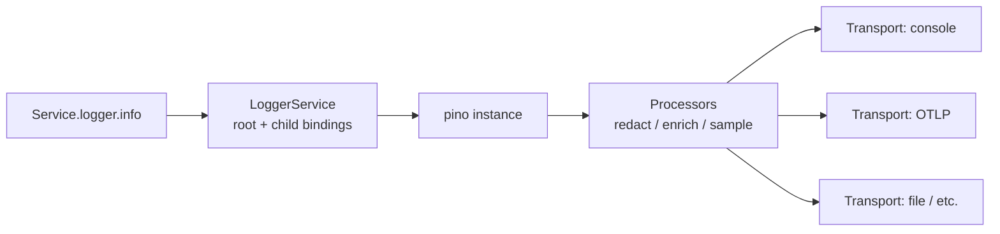

import ModuleBadge from '@site/src/components/ModuleBadge';

# LoggerModule

<ModuleBadge origin="built-in" pkg="@omnitron-dev/titan" subpath="/module/logger" status="stable" />

Structured pino-based logging with four levels, child loggers with
bound context, pluggable transports and processors, automatic
per-service binding, decorator-based property injection, and
method-level auto-instrumentation. **Auto-loaded** as a core module
by every Titan application (unless `disableCoreModules: true`).
No extra install required — ships inside `@omnitron-dev/titan`.

## When you need it

- **Every backend service.** A structured logger is non-negotiable
  for production.
- **Per-call context propagation.** Trace IDs, request IDs, user
  IDs attached to every log line automatically via child loggers.
- **Multiple destinations.** Console for dev, JSON for production
  ingestion, custom transports for ClickHouse / Loki / OTLP.
- **Selective redaction.** Strip auth headers and PII before they
  hit the transport.

## Quickstart

```typescript
import {
  LoggerModule, ConsoleTransport, RedactionProcessor,
} from '@omnitron-dev/titan/module/logger';

@Module({
  imports: [
    LoggerModule.forRoot({
      level:       'info',
      prettyPrint: process.env.NODE_ENV !== 'production',   // pretty console in dev
      transports: [
        new ConsoleTransport(),                             // ctor takes an optional ILogger, not options
      ],
      processors: [
        // RedactionProcessor takes a positional string[] of dotted paths
        new RedactionProcessor(['password', 'token', 'headers.authorization']),
      ],
    }),
  ],
})
class AppModule {}
```

## The `ILogger` interface

Pino-style, **object-first** signatures (the bound object comes first,
then an optional message). Six levels, plus level introspection and a
timing helper:

```typescript
interface ILogger {
  // Six levels — object-first (obj, msg?, ...args) or (msg, ...args)
  trace(obj: object, msg?: string, ...args: any[]): void;
  trace(msg: string, ...args: any[]): void;
  debug(obj: object, msg?: string, ...args: any[]): void;
  debug(msg: string, ...args: any[]): void;
  info(obj: object,  msg?: string, ...args: any[]): void;
  info(msg: string,  ...args: any[]): void;
  warn(obj: object,  msg?: string, ...args: any[]): void;
  warn(msg: string,  ...args: any[]): void;
  error(obj: object, msg?: string, ...args: any[]): void;
  error(msg: string, ...args: any[]): void;
  fatal(obj: object, msg?: string, ...args: any[]): void;
  fatal(msg: string, ...args: any[]): void;

  // Child logger with bound context — inherits transports + processors,
  // adds the supplied bindings to every log line through it
  child(bindings: object): ILogger;

  // Timing helper — returns a stop() that logs the elapsed duration
  time(label?: string): () => void;

  // Level introspection / control
  isLevelEnabled(level: LogLevel): boolean;
  setLevel(level: LogLevel): void;
  getLevel(): LogLevel;
}
```

> **Object-first calls.** Because signatures are Pino-style, pass
> structured context as the first argument and the message second:
> `logger.error({ err, userId }, 'repo failed')`. The single-arg
> string form `logger.info('done')` also works.

## Usage in a service

Inject the **`ILogger`** via `LOGGER_TOKEN` (the convenient alias the
module derives from the root logger) — or use the `@Logger()` property
decorator (below). The DI-injected `LoggerService` is the *module*
(`ILoggerModule`: `create` / `child` / `setLevel` / …), not an
`ILogger`; reach a logger via `loggerService.logger` or
`loggerService.create(name)`.

```typescript
import { Service, Public, Inject } from '@omnitron-dev/titan';
import { LOGGER_TOKEN, type ILogger } from '@omnitron-dev/titan/module/logger';

@Service({ name: 'users' })
class UsersService {
  constructor(@Inject(LOGGER_TOKEN) private readonly logger: ILogger) {}

  @Public()
  async findById(id: string) {
    this.logger.info({ id }, 'findById');         // object first, message second
    try {
      return await this.repo.findById(id);
    } catch (e) {
      this.logger.error({ id, err: e }, 'repo failed');
      throw e;
    }
  }
}
```

For a per-service tag, bind it with a child logger
(`this.logger.child({ service: 'UsersService' })`) — there is no
automatic class-name binding.

## Per-request child loggers

For request-scoped context (trace IDs, user IDs):

```typescript
@Public()
async findById(id: string, @Context() ctx: NetronContext) {
  const log = this.logger.child({
    traceId:   ctx.traceId,
    userId:    ctx.auth?.userId,
    requestId: ctx.requestId,
  });

  log.info({ id }, 'findById');
  return this.repo.findById(id);
}
```

→ See [Logging / Child Loggers](../logging/child-loggers.md) for
the full reference.

## Decorators

```typescript
import { Logger, Log, Monitor } from '@omnitron-dev/titan/module/logger';
```

### `@Logger()` — property injection

```typescript
@Service({ name: 'users' })
class UsersService {
  @Logger() private readonly logger!: ILogger;

  @Public()
  async findById(id: string) {
    this.logger.info({ id }, 'findById');
  }
}
```

### `@Log()` — method auto-logging

```typescript
@Public()
@Log()                                  // logs entry + exit at debug
async findById(id: string) { /* … */ }

@Public()
@Log({ level: 'info', includeArgs: true, includeResult: false })
async create(input: CreateInput) { /* … */ }
```

Options: `level` (`'trace'|'debug'|'info'|'warn'|'error'`),
`includeArgs`, `includeResult`, `message`. The method's instance must
expose a logger (a `logger` / `_logger` / `log` property) or the
decorator silently no-ops.

### `@Monitor()` — performance instrumentation

```typescript
@Public()
@Monitor()                              // logs duration + outcome
async heavyComputation(input: Input) { /* … */ }
```

## Services and helpers

| Symbol                | Purpose                                                |
| --------------------- | ------------------------------------------------------ |
| `LoggerService`       | DI-injected logger manager (`ILoggerModule`): `create` / `child` / `setLevel` / `logger` getter |
| `ConsoleTransport`    | Built-in `ITransport` (forwards records to an `ILogger`; mainly for tests) |
| `RedactionProcessor`  | Built-in `ILogProcessor` — redacts the given dotted paths (positional `string[]`) |
| `createNullLogger()`  | Returns an `ILogger` that discards everything (tests) |
| `isLogger(value)`     | Type guard                                            |

## Custom transports

A transport receives log records and writes them somewhere:

```typescript
import type { ITransport } from '@omnitron-dev/titan/module/logger';

class OtlpTransport implements ITransport {
  readonly name = 'otlp';                 // ITransport requires a `name`

  constructor(private readonly endpoint: string) {}

  async write(record: any): Promise<void> {
    await fetch(this.endpoint, {
      method: 'POST',
      body:   JSON.stringify(record),
    });
  }
}

LoggerModule.forRoot({
  transports: [
    new ConsoleTransport(),
    new OtlpTransport('https://otel.internal/v1/logs'),
  ],
})
```

→ See [Logging / Transports](../logging/transports.md).

## Custom processors

A processor transforms a log record before transports see it. The
`RedactionProcessor` is the canonical example; custom ones can add
trace context, scrub PII, sample to reduce volume:

```typescript
import { currentTrace } from '@omnitron-dev/titan/tracing';
import type { ILogProcessor } from '@omnitron-dev/titan/module/logger';

const TraceContextProcessor: ILogProcessor = {
  process(record) {
    const trace = currentTrace();
    if (trace) {
      record.traceId = trace.traceId;
      record.spanId  = trace.spanId;
    }
    return record;
  },
};

LoggerModule.forRoot({ processors: [TraceContextProcessor] });
```

→ See [Logging / Processors](../logging/processors.md).

## Pipeline


```mermaid
flowchart LR
  Code[Service.logger.info]
  Code --> Bind[LoggerService<br/>root + child bindings]
  Bind --> Pino[pino instance]
  Pino --> Proc[Processors<br/>redact / enrich / sample]
  Proc --> Trans1[Transport: console]
  Proc --> Trans2[Transport: OTLP]
  Proc --> Trans3[Transport: file / etc.]
```

## Tokens

| Token                       | Purpose                              |
| --------------------------- | ------------------------------------ |
| `LOGGER_TOKEN`              | Default `ILogger`                    |
| `LOGGER_SERVICE_TOKEN`      | `LoggerService` wrapper              |
| `LOGGER_OPTIONS_TOKEN`      | Resolved options                     |
| `LOGGER_TRANSPORTS_TOKEN`   | Registered transports                |
| `LOGGER_PROCESSORS_TOKEN`   | Registered processors                |

## Setting the level from config / at runtime

When ConfigModule is loaded, the logger reads its initial settings from
the `logger.*` namespace **once at construction** — `logger.level`,
`logger.prettyPrint`, `logger.redact`, `logger.base`, and so on:

```yaml
logger:
  level: debug
```

There is **no live `config:changed` subscription** — editing the file
at runtime does not re-level an already-constructed logger. To change
the level on a running process, call `setLevel()` imperatively on the
`LoggerService` (or any `ILogger`):

```typescript
loggerService.setLevel('debug');   // or: logger.setLevel('debug')
```

## Anti-patterns

- **`console.log` in services.** Bypasses the framework — no
  per-service context, no level, no transport routing. Always use
  the injected logger.
- **Logging in tight loops.** A `debug` log inside a 100 K-iteration
  loop floods the transport even if it's filtered out. Hoist the
  log outside the loop, or sample.
- **PII in logs without redaction.** Always wire
  `RedactionProcessor` for any transport shipping off-host.
- **Synchronous transports blocking the event loop.** Custom
  transports must be async / non-blocking.

## See also

- [Logging / Overview](../logging/overview.md) — conceptual guide
- [Logging / Transports](../logging/transports.md) — destinations
- [Logging / Processors](../logging/processors.md) — transform pipeline
- [Logging / Child Loggers](../logging/child-loggers.md) — bound context
- [Tracing](../tracing.md) — automatic correlation with log lines
