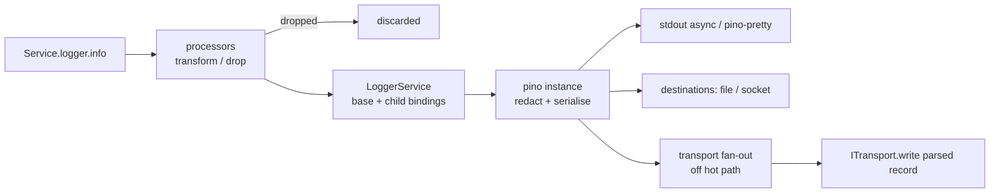

import ModuleBadge from '@site/src/components/ModuleBadge';

# LoggerModule

<ModuleBadge origin="built-in" pkg="@omnitron-dev/titan" subpath="/module/logger" status="stable" />

Structured pino-based logging with six levels, child loggers with
bound context, a processor pipeline (transform / drop), pino-native
redaction, raw-stream and `ITransport` fan-out, optional pretty-print,
automatic per-service binding, decorator-based property injection, and
method-level auto-instrumentation. **Auto-loaded** as a core module
by every Titan application (unless `disableCoreModules: true`).
No extra install required — ships inside `@omnitron-dev/titan`.

By default the logger writes **structured JSON**, one record per line,
to an async stdout destination (or a pino `multistream` over stdout
plus any extra `destinations`/`transports` you supply). Set
`prettyPrint` for colorised human-readable output in dev. It is built
on [pino](https://getpino.io); its JSON is what log shippers (Loki,
ELK, Datadog) expect.

## When you need it

- **Every backend service.** A structured logger is non-negotiable
  for production.
- **Per-call context propagation.** Trace IDs, request IDs, user
  IDs attached to every log line automatically via child loggers.
- **Multiple destinations.** Async stdout for ingestion, plus extra
  `destinations` raw streams and/or `ITransport` sinks (file, socket,
  ClickHouse / Loki / OTLP sink).
- **Transform / drop pipeline.** Enrich every line, or drop noisy
  records, via the `processors` pipeline (runs on the hot path,
  inherited by child loggers).
- **Selective redaction.** Strip auth headers and PII via pino's
  native `redact` (or a `RedactionProcessor`) before they hit output.
- **Pretty dev output.** `prettyPrint` for colorised human-readable
  lines locally; structured JSON in production.

## Quickstart

```typescript
import { createWriteStream } from 'node:fs';
import { LoggerModule, RedactionProcessor } from '@omnitron-dev/titan/module/logger';

@Module({
  imports: [
    LoggerModule.forRoot({
      level: 'info',
      // Colorised human-readable output for dev; leave off (JSON) in prod.
      prettyPrint: process.env.NODE_ENV !== 'production',
      // pino-native redaction — pino-optimised, hot-path, supports
      // path syntax + `*` wildcards. The simplest path for plain redaction.
      redact: ['password', 'token', 'headers.authorization'],
      // Processor pipeline — runs on every line (child loggers too). Use it
      // for transform/drop logic; RedactionProcessor is the redaction case.
      processors: [new RedactionProcessor(['ssn', 'creditCard'])],
      // Raw-stream fan-out besides stdout (stdout is the first stream).
      destinations: [
        { stream: createWriteStream('/var/log/myapp/app.log'), level: 'info' },
      ],
      // Object-receiving sinks, off the hot path + error-isolated.
      // transports: [new HttpSinkTransport('https://logs.example/ingest')],
    }),
  ],
})
class AppModule {}
```

> **Pretty-print, processors, and transports all work.** Set
> `prettyPrint` for colorised dev output (via pino-pretty); leave it off
> for structured JSON in production. `processors` run on every line and
> can transform or drop records; `transports` receive each parsed record
> off the hot path. The `RedactionProcessor` above genuinely redacts —
> though for plain path redaction the `redact` option is simpler and
> pino-optimised. See [Processors](#redaction-and-enrichment) and
> [Extra sinks](#extra-sinks-destinations-and-transports) below.

## The `ILogger` interface

Pino-style, **object-first** signatures (the bound object comes first,
then an optional message). Six levels, plus level introspection and a
timing helper:

```typescript
interface ILogger {
  // Six levels — object-first (obj, msg?, ...args) or (msg, ...args)
  trace(obj: object, msg?: string, ...args: any[]): void;
  trace(msg: string, ...args: any[]): void;
  debug(obj: object, msg?: string, ...args: any[]): void;
  debug(msg: string, ...args: any[]): void;
  info(obj: object,  msg?: string, ...args: any[]): void;
  info(msg: string,  ...args: any[]): void;
  warn(obj: object,  msg?: string, ...args: any[]): void;
  warn(msg: string,  ...args: any[]): void;
  error(obj: object, msg?: string, ...args: any[]): void;
  error(msg: string, ...args: any[]): void;
  fatal(obj: object, msg?: string, ...args: any[]): void;
  fatal(msg: string, ...args: any[]): void;

  // Child logger with bound context — inherits the parent's pino
  // config (level, redact, destinations) and adds the supplied
  // bindings to every log line through it
  child(bindings: object): ILogger;

  // Timing helper — returns a stop() that logs the elapsed duration
  time(label?: string): () => void;

  // Level introspection / control
  isLevelEnabled(level: LogLevel): boolean;
  setLevel(level: LogLevel): void;
  getLevel(): LogLevel;
}
```

> **Object-first calls.** Because signatures are Pino-style, pass
> structured context as the first argument and the message second:
> `logger.error({ err, userId }, 'repo failed')`. The single-arg
> string form `logger.info('done')` also works.

## Usage in a service

Inject the **`ILogger`** via `LOGGER_TOKEN` (the convenient alias the
module derives from the root logger) — or use the `@Logger()` property
decorator (below). The DI-injected `LoggerService` is the *module*
(`ILoggerModule`: `create` / `child` / `setLevel` / …), not an
`ILogger`; reach a logger via `loggerService.logger` or
`loggerService.create(name)`.

```typescript
import { Service, Inject } from '@omnitron-dev/titan';
import { Public } from '@omnitron-dev/titan/decorators';
import { LOGGER_TOKEN, type ILogger } from '@omnitron-dev/titan/module/logger';

@Service({ name: 'users' })
class UsersService {
  constructor(@Inject(LOGGER_TOKEN) private readonly logger: ILogger) {}

  @Public()
  async findById(id: string) {
    this.logger.info({ id }, 'findById');         // object first, message second
    try {
      return await this.repo.findById(id);
    } catch (e) {
      this.logger.error({ id, err: e }, 'repo failed');
      throw e;
    }
  }
}
```

For a per-service tag, bind it with a child logger
(`this.logger.child({ service: 'UsersService' })`) — there is no
automatic class-name binding.

## Per-request child loggers

For request-scoped context (trace IDs, user IDs):

```typescript
@Public()
async findById(id: string, @Context() ctx: NetronContext) {
  const log = this.logger.child({
    traceId:   ctx.traceId,
    userId:    ctx.auth?.userId,
    requestId: ctx.requestId,
  });

  log.info({ id }, 'findById');
  return this.repo.findById(id);
}
```

→ See [Logging / Child Loggers](../logging/child-loggers.md) for
the full reference.

## Decorators

```typescript
import { Logger, Log, Monitor } from '@omnitron-dev/titan/module/logger';
```

### `@Logger()` — property injection

```typescript
@Service({ name: 'users' })
class UsersService {
  @Logger() private readonly logger!: ILogger;

  @Public()
  async findById(id: string) {
    this.logger.info({ id }, 'findById');
  }
}
```

### `@Log()` — method auto-logging

```typescript
@Public()
@Log()                                  // logs entry + exit at debug
async findById(id: string) { /* … */ }

@Public()
@Log({ level: 'info', includeArgs: true, includeResult: false })
async create(input: CreateInput) { /* … */ }
```

Options: `level` (`'trace'|'debug'|'info'|'warn'|'error'`),
`includeArgs`, `includeResult`, `message`. The method's instance must
expose a logger (a `logger` / `_logger` / `log` property) or the
decorator silently no-ops.

### `@Monitor()` — performance instrumentation

```typescript
@Public()
@Monitor()                              // logs duration + outcome
async heavyComputation(input: Input) { /* … */ }
```

## Services and helpers

| Symbol                | Purpose                                                |
| --------------------- | ------------------------------------------------------ |
| `LoggerService`       | DI-injected logger manager (`ILoggerModule`): `create` / `child` / `setLevel` / `logger` getter |
| `ConsoleTransport`    | Bundled example `ITransport`; ctor takes an optional `ILogger` (positional). Registered via `transports`, its `write()` receives each parsed record off the hot path |
| `RedactionProcessor`  | Built-in `ILogProcessor`; redacts dotted paths (positional `string[]`). Runs on the hot path like any processor; for plain path redaction the `redact` option is simpler + pino-optimised |
| `createNullLogger()`  | Returns an `ILogger` that discards everything (tests) |
| `isLogger(value)`     | Type guard                                            |

## Extra sinks: `destinations` and `transports`

Two complementary ways to fan records out beyond stdout.

**`destinations` — raw Pino streams.** Each receives the serialised
JSON line as a chunk, plugged straight into Pino's `multistream`.
stdout is always the first stream, and each user stream is async-wrapped
so a slow consumer can't stall the hot path
(the stream-selection branch of `LoggerService.initialize`, plus
`wrapAsyncStream`):

```typescript
import { Writable } from 'node:stream';

class OtlpSink extends Writable {
  constructor(private readonly endpoint: string) { super(); }
  _write(chunk: Buffer, _enc: BufferEncoding, cb: (e?: Error | null) => void) {
    fetch(this.endpoint, { method: 'POST', body: chunk }).then(() => cb(), cb);
  }
}

LoggerModule.forRoot({
  destinations: [
    { stream: new OtlpSink('https://otel.internal/v1/logs'), level: 'info' },
  ],
})
```

**`transports` — object-receiving sinks.** A registered `ITransport`'s
`write(record)` **is called for every log line**, receiving the
fully-serialised record **parsed back to an object**, after the
processor pipeline and only for logs that passed the level filter.
Delivery is deferred a macrotask (off Pino's hot path) and each
transport is isolated in try/catch, so a slow or throwing transport
can't block or break logging. `flush()` is awaited by
`LoggerService.flush()` (`LoggerService.createTransportFanout` and `LoggerService.flush`):

```typescript
import type { ITransport } from '@omnitron-dev/titan/module/logger';

class HttpSinkTransport implements ITransport {
  name = 'http-sink';
  private buf: any[] = [];
  constructor(private readonly url: string) {}
  write(record: any) {                 // record is a parsed object
    this.buf.push(record);
  }
  async flush() {                      // awaited on shutdown
    if (this.buf.length === 0) return;
    const batch = this.buf.splice(0);
    await fetch(this.url, { method: 'POST', body: JSON.stringify(batch) });
  }
}

LoggerModule.forRoot({
  transports: [new HttpSinkTransport('https://logs.example/ingest')],
})
```

> **Configure transports at `forRoot`.** The fan-out stream that drives
> `ITransport.write()` is created at init, and only when at least one
> transport is registered then (the multistream branch of `LoggerService.initialize`). So
> `addTransport()` after init delivers records **only if** the logger
> started with ≥1 transport; with zero transports at init there is no
> fan-out stream, so a later `addTransport()`'s `write()` won't receive
> records (its `flush()` still runs). Register transports up front for
> guaranteed delivery.

Use **`destinations`** for raw byte sinks (files, sockets, an OS
shipper) and **`transports`** when you want the parsed record object,
hot-path isolation, or a `flush()` lifecycle. There is **no
`FileTransport`** and no built-in rotation — use a rotating
`destinations` stream, or ship stdout with an OS-level log shipper.

→ See [Logging / Transports](../logging/transports.md).

## Redaction and enrichment

Redaction has two working paths. For **plain path redaction**, prefer
**pino's native `redact` option** — `LoggerService` forwards it straight
to pino when it builds the root logger (`redact: config.redact || []` in `LoggerService.initialize`). It
runs inside pino's serialisation, on the hot path, for every line
including child loggers; it is pino-optimised and supports pino path
syntax (`*` wildcards, bracket notation) and the object form for a
custom censor:

```typescript
LoggerModule.forRoot({
  redact: ['password', 'token', 'apiKey', 'headers.authorization', '*.creditCard'],
})
```

The list can also come from `ConfigService` under `logger.redact`
(read at startup in `getConfiguration`). Titan redacts nothing by
default (`redact: config.redact || []`) — set the list per app.

For **arbitrary transform/drop logic** (conditional redaction,
cross-field rules, computed values, or dropping a record), use the
`processors` pipeline — it runs on the hot path and is inherited by
child loggers. The bundled `RedactionProcessor` covers the simple
dotted-path case and genuinely redacts when registered:

```typescript
import { RedactionProcessor } from '@omnitron-dev/titan/module/logger';

LoggerModule.forRoot({ processors: [new RedactionProcessor(['ssn', 'creditCard'])] });
```

For the other shaping needs:

- **Static fields on every line** → `base`
  (`forRoot({ base: { region, version } })`) or `setContext(...)`, both
  of which flow into pino's bindings (lower-ceremony than a processor).
- **Per-request context** (trace ID, user ID) → a **child logger** —
  see [Per-request child loggers](#per-request-child-loggers). This is
  the idiomatic way to attach per-scope fields.
- **Transform or drop per line** → a `processors` entry. Each runs on
  every log call and returns the modified record, or `null`/`undefined`
  to drop it (`LoggerService.runProcessors`).
- **Filtering by level** → set the level (`forRoot({ level })` or
  `setLevel`); pino drops below-threshold records before serialising
  (cheaper than a dropping processor for a pure level cut).

→ See [Logging / Processors](../logging/processors.md).

## Pipeline


```mermaid
flowchart LR
  Code[Service.logger.info]
  Code --> Proc[processors<br/>transform / drop]
  Proc -->|dropped| X[discarded]
  Proc --> Bind[LoggerService<br/>base + child bindings]
  Bind --> Pino[pino instance<br/>redact + serialise]
  Pino --> Out1[stdout async / pino-pretty]
  Pino --> Out2[destinations: file / socket]
  Pino --> Fan[transport fan-out<br/>off hot path]
  Fan --> T1[ITransport.write parsed record]
```

The `processors` pipeline runs first (via pino's `logMethod` hook,
inherited by child loggers) and can drop a record. The fan-out is
pino's `multistream` over stdout — JSON, or pino-pretty when
`prettyPrint` is set — plus any `destinations` streams and a fan-out
stream that drives `ITransport` sinks off the hot path. Redaction
happens inside pino's serialisation (`redact`) and/or as a processor.

## Tokens

| Token                       | Purpose                              |
| --------------------------- | ------------------------------------ |
| `LOGGER_TOKEN`              | Default `ILogger`                    |
| `LOGGER_SERVICE_TOKEN`      | `LoggerService` wrapper              |
| `LOGGER_OPTIONS_TOKEN`      | Resolved options                     |
| `LOGGER_TRANSPORTS_TOKEN`   | Registered transports                |
| `LOGGER_PROCESSORS_TOKEN`   | Registered processors                |

## Setting the level from config / at runtime

When ConfigModule is loaded, the logger reads its initial settings from
the `logger.*` namespace **once at construction** — `logger.level`,
`logger.prettyPrint`, `logger.redact`, `logger.base`, and so on
(`LoggerService.getConfiguration`):

```yaml
logger:
  level: debug
```

There is **no live `config:changed` subscription** — editing the file
at runtime does not re-level an already-constructed logger. To change
the level on a running process, call `setLevel()` imperatively on the
`LoggerService` (or any `ILogger`):

```typescript
loggerService.setLevel('debug');   // or: logger.setLevel('debug')
```

## Anti-patterns

- **`console.log` in services.** Bypasses the framework — no
  per-service context, no level, no JSON formatting. Always use
  the injected logger.
- **Logging in tight loops.** A `debug` log inside a 100 K-iteration
  loop floods the output even if it's filtered out. Hoist the
  log outside the loop, or raise the level.
- **PII in logs without redaction.** Set the `redact` option (pino
  native, simplest for path redaction) — or a `RedactionProcessor` /
  custom processor for conditional logic — for anything shipping off-host.
- **Adding the first `ITransport` after init.** The fan-out stream is
  created at `forRoot` only when ≥1 transport is registered then; a
  later `addTransport()` on a logger that started with none won't
  deliver `write()`. Register transports up front.
- **Heavy work in a `processor.process()`.** It runs on every line
  (after the level filter). Keep it cheap; offload expensive shipping
  to an `ITransport`, which runs off the hot path.
- **Synchronous `destinations` streams blocking the event loop.** Each
  user stream is async-wrapped, but a stream that does a blocking
  syscall in `_write` still stalls; keep extra sinks async / non-blocking.

## See also

- [Logging / Overview](../logging/overview.md) — conceptual guide
- [Logging / Transports](../logging/transports.md) — async stdout, `destinations`, `ITransport` sinks
- [Logging / Processors](../logging/processors.md) — transform / drop pipeline + redaction
- [Logging / Child Loggers](../logging/child-loggers.md) — bound context
- [Tracing](../tracing.md) — automatic correlation with log lines
