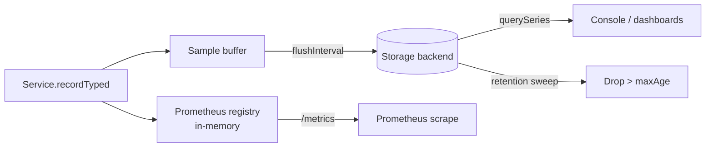

import ModuleBadge from '@site/src/components/ModuleBadge';

# titan-metrics

<ModuleBadge origin="official" pkg="@omnitron-dev/titan-metrics" status="stable" />

Pure Titan-native counters, gauges, and histograms with a Prometheus-
exposition registry, pluggable storage backends (memory / PostgreSQL
/ SQLite), automatic process / system / RPC collection, retention,
and optional sync hooks for external systems.

```bash
pnpm add @omnitron-dev/titan-metrics
```

> **No `prom-client` dependency.** This module ships its own
> Prometheus exposition format generator and time-series storage.
> Scrape with any Prometheus-compatible tool; persist locally with
> SQLite; aggregate across pods with PostgreSQL.

## When you need it

- **Dashboards.** Counters for throughput, histograms for latency,
  gauges for resource use.
- **Time-series queries inside your app.** Persist to SQLite or
  Postgres and query directly without setting up Prometheus.
- **Prometheus exposition.** Generate the standard `/metrics`
  text format from the registry.

## Quickstart

```typescript
import { TitanMetricsModule } from '@omnitron-dev/titan-metrics';

@Module({
  imports: [
    TitanMetricsModule.forRoot({
      appName:    'my-api',
      collection: {
        enabled:  true,
        interval: 5_000,                 // sample every 5s
        process:  true,                  // CPU, RSS, heap
        system:   true,                  // load, free mem
        rpc:      true,                  // Netron call metrics
        custom:   true,
      },
      storage:   { type: 'memory', batchSize: 200, flushInterval: 5_000 },
      retention: { maxAge: '7d', cleanupInterval: 3_600_000 },
    }),
  ],
})
class AppModule {}
```

Async config via `forRootAsync({ useFactory, inject? })`.

## `IMetricsModuleOptions`

| Option              | Type                                                                          | Default       |
| ------------------- | ----------------------------------------------------------------------------- | ------------- |
| `appName`           | `string` — required; tags every metric                                       | —             |
| `collection`        | `{ enabled?, interval?, process?, system?, rpc?, custom? }`                  | enabled, 5s, all on |
| `storage`           | `{ type: 'memory' \| 'postgres' \| 'sqlite', batchSize?, flushInterval? }`   | `'memory'`, `200`, `5_000` |
| `retention`         | `{ maxAge?, cleanupInterval? }`                                              | `'7d'`, `1h`  |
| `sync`              | `{ enabled?, onFlush?: (batch) => Promise<void> }`                           | —             |
| `isGlobal`          | `boolean`                                                                     | `false`       |

## `MetricsService` — the API

```typescript
import { MetricsService, METRICS_SERVICE_TOKEN }
  from '@omnitron-dev/titan-metrics';

@Service({ name: 'users' })
class UsersService {
  constructor(@Inject(METRICS_SERVICE_TOKEN) private readonly metrics: MetricsService) {}

  @Public()
  async create(input: CreateInput) {
    this.metrics.recordTyped('counter', 'users.created.total',
      { source: input.source }, 1);

    const t0 = performance.now();
    try {
      return await this.repo.create(input);
    } finally {
      this.metrics.recordTyped('histogram', 'users.create.ms',
        { source: input.source }, performance.now() - t0);
    }
  }
}
```

### Recording API

| Method                                                            | Purpose                                          |
| ----------------------------------------------------------------- | ------------------------------------------------ |
| `record(sample)`                                                  | Record a fully-formed sample                     |
| `recordBatch(samples[])`                                          | Record many at once                              |
| `recordTyped(type, name, labels, value)`                          | **Preferred** — keeps registry + storage in sync |
| `getRegistry()`                                                   | Direct access to the in-memory Prometheus registry |

The `recordTyped()` method is the canonical entry point — it
guarantees the Prometheus registry and long-term storage stay
synchronised. Lower-level `record` is for cases where you've
already built a sample object.

### Query API

| Method                                                            | Purpose                                          |
| ----------------------------------------------------------------- | ------------------------------------------------ |
| `getSnapshot()`                                                   | Point-in-time snapshot of all metrics            |
| `querySeries(filter)`                                             | Query time-series data with filters              |
| `getPrometheusText()`                                             | Standard Prometheus exposition format            |
| `evictApp(app)`                                                   | Drop all metrics for a given app tag             |

### Lifecycle

| Method                                                            | Purpose                                          |
| ----------------------------------------------------------------- | ------------------------------------------------ |
| `start()`                                                         | Start periodic collection + flushing             |
| `stop()`                                                          | Drain buffers, stop collection                   |
| `flush()`                                                         | Force-flush pending samples; re-enqueues on failure |
| `cleanup()`                                                       | Apply retention policy                           |

The buffer-flush pattern preserves data on transient storage
failures — failed batches are re-enqueued for the next flush
attempt rather than being dropped.

## Storage backends

| Backend                       | Class                       | When                                                    |
| ----------------------------- | --------------------------- | ------------------------------------------------------- |
| `'memory'`                    | `MemoryMetricsStorage`      | Default — ring buffer; console reads from it            |
| `'sqlite'`                    | `SQLiteMetricsStorage`      | Local persistence for single-node deployments           |
| `'postgres'`                  | `PostgresMetricsStorage`    | Persistent + cross-pod aggregation                      |

For cross-pod metrics aggregation use `'postgres'` with shared
connection details. For ad-hoc time-series inspection without an
external system, `'sqlite'` is enough.

## `@Metrics` decorator

```typescript
import { Metrics } from '@omnitron-dev/titan-metrics';

@Public()
@Metrics({
  counter:   { name: 'orders.processed.total' },
  histogram: { name: 'orders.process.ms', buckets: [1, 5, 25, 100, 500] },
})
async process(order: Order) { /* … */ }
```

The decorator auto-instruments the method: increments the counter on
each call, records duration into the histogram, optionally
distinguishes success/error outcomes via labels.

## Prometheus exposition

```typescript
const text = await this.metrics.getPrometheusText();
// # HELP users_created_total Number of users created
// # TYPE users_created_total counter
// users_created_total{source="web"} 42
// ...
```

Serve this on a `/metrics` route from a tiny HTTP handler and point
Prometheus at it. No `prom-client` needed.

## Pipeline at runtime



## Tokens

| Token                       |
| --------------------------- |
| `METRICS_SERVICE_TOKEN`     |
| `METRICS_OPTIONS_TOKEN`     |
| `METRICS_STORAGE_TOKEN`     |

## Lifecycle

`MetricsService.start()` runs at module init; `stop()` at module
shutdown — both invoked automatically by the Titan lifecycle.

## RPC endpoint

`MetricsRpcService` (when registered) exposes aggregated metrics
over Netron for the Omnitron CLI / web console.

## Anti-patterns

- **Per-user labels.** A label per `userId` creates a new time
  series per user, blowing up cardinality. Keep labels low-
  cardinality (`tier`, `region`, `status`).
- **Counters that decrement.** Counters are monotonically
  increasing. Use a gauge for values that go up *and* down.
- **Histograms with too many buckets.** Each bucket is a separate
  time series. Five to ten buckets per histogram is usually right.
- **Forgetting `appName`.** Without it, metrics from different
  services pile together. Always set it per application.
- **Calling `record()` outside `recordTyped()`.** Skips the
  registry-storage sync guarantee. Use `recordTyped()` unless you
  have a specific reason.

## See also

- [Best Practices / Observability](../best-practices/observability.md)
  — logs, metrics, traces working together
- [`titan-telemetry-relay`](./telemetry-relay.mdx) — ship metrics
  off-host via store-and-forward
- [`titan-health`](./health.mdx) — register a health indicator that
  surfaces `MetricsService` connectivity
