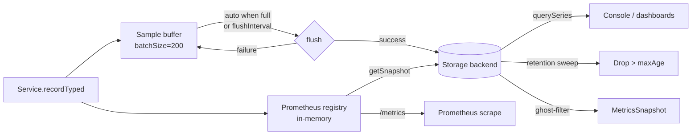

import ModuleBadge from '@site/src/components/ModuleBadge';

# titan-metrics

<ModuleBadge origin="official" pkg="@omnitron-dev/titan-metrics" status="stable" />

Pure Titan-native counters, gauges, and histograms with a Prometheus
exposition registry, pluggable storage backends (memory / PostgreSQL
/ SQLite), automatic process / system / RPC collection, retention,
re-enqueue-on-failure semantics, ghost-app filtering, and optional
sync hooks for external systems.

```bash
pnpm add @omnitron-dev/titan-metrics
```

> **No `prom-client` dependency.** This module ships its own
> Prometheus exposition format generator and time-series storage.
> Scrape with any Prometheus-compatible tool; persist locally with
> SQLite; aggregate across pods with PostgreSQL.

## When you need it

- **Dashboards.** Counters for throughput, histograms for latency,
  gauges for resource use.
- **Time-series queries inside your app.** Persist to SQLite or
  Postgres and query directly without setting up Prometheus.
- **Prometheus exposition.** Generate the standard `/metrics`
  text format from the registry.
- **Operator console without external observability stack.** The
  in-memory ring buffer + the `OmnitronMetrics` RPC service let the
  CLI and webapp read the metrics directly.

## Quickstart

```typescript
import { TitanMetricsModule } from '@omnitron-dev/titan-metrics';

@Module({
  imports: [
    TitanMetricsModule.forRoot({
      appName:    'my-api',
      collection: {
        enabled:  true,
        interval: 5_000,                 // sample every 5s
        process:  true,                  // CPU, RSS, heap
        system:   true,                  // load, free mem
        rpc:      true,                  // Netron call metrics
        custom:   true,
      },
      storage:   { type: 'memory', batchSize: 200, flushInterval: 5_000 },
      retention: { maxAge: '7d', cleanupInterval: 3_600_000 },
    }),
  ],
})
class AppModule {}
```

Async config via `forRootAsync({ useFactory, inject? })`.

## `IMetricsModuleOptions`

| Option              | Type                                                                          | Default                  |
| ------------------- | ----------------------------------------------------------------------------- | ------------------------ |
| `appName`           | `string` — required; tags every metric                                       | —                        |
| `collection`        | `{ enabled?, interval?, process?, system?, rpc?, custom? }`                  | enabled, 5s, all on      |
| `storage`           | `{ type: 'memory' \| 'postgres' \| 'sqlite', batchSize?, flushInterval? }`   | `'memory'`, `200`, `5_000` |
| `retention`         | `{ maxAge?, cleanupInterval? }`                                              | `'7d'`, `1h`             |
| `sync`              | `{ enabled?, onFlush?: (batch) => Promise<void> }`                           | —                        |
| `isGlobal`          | `boolean`                                                                     | `false`                  |

## `MetricsService` — the API

```typescript
import { MetricsService, METRICS_SERVICE_TOKEN }
  from '@omnitron-dev/titan-metrics';

@Service('users@1.0.0')
class UsersService {
  constructor(@Inject(METRICS_SERVICE_TOKEN) private readonly metrics: MetricsService) {}

  @Public()
  async create(input: CreateInput) {
    this.metrics.recordTyped('counter', 'users.created.total',
      { source: input.source }, 1);

    const t0 = performance.now();
    try {
      return await this.repo.create(input);
    } finally {
      this.metrics.recordTyped('histogram', 'users.create.ms',
        { source: input.source }, performance.now() - t0);
    }
  }
}
```

### Recording API

| Method                                                            | Purpose                                          |
| ----------------------------------------------------------------- | ------------------------------------------------ |
| `record(sample)`                                                  | Record a fully-formed sample                     |
| `recordBatch(samples[])`                                          | Record many at once                              |
| `recordTyped(type, name, labels, value)`                          | **Preferred** — keeps registry + storage in sync |
| `getRegistry()`                                                   | Direct access to the in-memory Prometheus registry |

The `recordTyped()` method is the canonical entry point — it
guarantees the Prometheus registry and long-term storage stay
synchronised. Lower-level `record` is for cases where you've
already built a sample object.

### Query API

| Method                                                            | Purpose                                          |
| ----------------------------------------------------------------- | ------------------------------------------------ |
| `getSnapshot()`                                                   | Point-in-time per-app snapshot (ghost-filtered)  |
| `querySeries(filter)`                                             | Query time-series with bucketing                 |
| `getPrometheusText()`                                             | Standard Prometheus exposition format            |
| `evictApp(app)`                                                   | Drop all metrics for a given app tag             |

### Lifecycle

| Method                                                            | Purpose                                          |
| ----------------------------------------------------------------- | ------------------------------------------------ |
| `start()`                                                         | Start periodic collection + flushing + cleanup   |
| `stop()`                                                          | Drain buffers, stop collection                   |
| `flush()`                                                         | Force-flush pending samples; re-enqueues on failure |
| `cleanup()`                                                       | Apply retention policy                           |

## Why `recordTyped` matters (T#74)

The unified entry point exists because pre-T#74, callers had two
incompatible ways to write metrics:

1. **`record(sample)`** — wrote to BOTH registry and storage, but
   the registry routed by previously-registered type, defaulting
   to **gauge**. Wrong for counters and histograms unless someone
   else pre-registered the metric name.
2. **`getRegistry().counter(...)` etc** — wrote to ONLY the
   registry. These metrics appeared in `/metrics` (Prometheus) but
   were **invisible** to `querySeries()` — every dashboard query
   for them returned empty.

`recordTyped` takes an explicit type, writes to the registry via
the correct type-specific method, and pushes the sample to the
storage buffer in the same call. Use it unless you have a specific
reason not to.

## `MetricsQueryFilter` — the shape of time-series queries

```typescript
interface MetricsQueryFilter {
  names?:    string[];                          // ['orders.process.ms']
  apps?:     string[];                          // ['orders-api']
  from?:     string | number;                   // ISO string or ms
  to?:       string | number;
  labels?:   Record<string, string>;            // { region: 'eu-west' }
  interval?: string;                            // '1m' | '5m' | '1h' for bucketing
  limit?:    number;
}
```

Returns `MetricsTimeSeries[]`:

```typescript
interface MetricsTimeSeries {
  name:   string;
  app:    string;
  labels: Record<string, string>;
  points: Array<{ timestamp: number; value: number }>;
}
```

A typical dashboard query:

```typescript
const series = await metrics.querySeries({
  names:    ['orders.process.ms'],
  apps:     ['orders-api'],
  from:     Date.now() - 3_600_000,           // last hour
  to:       Date.now(),
  interval: '1m',                              // 60 points
});
```

Pagination uses `limit` + repeated calls with adjusted `from` —
there's no opaque cursor.

## `MetricsSnapshot` — what `getSnapshot()` returns

```typescript
interface MetricsSnapshot {
  timestamp: number;
  apps: Record<string, {
    cpu:        number;
    memory:     number;
    requests:   number;
    errors:     number;
    instances:  number;
    status:     string;
    latency?:   { p50: number; p95: number; p99: number; mean: number };
  }>;
  totals: {
    cpu:        number;
    memory:     number;
    apps:       number;
    onlineApps: number;
  };
}
```

The snapshot powers the omnitron-console dashboard. It includes
**per-app aggregates** plus cluster-wide totals.

### Ghost-app filtering

A subtle but important property: `getSnapshot()` filters out apps
whose freshest `app_status` sample is older than
`max(3 × collection.interval, 30_000)` ms. Without this filter,
the ring buffer would keep showing apps the orchestrator no longer
reports (renamed, removed, dev-mode reload, etc.) as "offline" —
inflating `totals.apps` with ghosts.

The staleness multiplier is fixed at 3× (the smallest value that
survives normal flush jitter). Override the floor by configuring
a longer `collection.interval`.

## Storage backends

| Backend                       | Class                       | When                                                    |
| ----------------------------- | --------------------------- | ------------------------------------------------------- |
| `'memory'`                    | `MemoryMetricsStorage`      | Default — ring buffer; console reads from it            |
| `'sqlite'`                    | `SQLiteMetricsStorage`      | Local persistence for single-node deployments           |
| `'postgres'`                  | `PostgresMetricsStorage`    | Persistent + cross-pod aggregation                      |

### Backend comparison

| Concern                          | `memory`            | `sqlite`              | `postgres`               |
| -------------------------------- | ------------------- | --------------------- | ------------------------ |
| Persistence across restart       | ✗                   | ✓                     | ✓                        |
| Multi-pod aggregation            | ✗                   | ✗ (per-node)          | ✓                        |
| Setup cost                       | none                | one file path         | DB + schema + creds      |
| Write latency                    | μs                  | ~1 ms                 | ~1–5 ms                  |
| Query latency at 1M samples      | μs (ring)           | ~10 ms                | ~10–50 ms                |
| Footprint (RAM)                  | bounded ring        | minimal               | minimal                  |
| Footprint (disk)                 | none                | per-segment growth    | per-row growth           |
| Retention enforcement            | natural (ring)      | `cleanup(maxAgeMs)`   | `cleanup(maxAgeMs)`      |

Rules of thumb:
- **Single pod, no external observability:** `memory` is fine.
- **Single pod, want history across restart:** `sqlite`.
- **Multi-pod with shared dashboards:** `postgres` with shared
  connection details.

The buffer-flush pattern preserves data on transient storage
failures — failed batches are re-enqueued for the next flush
attempt rather than being dropped. This applies to all backends
(T#70 fix).

## `@Metrics` decorator

```typescript
import { Metrics } from '@omnitron-dev/titan-metrics';

@Public()
@Metrics({
  counter:   { name: 'orders.processed.total' },
  histogram: { name: 'orders.process.ms', buckets: [1, 5, 25, 100, 500] },
})
async process(order: Order) { /* … */ }
```

The decorator auto-instruments the method: increments the counter on
each call, records duration into the histogram, optionally
distinguishes success/error outcomes via labels.

## Prometheus exposition

```typescript
const text = await this.metrics.getPrometheusText();
// # HELP users_created_total Number of users created
// # TYPE users_created_total counter
// users_created_total{source="web"} 42
// ...
```

Serve this on a `/metrics` route from a tiny HTTP handler and point
Prometheus at it. No `prom-client` needed.

## RPC surface — `OmnitronMetrics`

Auto-registered when the module loads. Verified from
[`packages/titan-metrics/src/rpc-service.ts`](https://github.com/omnitron-dev/omni/tree/main/packages/titan-metrics/src/rpc-service.ts).

| Method                         | Returns                       | Auth                |
| ------------------------------ | ----------------------------- | ------------------- |
| `getSnapshot()`                | `MetricsSnapshot`             | `allowAnonymous`    |
| `querySeries(filter)`          | `MetricsTimeSeries[]`         | `allowAnonymous`    |
| `getPrometheusText()`          | `string`                      | `allowAnonymous`    |
| `cleanup()`                    | `{ cleaned: true }`           | requires auth       |
| `flush()`                      | `{ flushed: true }`           | requires auth       |
| `evictApp({ app })`            | `{ evicted: true }`           | requires auth       |

Read methods are anonymous-safe by design (so dashboards can poll
without per-poll auth). Mutating methods (`cleanup`, `flush`,
`evictApp`) require authentication — gate them behind admin role
in the Netron middleware chain.

```typescript
const metricsClient = await peer.queryInterface<MetricsRpcService>('OmnitronMetrics');
const snap = await metricsClient.getSnapshot();
```

## Pipeline at runtime



Key invariants:

- **Buffer is the lifeboat.** A failed `storage.write` `unshifts`
  the batch back to the head so the next periodic flush retries
  it (T#70).
- **One flush at a time.** The `flushing` flag prevents
  concurrent flushes from interleaving.
- **Cleanup runs hourly.** `cleanupInterval` default 3 600 000 ms;
  applies `maxAgeMs` to the storage backend.

## Retention tuning

| `maxAge` | Disk implication (postgres, 1k samples/s) | Use case                              |
| -------- | ----------------------------------------- | ------------------------------------- |
| `'1h'`   | tiny — RAM-friendly                       | Debug-time / smoke                   |
| `'1d'`   | ~100 M rows; trivial Postgres             | Short-term operator dashboard         |
| `'7d'`   | ~700 M rows; standard                     | Default — week-over-week comparisons  |
| `'30d'`  | ~3 B rows; needs partitioning             | Long-term trending                    |

`cleanup()` is non-trivial on Postgres at high cardinality — set
`cleanupInterval` longer (e.g., `4 × 3_600_000` for 4 h) if the
sweep itself stalls writes.

## Sizing & cardinality control

The single biggest operational risk is **label cardinality**.
Every unique combination of label values creates a separate
time-series in storage. At 1 metric × 10 labels × 100 values
each, that's 10^10 series — far past anything healthy.

Recipes:

- **Bucket continuous values.** Don't label by exact `amount`;
  label by `tier` derived from amount (`free|pro|enterprise`).
- **Drop request IDs.** They're unique per request — never use as
  labels.
- **Quantise time.** If you must label by a timestamp, round to
  the hour or day, not the second.
- **One metric, many labels** beats **many metrics, few labels**
  for cardinality budget — but be sane about it.

Healthy cardinality targets:

| Setup                       | Total series target           |
| --------------------------- | ----------------------------- |
| Single small app            | < 10 000                      |
| Multi-pod cluster           | < 100 000                     |
| Aggregator backbone         | < 1 000 000                   |

Monitor `metrics.getRegistry()` size as a meta-metric; alert when
it grows faster than your service count.

## Tokens

| Token                       | Type                          |
| --------------------------- | ----------------------------- |
| `METRICS_SERVICE_TOKEN`     | `IMetricsService`             |
| `METRICS_OPTIONS_TOKEN`     | `IMetricsModuleOptions`       |
| `METRICS_STORAGE_TOKEN`     | `IMetricsStorage`             |

## Lifecycle

`MetricsService.start()` is invoked at module init and:
- Starts the collector (process / system / RPC samples on
  `collection.interval`, default 5 s).
- Schedules periodic flush every 5 s (`DEFAULT_FLUSH_INTERVAL`).
- Schedules periodic cleanup every 1 h (`DEFAULT_CLEANUP_INTERVAL`).

`stop()` does the reverse in order:
- Stops the collector.
- Clears flush + cleanup timers.
- Drains the collector buffer.
- Calls `flush()` one last time to push everything to storage.

Both timers `unref()` so they don't pin the event loop alive.

## Anti-patterns

- **Per-user labels.** A label per `userId` creates a new time
  series per user, blowing up cardinality. Keep labels low-
  cardinality (`tier`, `region`, `status`).
- **Counters that decrement.** Counters are monotonically
  increasing. Use a gauge for values that go up *and* down.
- **Histograms with too many buckets.** Each bucket is a separate
  time series. Five to ten buckets per histogram is usually right.
- **Forgetting `appName`.** Without it, metrics from different
  services pile together. Always set it per application.
- **Calling `record()` outside `recordTyped()`.** Skips the
  registry-storage sync guarantee. Use `recordTyped()` unless you
  have a specific reason.
- **Disabling retention.** Leaving samples to accumulate
  indefinitely fills disk on Postgres / SQLite. Default `'7d'`
  is sensible.
- **Anonymous RPC `cleanup` / `flush` / `evictApp`.** These
  mutate state. The defaults require auth — don't relax this in
  production.

## See also

- [Best Practices / Observability](../best-practices/observability.md)
  — logs, metrics, traces working together
- [`titan-telemetry-relay`](./telemetry-relay.mdx) — ship metrics
  off-host via store-and-forward
- [`titan-health`](./health.mdx) — register a health indicator that
  surfaces `MetricsService` connectivity
- [Tokens & RPC reference](./tokens-reference.mdx) — full token
  inventory
- [Migrations / From prom-client](../migrations/from-prom-client.md) —
  surgical migration path
