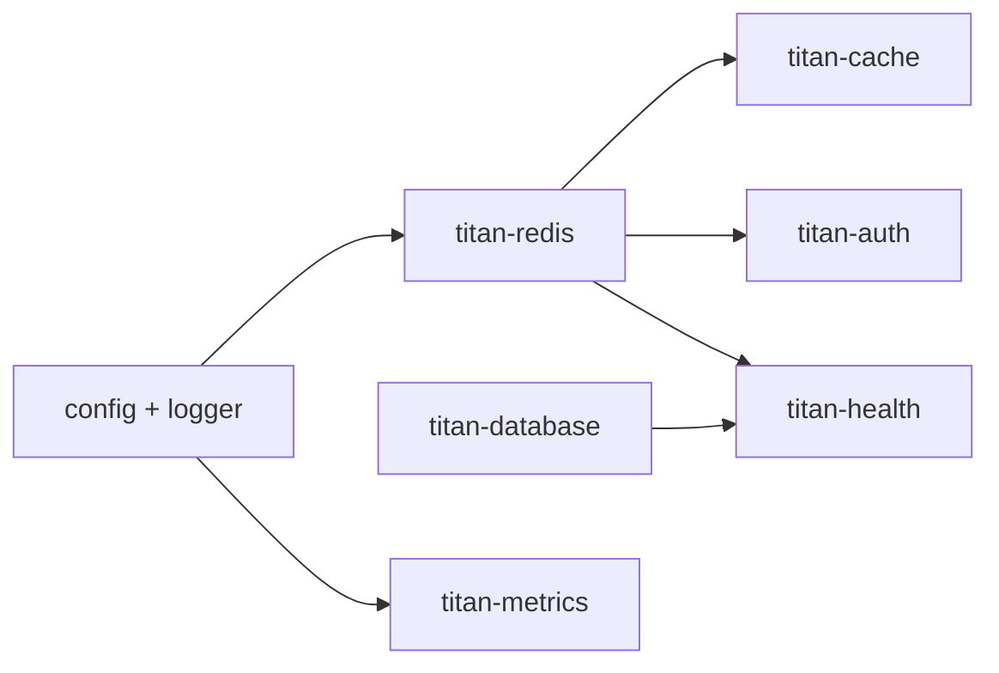
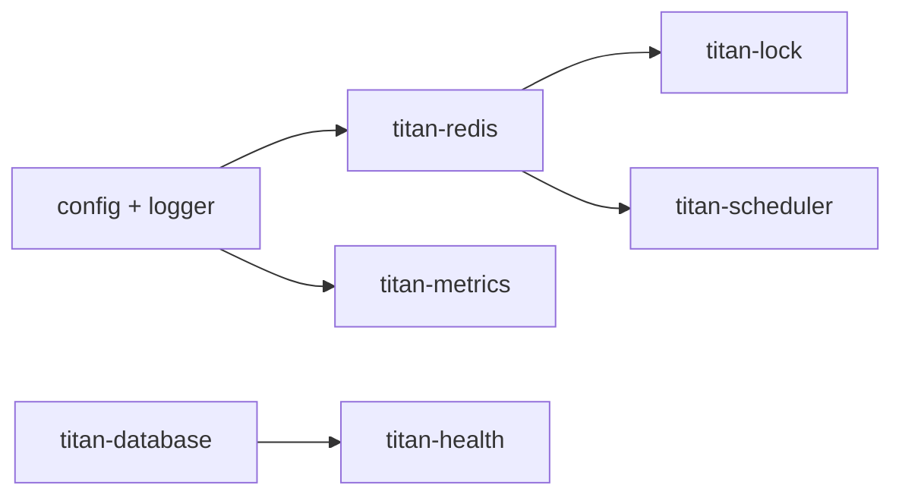
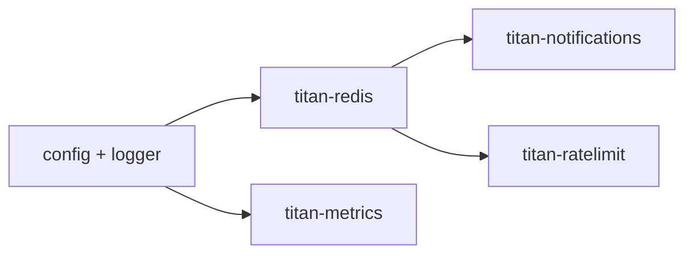
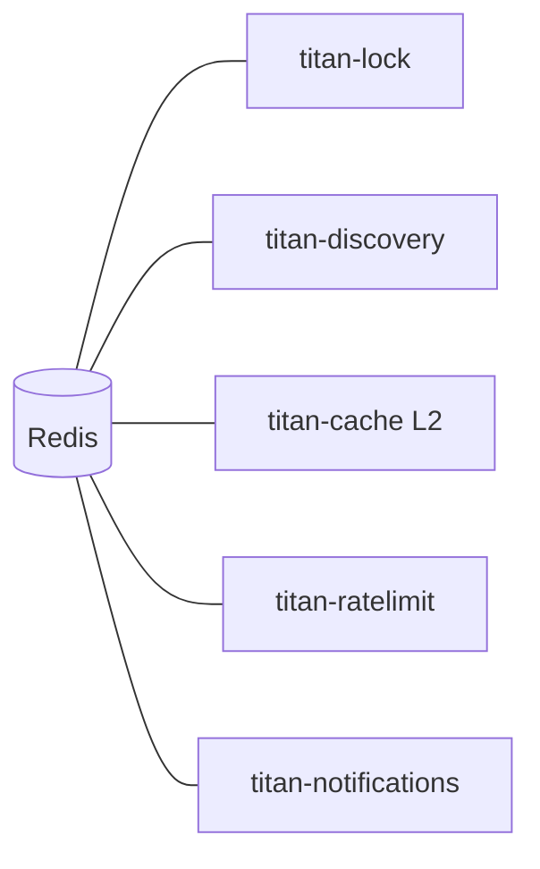
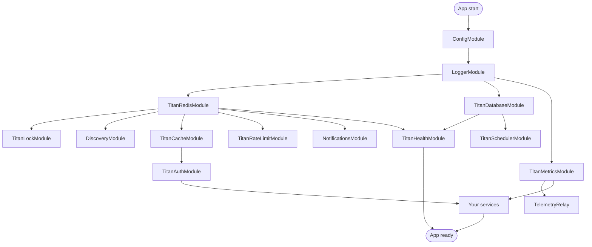

import ModuleBadge from '@site/src/components/ModuleBadge';

# Module map

A bird's-eye view of every module in the Titan ecosystem — who
depends on whom, who can substitute for whom, and which
combinations show up in real backends.

## Dependency graph

```mermaid
flowchart TB
  subgraph Builtin["Built-in (ship with @omnitron-dev/titan)"]
    Config[config]
    Logger[logger]
  end

  subgraph Foundations["Foundation modules"]
    Redis[titan-redis]
    Events[titan-events]
    Database[titan-database]
  end

  subgraph Observability["Observability"]
    Health[titan-health]
    Metrics[titan-metrics]
    Telemetry[titan-telemetry-relay]
  end

  subgraph Coordination["Coordination & runtime"]
    Lock[titan-lock]
    Scheduler[titan-scheduler]
    PM[titan-pm]
    Discovery[titan-discovery]
  end

  subgraph Surface["Surface modules"]
    Auth[titan-auth]
    Cache[titan-cache]
    RateLimit[titan-ratelimit]
    Notifications[titan-notifications]
  end

  Lock --> Redis
  Discovery --> Redis
  Cache -. L2 tier .-> Redis
  RateLimit -. redis storage .-> Redis
  Notifications --> Redis
  Scheduler -. redis persistence .-> Redis

  Health -. db indicator .-> Database
  Health -. redis indicator .-> Redis

  Notifications -. preference store .-> Database
  Telemetry -. ships .-> Metrics

  Auth -. token cache .-> Cache

  classDef builtin    fill:#e8f5e9,stroke:#43a047,color:#1b5e20
  classDef found      fill:#e3f2fd,stroke:#1976d2,color:#0d47a1
  classDef obs        fill:#fff8e1,stroke:#fb8c00,color:#e65100
  classDef coord      fill:#f3e5f5,stroke:#8e24aa,color:#4a148c
  classDef surf       fill:#fce4ec,stroke:#d81b60,color:#880e4f

  class Config,Logger          builtin
  class Redis,Events,Database  found
  class Health,Metrics,Telemetry obs
  class Lock,Scheduler,PM,Discovery coord
  class Auth,Cache,RateLimit,Notifications surf
```

Solid arrows are **hard dependencies** — you can't run the
dependent module without the foundation. Dotted arrows are
**soft / optional** — feature flagged at config time
(`storage: 'redis'`, `multiTier: true`, `enableDatabaseIndicator: true`).

## Install footprint

The numbers below count peer modules a typical adoption pulls in
(transitive Redis client, postgres driver, etc. are omitted):

| You install                  | What else lights up                                       |
| ---------------------------- | --------------------------------------------------------- |
| `titan-events`               | Standalone                                                |
| `titan-redis`                | Standalone                                                |
| `titan-database`             | Standalone (+ db driver)                                  |
| `titan-cache`                | Standalone (`+ titan-redis` if `multiTier: true`)         |
| `titan-lock`                 | `+ titan-redis`                                           |
| `titan-discovery`            | `+ titan-redis`                                           |
| `titan-ratelimit`            | Standalone (`+ titan-redis` if `storage: 'redis'`)        |
| `titan-notifications`        | `+ titan-redis` (`+ titan-database` for preference store) |
| `titan-scheduler`            | Standalone (`+ titan-redis` for distributed persistence)  |
| `titan-auth`                 | Standalone (`+ titan-cache` for token cache)              |
| `titan-health`               | Standalone (indicators light up per `enableXxxIndicator`) |
| `titan-metrics`              | Standalone (`+` storage driver if persisting)             |
| `titan-telemetry-relay`      | Standalone (paired with `titan-metrics` at remote end)    |
| `titan-pm`                   | Standalone                                                |

The framework deliberately keeps modules independently versionable —
you only pull in what you actually use.

## Common stacks

### Web API service

<ModuleBadge origin="built-in" pkg="@omnitron-dev/titan" subpath="config + logger" />
<ModuleBadge origin="official" pkg="titan-redis + titan-database + titan-cache + titan-auth + titan-health + titan-metrics" />



Common starting set for any REST / RPC backend.

### Worker fleet

<ModuleBadge origin="built-in" pkg="@omnitron-dev/titan" subpath="config + logger" />
<ModuleBadge origin="official" pkg="titan-redis + titan-database + titan-lock + titan-scheduler + titan-metrics + titan-health" />



`titan-lock` is what stops two workers running the same job.

### Notification gateway

<ModuleBadge origin="built-in" pkg="@omnitron-dev/titan" subpath="config + logger" />
<ModuleBadge origin="official" pkg="titan-redis + titan-notifications + titan-ratelimit + titan-metrics" />



`titan-ratelimit` shields the upstream provider; `titan-metrics`
records throughput / failures by channel.

### Multi-instance app

Add **`titan-discovery`** to any of the above when you have more
than one pod and want to address services without hard-coded URLs.

### Edge / offline node

<ModuleBadge origin="official" pkg="titan-telemetry-relay" status="stable" />

Add `titan-telemetry-relay` when the node may be disconnected from
the central metrics endpoint — it buffers samples to SQLite and
flushes when connectivity returns.

## Similar modules — when which?

| Need                                | Reach for                                     | Why                                                        |
| ----------------------------------- | --------------------------------------------- | ---------------------------------------------------------- |
| Sync in-process pub/sub             | [`titan-events`](./events.mdx)                | Fire-and-forget, intra-process, typed channels             |
| Reliable cross-pod queue            | [`titan-notifications`](./notifications.mdx)  | Built on rotif; survives crashes, has DLQ + retry          |
| Periodic work (cron / interval)     | [`titan-scheduler`](./scheduler.mdx)          | Per-job persistence + missed-fire handling                 |
| Memoize a function call             | [`titan-cache`](./cache.mdx)                  | `@Cached(...)` decorator; multi-tier (L1+L2)               |
| Talk to Redis directly              | [`titan-redis`](./redis.mdx)                  | Just a typed client; no service abstraction                |
| Throttle calls                      | [`titan-ratelimit`](./ratelimit.mdx)          | Token-bucket / sliding-window / fixed-window               |
| Coordinate across instances         | [`titan-lock`](./lock.mdx)                    | Redis-backed mutex with UUID ownership                     |
| Spawn / supervise child processes   | [`titan-pm`](./pm.mdx)                        | Worker pools, IPC, crash supervision                       |
| Find sibling services               | [`titan-discovery`](./discovery.mdx)          | Heartbeat-based service registry                           |
| Count / measure                     | [`titan-metrics`](./metrics.mdx)              | Counters, gauges, histograms; Prom exposition              |
| Ship metrics off-host               | [`titan-telemetry-relay`](./telemetry-relay.mdx) | Store-and-forward; survives offline windows             |
| Check it's alive                    | [`titan-health`](./health.mdx)                | k8s probes + custom indicators                             |
| Authenticate RPC callers            | [`titan-auth`](./auth.mdx)                    | JWT (HS256/RS256/ES256), JWKS, token cache                 |
| Query a database                    | [`titan-database`](./database.mdx)            | Kysely + migrations + RLS                                  |
| Validated config                    | [`config`](./config.mdx) (built-in)           | Layered, validated, hot-reloadable                         |
| Structured logging                  | [`logger`](./logger.mdx) (built-in)           | pino under the hood; transports + processors               |

## Replacement / overlap matrix

| Module                       | Closest overlap                                  | When to prefer                                        |
| ---------------------------- | ------------------------------------------------ | ----------------------------------------------------- |
| `titan-events`               | `titan-notifications`                            | In-process / no persistence / lowest latency          |
| `titan-notifications`        | `titan-events` + `titan-scheduler`               | Cross-process, retry, DLQ, channel templating         |
| `titan-cache`                | bare `titan-redis`                               | Caching semantics (`@Cached`, TTL, multi-tier)        |
| `titan-scheduler`            | `setInterval` / `node-cron`                      | Persistence, missed-fire, observability               |
| `titan-lock`                 | bare `SETNX` on Redis                            | Safe ownership (UUID) + Lua-script atomicity          |
| `titan-discovery`            | env-var URL config                               | Dynamic topology, autoscaling, rolling deploys        |
| `titan-metrics`              | `prom-client`                                    | Native persistence + cross-pod aggregation            |
| `titan-telemetry-relay`      | direct Prom scrape                               | Edge / offline / store-and-forward                    |
| `titan-health`               | rolling-your-own `/healthz`                      | Standard k8s probe shapes + indicator registry        |
| `titan-auth`                 | manual JWT verification                          | JWKS rotation, token cache, RBAC primitives           |

## Where Redis sits

Five official modules use Redis as their primary backend. They
share the same `Redis` client provided by `titan-redis`:



Register `TitanRedisModule.forRoot(...)` once at app boot; all
five pick up the connection automatically.

```typescript
@Module({
  imports: [
    TitanRedisModule.forRoot({ config: { url: env.REDIS_URL } }),
    TitanLockModule.forRoot(),
    DiscoveryModule.forRoot(),
    TitanCacheModule.forRoot({ multiTier: true, l2: { /* picked up */ } }),
    TitanRateLimitModule.forRoot({ storageType: 'redis' }),
    NotificationsModule.forRoot({ /* … */ }),
  ],
})
class AppModule {}
```

**Recommended Redis-DB split** (avoid keyspace collisions):

| DB | Purpose                                                  |
| -- | -------------------------------------------------------- |
| 0  | App data (cache, sessions, business state)               |
| 1  | Queues / pub-sub (notifications, events)                 |
| 2  | Rate limits                                              |
| 3  | Locks (`titan-lock`)                                     |
| 4  | Discovery registry                                       |

Configure per-module by passing a different `db:` index in the
options, or by registering multiple named Redis clients via
`TitanRedisModule.forRootMultiple([...])`.

## Lifecycle order — first to last

The container resolves lifecycle in dependency order:



On shutdown, the reverse order is followed — user services drain
first, then surface modules, then foundations, then logger / config
last. The exact reverse ensures dependants always stop before
their dependencies.

## Picking the right tier

| Question                                       | Tier         |
| ---------------------------------------------- | ------------ |
| Always available, smallest install?            | **Built-in** |
| Battle-tested, official, individually versioned? | **Official** |
| Niche need, no official equivalent yet?        | **Community** (audit first) |
| Want to publish your own?                      | [Authoring a module](../modules-system/authoring-modules.md) |

## See also

- [Modules index](./index.mdx) — flat list by tier
- [Authoring a module](../modules-system/authoring-modules.md) —
  conventions every official module follows
- [Recipes](../recipes/index.md) — concrete combinations that solve
  real problems
