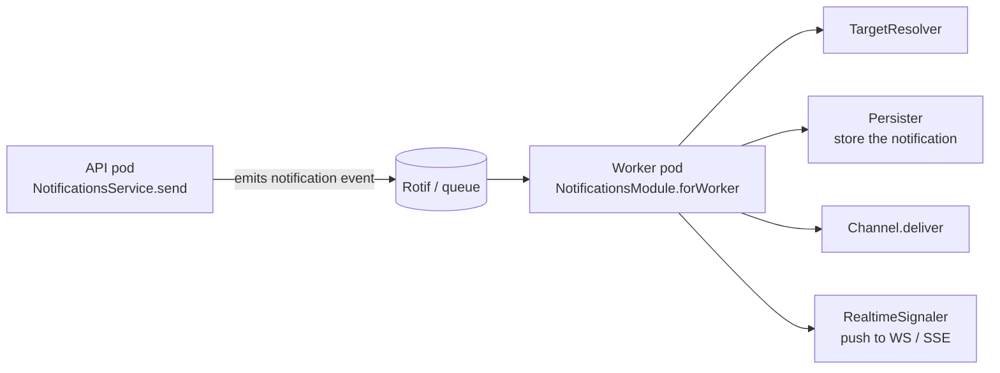

import ModuleBadge from '@site/src/components/ModuleBadge';

# titan-notifications

<ModuleBadge origin="official" pkg="@omnitron-dev/titan-notifications" status="stable" />

Multi-channel notification delivery (in-app, webhook, plus extensible
email / SMS / push abstractions) with a template engine, Redis-backed
rate limiting, per-user preferences, channel routing, scheduled and
broadcast send, and a separate **worker mode** for consuming
notification events from Rotif.

```bash
pnpm add @omnitron-dev/titan-notifications @omnitron-dev/titan-events @omnitron-dev/titan-redis
```

## When you need it

- **Multi-channel delivery.** Same payload, different channels per
  user (email + push for some, in-app only for others).
- **Templated messages.** Render once, send via any channel.
- **Preference-respecting workflow.** Users opt out of certain
  channels; rate limits stop you spamming.
- **Producer/worker split.** API pod publishes, worker pod consumes
  and delivers — `forRoot` and `forWorker` cover both ends.

## Quickstart — producer (the app that emits notifications)

```typescript
import { NotificationsModule } from '@omnitron-dev/titan-notifications';

@Module({
  imports: [
    TitanRedisModule.forRoot({ config: { url: env.REDIS_URL } }),
    NotificationsModule.forRoot({
      redis:           env.REDIS_URL,
      enableInApp:     true,
      enableWebhook:   true,
      defaultChannels: ['inapp', 'email'],
      templates:       { enabled: true, cacheEnabled: true },
      rateLimiterConfig: {
        defaultLimits: { perMinute: 10, perHour: 100, perDay: 1_000 },
        channelLimits: { sms: { perMinute: 1, perHour: 10 } },
      },
    }),
  ],
})
class AppModule {}
```

## Quickstart — worker (the pod that consumes and delivers)

```typescript
import { NotificationsModule } from '@omnitron-dev/titan-notifications';

@Module({
  imports: [
    NotificationsModule.forWorker({
      targetResolver:   NOTIFICATION_TARGET_RESOLVER,
      persister:        NOTIFICATION_PERSISTER,
      realtimeSignaler: NOTIFICATION_REALTIME_SIGNALER,
      workerOptions:    { concurrency: 8 },
    }),
  ],
  providers: [
    { provide: NOTIFICATION_TARGET_RESOLVER, useClass: MyUserResolver },
    { provide: NOTIFICATION_PERSISTER,        useClass: MyPersister },
    { provide: NOTIFICATION_REALTIME_SIGNALER,useClass: MyRealtimeSignaler },
  ],
})
class WorkerModule {}
```

The worker consumes events emitted by the producer (typically via
Rotif), looks up channel targets, persists the notification, and
signals realtime channels (WebSocket / SSE).

## `NotificationsModuleOptions`

| Option                    | Type                                                                                  |
| ------------------------- | ------------------------------------------------------------------------------------- |
| `transport`               | `{ useTransport?: MessagingTransport, rotif?: RotifTransportOptions }`                |
| `redis`                   | `RedisOptions \| string`                                                              |
| `rateLimiter`             | `IRateLimiter`                                                                        |
| `preferenceStore`         | `IPreferenceStore`                                                                    |
| `channelRouter`           | `IChannelRouter`                                                                      |
| `defaultChannels`         | `string[]`                                                                            |
| `channels`                | `NotificationChannel[]`                                                               |
| `enableInApp`             | `boolean` (default `true`; needs Redis)                                               |
| `enableWebhook`           | `boolean` (default `true`)                                                            |
| `inAppConfig`             | `{ keyPrefix?, defaultTTL?, maxNotificationsPerUser?, enableRealtime? }`              |
| `webhookConfig`           | `{ timeout?, retries?, signatureSecret?, signatureHeader? }`                          |
| `templates`               | `{ enabled?, cacheEnabled?, cacheTTL? }`                                              |
| `rateLimiterConfig`       | `{ keyPrefix?, defaultLimits, channelLimits?, enableBurstDetection? }`                |
| `preferenceStoreConfig`   | `{ keyPrefix?, defaultPreferences? }`                                                 |
| `isGlobal`                | `boolean`                                                                             |

Also: `forRootAsync({ useFactory, inject?, useExisting?, useClass?, imports?, isGlobal? })`.

## `NotificationsService` — the producer API

```typescript
import { NotificationsService, NOTIFICATIONS_SERVICE }
  from '@omnitron-dev/titan-notifications';

@Service({ name: 'notify' })
class NotifyService {
  constructor(@Inject(NOTIFICATIONS_SERVICE) private readonly notify: NotificationsService) {}

  @Public()
  async welcome(user: User) {
    await this.notify.send(
      { userId: user.id, email: user.email },
      { template: 'welcome', data: { name: user.name } },
      { channels: ['email', 'inapp'] },
    );
  }
}
```

| Method                                                                   | Returns                  |
| ------------------------------------------------------------------------ | ------------------------ |
| `send(recipient, payload, options?)`                                     | `Promise<SendResult>`    |
| `broadcast(recipients[], payload, options?)`                             | `Promise<BroadcastResult>` |
| `schedule(recipient, payload, scheduledAt)`                              | `Promise<ScheduleResult>`  |

The service:
1. Checks rate limits per channel per recipient.
2. Checks preferences (does the user opt in to this channel?).
3. Routes to the right channel via `IChannelRouter`.
4. Renders the template (if `template` is in the payload).
5. Hands off to the channel implementation.

## Channels

Out-of-the-box implementations + extensible bases:

| Channel class                | Purpose                                            |
| ---------------------------- | -------------------------------------------------- |
| `InAppChannel`               | In-app inbox; Redis-backed list per user           |
| `WebhookChannel`             | HMAC-signed HTTP POST to a URL                     |
| `AbstractEmailChannel`       | Base — extend for SMTP / Sendgrid / SES / etc.     |
| `AbstractSMSChannel`         | Base — extend for Twilio / Vonage / etc.           |
| `AbstractPushChannel`        | Base — extend for FCM / APNS / etc.                |
| `MockEmailChannel` / `MockSMSChannel` / `MockPushChannel` | Test doubles      |

A concrete channel typically implements just `deliver(recipient,
rendered, options)` plus optional `validate()`.

## Templates

```typescript
NotificationsModule.forRoot({
  templates: { enabled: true, cacheEnabled: true, cacheTTL: 60_000 },
})

// Use:
await this.notify.send(
  { userId, email },
  { template: 'welcome', data: { name: 'Ada' } },
);
```

`TemplateEngine` supports variable substitution via `{{name}}`
placeholders. Templates can be passed at boot or registered at
runtime. `DEFAULT_TEMPLATES` is exported as a starting set.

## Rate limiting and preferences

`RedisRateLimiter` enforces per-minute / per-hour / per-day limits
globally or per-channel; `RedisPreferenceStore` tracks per-user
opt-in/out per channel. Wired automatically when `redis:` is set.

```typescript
rateLimiterConfig: {
  defaultLimits:        { perMinute: 10, perHour: 100, perDay: 1_000, burstLimit: 5 },
  channelLimits:        { sms: { perMinute: 1, perHour: 10 } },
  enableBurstDetection: true,
}

preferenceStoreConfig: {
  defaultPreferences: { channels: { email: true, sms: false, push: true } },
}
```

## Worker model



Producer/worker split lets you scale delivery independently from the
request path and isolate flaky external providers (email, SMS) from
the API tier.

## `@OnNotification` decorator

```typescript
import { OnNotification } from '@omnitron-dev/titan-notifications';

@Injectable()
class AuditListener {
  @OnNotification({ pattern: 'sent', priority: 10 })
  async onSent(notification: any) { /* … */ }

  @OnNotification({ pattern: 'failed' })
  async onFailed(notification: any) { /* … */ }
}
```

Subscribe to delivery lifecycle events for observability, audit,
metrics.

## Health indicator

`NotificationsHealthIndicator` is exported and registers
automatically with [`titan-health`](./health.mdx) if both modules
are loaded.

## Tokens (selection)

| Token                                          |
| ---------------------------------------------- |
| `NOTIFICATIONS_SERVICE`                        |
| `NOTIFICATIONS_TRANSPORT`                      |
| `NOTIFICATIONS_MODULE_OPTIONS`                 |
| `NOTIFICATIONS_HEALTH`                         |
| `NOTIFICATIONS_RATE_LIMITER`                   |
| `NOTIFICATIONS_PREFERENCE_STORE`               |
| `NOTIFICATIONS_CHANNEL_ROUTER`                 |
| `NOTIFICATIONS_EVENT_EMITTER`                  |
| `NOTIFICATIONS_CHANNEL_REGISTRY`               |
| `NOTIFICATIONS_TEMPLATE_ENGINE`                |
| `NOTIFICATION_TARGET_RESOLVER`                 |
| `NOTIFICATION_PERSISTER`                       |
| `NOTIFICATION_REALTIME_SIGNALER`               |

## Lifecycle

The service is registered as a Titan provider; standard lifecycle
hooks apply. The worker mode (`forWorker`) starts a Rotif consumer
during the application `onStart` phase and stops it on `onStop`.

## Anti-patterns

- **Sending from the request path.** Heavy channels (SMS / email)
  can take seconds. Send via the worker pattern, not directly in
  the request handler.
- **Skipping preferences.** Sending to users who opted out is a
  compliance risk in many jurisdictions. Always wire
  `preferenceStore`.
- **Per-user templates.** Templates are content; per-user data goes
  in the `data` payload. Pre-render with the engine, not in code.
- **No rate limits.** Without limits, a runaway loop can spam every
  user in your database in minutes.

## See also

- [`titan-events`](./events.mdx) — in-process events; this module
  bridges them to multi-channel delivery
- [`titan-redis`](./redis.mdx) — backs rate limiter, preference
  store, and Rotif
- [`titan-ratelimit`](./ratelimit.mdx) — pluggable rate limiter
  for the producer side
