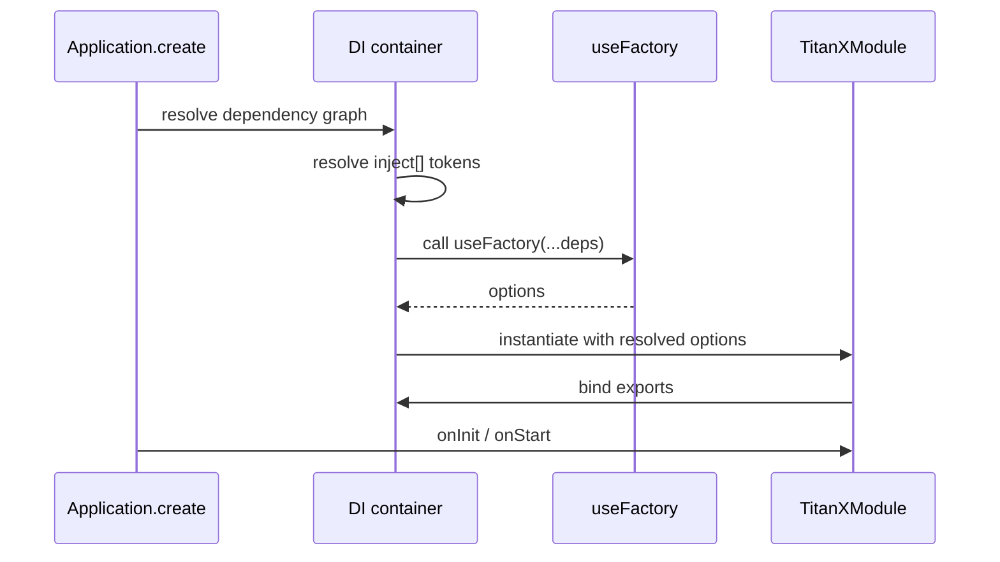

import ModuleBadge from '@site/src/components/ModuleBadge';

# Options patterns

Every Titan module is configured through one of four static factory
methods. They are intentionally repetitive across modules — the
shape stays the same so muscle memory transfers from one module to
the next. This page gives you the canonical examples plus a
support matrix so you know which factory each module actually
implements.

## Support matrix

<ModuleBadge origin="official" pkg="@omnitron-dev/titan-*" />

| Module                        | `forRoot` | `forRootAsync` | `forFeature` | `forWorker` |
| ----------------------------- | :-------: | :------------: | :----------: | :---------: |
| `titan-auth`                  |     ✓     |       ✓        |       —      |       —     |
| `titan-cache`                 |     ✓     |       ✓        |       ✓      |       —     |
| `titan-database`              |     ✓     |       ✓        |       ✓      |       —     |
| `titan-discovery`             |     ✓     |       —        |       —      |       —     |
| `titan-events`                |     ✓     |       ✓        |       ✓      |       —     |
| `titan-health`                |     ✓     |       ✓        |       ✓      |       —     |
| `titan-lock`                  |     ✓     |       ✓        |       —      |       —     |
| `titan-metrics`               |     ✓     |       ✓        |       —      |       —     |
| `titan-notifications`         |     ✓     |       ✓        |       —      |       ✓     |
| `titan-pm`                    |     ✓     |       ✓        |       —      |       —     |
| `titan-ratelimit`             |     ✓     |       ✓        |       —      |       —     |
| `titan-redis`                 |     ✓     |       ✓        |       ✓      |       —     |
| `titan-scheduler`             |     ✓     |       ✓        |       ✓      |       —     |
| `titan-telemetry-relay`       |     —     |       —        |       —      |       —     |

> `titan-telemetry-relay` does **not** ship a Module class. Use
> `new TelemetryRelayService(options)` directly and wire it via a
> `useValue` provider when DI integration is wanted.

<ModuleBadge origin="built-in" pkg="@omnitron-dev/titan" subpath="config + logger" />

Built-in modules follow the same pattern:

| Module     | `forRoot` | `forRootAsync` | `forFeature` |
| ---------- | :-------: | :------------: | :----------: |
| `config`   |     ✓     |       ✓        |       —      |
| `logger`   |     ✓     |       ✓        |       —      |

## `forRoot(options)` — synchronous configuration

The simplest form. Options are known at boot time.

```typescript
@Module({
  imports: [
    TitanRedisModule.forRoot({
      config: { host: 'localhost', port: 6379, db: 0 },
    }),
    TitanCacheModule.forRoot({
      defaultTTL: 60,
      maxItems:   10_000,
    }),
  ],
})
class AppModule {}
```

Use when:
- Options come from a literal object or `process.env` read.
- No other module's services need to compute the options.

## `forRootAsync({ useFactory, inject?, imports? })` — DI-driven

When the options depend on another module's service — most often
`ConfigService` — use the async variant.

```typescript
import { TitanRedisModule } from '@omnitron-dev/titan-redis';
import { CONFIG_SERVICE_TOKEN, ConfigService }
  from '@omnitron-dev/titan/module/config';

@Module({
  imports: [
    TitanRedisModule.forRootAsync({
      useFactory: (config: ConfigService) => ({
        config: {
          host: config.get('redis.host'),
          port: config.get('redis.port'),
          db:   config.get('redis.db'),
        },
      }),
      inject: [CONFIG_SERVICE_TOKEN],
    }),
  ],
})
class AppModule {}
```

The factory:
- Receives the injected dependencies in the order declared in `inject`.
- Returns the same `options` shape as `forRoot()`.
- May be sync or async (`async (config) => {...}` is fine).

### Importing extra modules into the factory scope

If your factory depends on services that aren't globally exported,
import their host module:

```typescript
TitanCacheModule.forRootAsync({
  imports: [SecretsModule],                    // brings SecretsService into scope
  useFactory: (secrets: SecretsService) => ({
    redis: { url: secrets.get('REDIS_URL') },
  }),
  inject: [SecretsService],
}),
```

### `useClass` / `useExisting` variants

Some modules also accept class-based provider variants:

```typescript
NotificationsModule.forRootAsync({
  useClass: NotificationsOptionsFactory,       // implements `createNotificationsOptions(): Options`
})

// Or reuse an existing factory exported by another module:
NotificationsModule.forRootAsync({
  useExisting: SharedOptionsFactory,
})
```

Refer to per-module pages — `useClass` and `useExisting` are
supported by `titan-notifications` but not uniformly by all
modules.

## `forFeature(...)` — register additional resources

`forFeature` is for *adding* per-feature configuration **after**
the global module has been bound. Shape varies per module.

### `titan-database.forFeature(repositories)`

```typescript
@Module({
  imports: [
    TitanDatabaseModule.forFeature([
      UsersRepository,
      OrdersRepository,
    ]),
  ],
})
class UsersModule {}
```

Each repository becomes injectable by class reference; the
underlying `Database` connection is the one registered by the
global `TitanDatabaseModule.forRoot(...)`.

### `titan-cache.forFeature(caches)`

```typescript
@Module({
  imports: [
    TitanCacheModule.forFeature([
      { name: 'users',  defaultTTL: 300 },
      { name: 'tokens', defaultTTL: 60  },
    ]),
  ],
})
class CacheLayerModule {}
```

Multiple named caches share the same backing store but have
independent TTLs and namespacing.

### `titan-events.forFeature(emitters)`

Adds event metadata / discovery for additional event-emitting
services. See [`titan-events`](./events.mdx).

### `titan-health.forFeature(indicators)`

Registers additional `IHealthIndicator` classes after `forRoot`:

```typescript
@Module({
  imports: [
    TitanHealthModule.forFeature([
      StripeHealthIndicator,
      SearchClusterIndicator,
    ]),
  ],
})
class FeatureModule {}
```

### `titan-redis.forFeature(clients)`

Adds named Redis clients:

```typescript
@Module({
  imports: [
    TitanRedisModule.forFeature(['cache', 'queue']),
  ],
})
class MultiClientModule {}
```

Inject via the token factory:

```typescript
import { getRedisClientToken } from '@omnitron-dev/titan-redis';

constructor(
  @Inject(getRedisClientToken('cache')) private cacheRedis: Redis,
  @Inject(getRedisClientToken('queue')) private queueRedis: Redis,
) {}
```

### `titan-scheduler.forFeature(providers)`

Registers additional providers that own `@Cron` / `@Interval` /
`@Timeout` methods, ensuring the scheduler discovers them.

## `forWorker(...)` — separate runtime

`titan-notifications` ships this fourth factory specifically for
the **worker** pod — the one that consumes the messaging
transport and actually delivers messages. The producer pod uses
`forRoot`; the worker pod uses `forWorker`.

```typescript
// Worker pod
@Module({
  imports: [
    NotificationsModule.forWorker({
      targetResolver:   NOTIFICATION_TARGET_RESOLVER,
      persister:        NOTIFICATION_PERSISTER,
      realtimeSignaler: NOTIFICATION_REALTIME_SIGNALER,
      workerOptions:    { concurrency: 8 },
    }),
  ],
  providers: [
    { provide: NOTIFICATION_TARGET_RESOLVER, useClass: MyTargetResolver },
    { provide: NOTIFICATION_PERSISTER,        useClass: MyPersister },
    { provide: NOTIFICATION_REALTIME_SIGNALER,useClass: MyRealtimeSignaler },
  ],
})
class NotificationsWorkerModule {}
```

This separation lets you scale producers (web pods) independently
from workers (delivery pods).

## Global vs scoped modules

Most modules accept `isGlobal: true` (or `global: true` on the
returned `DynamicModule`) — when set, the module's exports are
visible to every other module without explicit re-import.

```typescript
TitanRedisModule.forRoot({ config, isGlobal: true });
```

| When                                              | Recommendation                  |
| ------------------------------------------------- | ------------------------------- |
| Infrastructure (config, logger, redis, database)  | `isGlobal: true`                |
| Feature modules (your business logic)             | leave scoped                    |
| Test environments                                 | scoped — easier to override     |

## Async lifecycle of `forRootAsync`



The factory is called **once** per app boot, after its declared
`inject:` dependencies are resolved. The resolved options are then
used to instantiate the module's services.

## Common gotchas

- **`inject:` order must match factory arguments.** A misordered
  array silently passes the wrong service to the wrong parameter.
  Prefer named destructuring + tuple typing:
  ```typescript
  useFactory: (config: ConfigService, redis: Redis) => ({...}),
  inject: [CONFIG_SERVICE_TOKEN, REDIS_TOKEN],
  ```
- **`forFeature` before `forRoot`** — the global module has to be
  bound first or `forFeature` won't find what to attach to.
  `Application.create({ modules: [GlobalModule, FeatureModule] })`
  resolves order from the dependency graph, but if you're loading
  them in `imports: []` manually, list `forRoot` first.
- **Hardcoding `redisOptions` in two modules** — when you let
  `titan-cache`, `titan-lock`, `titan-discovery`, etc. each spin
  up their own Redis connection, you triple-count connections.
  Configure `TitanRedisModule` once and let the other modules
  pick up the shared client.
- **Calling `forRoot` twice** — the second call typically wins,
  which is rarely what you want. If you need different options for
  different scopes, use `forFeature` (where supported) or
  consciously override via test fixtures.
- **`forRootAsync` factory throwing.** A throw aborts boot with
  the original error wrapped in a `ModuleResolutionError`. Don't
  log-and-swallow; let it crash so the operator sees the
  configuration mistake.

## Migration tip — sync to async

Start with `forRoot({...})`. The moment you need a value from
`ConfigService` (or any other service), switch the call to
`forRootAsync({useFactory, inject})`. The options object shape
stays identical — only the wrapper changes.

```typescript
// Before
TitanRedisModule.forRoot({ config: { url: 'redis://localhost' } })

// After
TitanRedisModule.forRootAsync({
  useFactory: (cfg: ConfigService) => ({ config: { url: cfg.get('redis.url') } }),
  inject:     [CONFIG_SERVICE_TOKEN],
})
```

## See also

- [Module map](./module-map.mdx) — visual dependency graph
- [Tokens & RPC reference](./tokens-reference.mdx) — what to put
  in `inject:`
- [Modules system / Dynamic modules](../modules-system/dynamic-modules.md) —
  the underlying `DynamicModule` mechanism this all sits on
- [Authoring a module](../modules-system/authoring-modules.md) —
  how to implement these patterns when building your own
