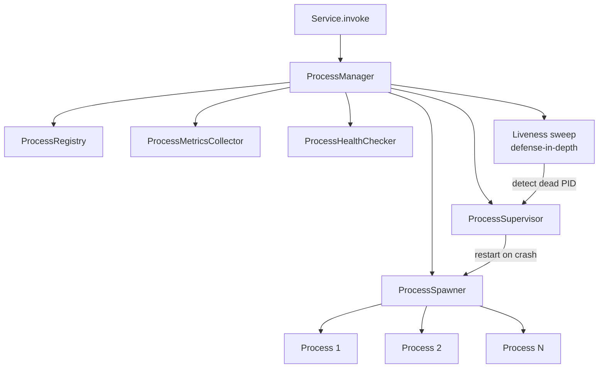

import ModuleBadge from '@site/src/components/ModuleBadge';

# titan-pm

<ModuleBadge origin="official" pkg="@omnitron-dev/titan-pm" status="stable" />

Process supervision with worker pools, IPC (Unix / TCP / WebSocket),
supervisor patterns, restart policies with exponential backoff,
resource limits, metrics + health collection, a transparent service
proxy that makes every process behave like a local Netron service,
and a rich decorator set for workflows, actors, sagas, and
resilience.

```bash
pnpm add @omnitron-dev/titan-pm
```

## When you need it

- **CPU-bound work.** Image processing, ML inference, parsing —
  isolate from the main event loop.
- **Crash isolation.** A worker crash should not take the whole app
  down. Supervisors restart with backoff and policy.
- **Worker pools.** Many parallel workers across CPUs with load
  balancing.
- **Actor model / sagas.** Long-running stateful processes with
  compensation logic.

## Quickstart

```typescript
import { ProcessManagerModule } from '@omnitron-dev/titan-pm';

@Module({
  imports: [
    ProcessManagerModule.forRoot({
      isolation: 'worker',                       // 'worker' | 'process' | 'thread'
      transport: 'unix',                          // 'unix' | 'tcp' | 'websocket'
      restartPolicy: {
        enabled:     true,
        maxRestarts: 3,
        window:      60_000,
        delay:       1_000,
        backoff:     { type: 'exponential', initial: 1_000, max: 30_000, factor: 2 },
      },
      resources: {
        maxMemory: '512MB',
        maxCpu:    1.0,
        timeout:   30_000,
      },
      monitoring: {
        healthCheck: { interval: 5_000, timeout: 2_000 },
        metrics:     true,
        tracing:     false,
      },
    }),
  ],
})
class AppModule {}
```

Async config via `forRootAsync({ useFactory, inject?, useExisting? })`.

## `IProcessManagerConfig`

| Option            | Type                                                                                                |
| ----------------- | --------------------------------------------------------------------------------------------------- |
| `isolation`       | `'worker' \| 'process' \| 'thread'`                                                                 |
| `transport`       | `'unix' \| 'tcp' \| 'websocket'`                                                                    |
| `restartPolicy`   | `{ enabled, maxRestarts, window, delay, backoff?: { type, initial, max, factor? } }`               |
| `resources`       | `{ maxMemory, maxCpu, timeout }`                                                                    |
| `monitoring`      | `{ healthCheck: { interval, timeout }, metrics, tracing }`                                          |
| `testing`         | `{ useMockSpawner }`                                                                                |
| `advanced`        | `{ gracefulShutdownTimeout, livenessSweepIntervalMs, handleSignals }`                              |

Defaults are pulled from `DEFAULT_PM_CONFIG`.

## `ProcessManager` — the API

```typescript
import { ProcessManager, PM_MANAGER_TOKEN, Process, Public }
  from '@omnitron-dev/titan-pm';

@Process({ name: 'image-worker' })
class ImageWorker {
  @Public()
  async resize(input: Buffer, width: number): Promise<Buffer> {
    return sharp(input).resize(width).toBuffer();
  }
}

@Service({ name: 'media' })
class MediaService {
  constructor(@Inject(PM_MANAGER_TOKEN) private readonly pm: ProcessManager) {}

  @Public()
  async resize(input: Buffer, width: number) {
    const worker = await this.pm.spawn(ImageWorker);
    return worker.resize(input, width);     // transparent RPC call
  }
}
```

| Method                                                                  | Returns                                       |
| ----------------------------------------------------------------------- | --------------------------------------------- |
| `spawn<T>(processClass, options?)`                                      | `Promise<ServiceProxy<T>>`                    |
| `createPool<T>(processClass, options?)`                                 | `ProcessPool<T>`                              |
| `createSupervisor<T>(processClass, options?)`                           | `ProcessSupervisor`                           |
| `getProcessInfo(id)`                                                    | `IProcessInfo \| undefined`                   |
| `getAllProcesses()`                                                     | `IProcessInfo[]`                              |
| `stopProcess(id, timeout?)`                                             | `Promise<void>`                               |
| `stopAll(timeout?)`                                                     | `Promise<void>`                               |
| `getMetrics(processId?)`                                                | `IProcessMetrics \| Map<string, IProcessMetrics>` |
| `health()`                                                              | `Promise<IHealthStatus>`                      |

The `ServiceProxy` returned by `spawn()` exposes every `@Public`
method of the process class as a typed remote call — transport
details are hidden.

### Worker pools

```typescript
const pool = this.pm.createPool(ImageWorker, { min: 2, max: 8 });
const result = await pool.invoke('resize', [input, width]);
```

The pool routes the call to a free worker, queues if all workers
are busy, and respects the pool's load-balancing policy.

### Supervisors

```typescript
const supervisor = this.pm.createSupervisor(ParentProcess);
```

Supervisor coordinates child processes and applies restart policies
from the module config (or per-supervisor overrides).

## Decorators

The rich decorator set is what makes processes feel like local
services. Annotated processes can declare lifecycle, observability,
resilience, and saga semantics declaratively.

### Class-level

| Decorator         | Purpose                                                          |
| ----------------- | ---------------------------------------------------------------- |
| `@Process(opts?)` | Mark a class as a runnable process                               |
| `@Workflow(opts?)`| Multi-step workflow (state machine)                              |
| `@Actor()`        | Actor model (one-process serial mailbox)                         |
| `@Supervisor(opts?)`| Supervisor for child processes                                 |

### Method-level — exposure and lifecycle

| Decorator         | Purpose                                                          |
| ----------------- | ---------------------------------------------------------------- |
| `@Public()`       | Expose method over IPC                                           |
| `@Stage()`        | Workflow stage                                                   |
| `@Compensate()`   | Saga compensation handler — runs to undo a failed stage          |
| `@HealthCheck()`  | Mark method as the health check                                  |
| `@OnShutdown()`   | Cleanup hook before the process exits                            |
| `@Child()`        | Supervisor: declare a supervised child                           |

### Method-level — observability

| Decorator         | Purpose                                                          |
| ----------------- | ---------------------------------------------------------------- |
| `@Trace()`        | Distributed tracing span                                         |
| `@Metric()`       | Auto-instrument metric                                           |
| `@Validate()`     | Validate input                                                   |
| `@Cache()`        | Cache the result                                                 |

### Method-level — resilience

| Decorator             | Purpose                                                      |
| --------------------- | ------------------------------------------------------------ |
| `@CircuitBreaker()`   | Circuit-break the method                                     |
| `@RateLimit()`        | Rate-limit the method                                        |
| `@Idempotent()`       | Mark as idempotent (safe to retry, deduplicate by key)       |

### Combined example — a worker class

```typescript
import {
  Process, Public, OnShutdown, HealthCheck,
  Trace, Metric, CircuitBreaker, Idempotent,
} from '@omnitron-dev/titan-pm';

@Process({ name: 'image-worker' })
class ImageWorker {
  @Public()
  @Trace()
  @Metric({ counter: 'images.resized', histogram: 'images.resize.ms' })
  @CircuitBreaker({ failureThreshold: 5, timeout: 30_000 })
  @Idempotent({ keyFn: (input, w) => `${hash(input)}:${w}` })
  async resize(input: Buffer, width: number): Promise<Buffer> {
    return sharp(input).resize(width).toBuffer();
  }

  @HealthCheck()
  async health() {
    return { status: 'healthy', queueDepth: this.queue.size };
  }

  @OnShutdown()
  async cleanup() {
    await this.queue.drain();
  }
}
```

## Architecture



The **liveness sweep** is defense-in-depth: even if a process exits
without firing its exit signal, the sweep detects the dead PID
(every `livenessSweepIntervalMs`, default 30 s) and tells the
supervisor to restart per policy.

## Tokens

| Token                   |
| ----------------------- |
| `PM_CONFIG_TOKEN`       |
| `PM_MANAGER_TOKEN`      |
| `PM_REGISTRY_TOKEN`     |
| `PM_SPAWNER_TOKEN`      |
| `PM_METRICS_TOKEN`      |
| `PM_HEALTH_TOKEN`       |

## Lifecycle

`ProcessManager` is registered as a singleton service. On
application shutdown, `stopAll()` runs to gracefully terminate
every spawned process (respects `gracefulShutdownTimeout`).

## Isolation modes

| Isolation | Backed by              | Best for                                                  |
| --------- | ---------------------- | --------------------------------------------------------- |
| `worker`  | `worker_threads`       | CPU-bound work, low IPC latency; shared memory option     |
| `process` | `child_process.fork`   | Strong isolation, ability to crash without taking down peers |
| `thread`  | Native threads (where supported) | Specialised workloads                            |

## Transport choice

| Transport   | Best for                                            |
| ----------- | --------------------------------------------------- |
| `unix`      | Local IPC; lowest latency on the same host          |
| `tcp`       | Cross-host workers; encrypt with TLS if needed     |
| `websocket` | Long-lived workers behind a proxy                   |

## Anti-patterns

- **Tiny tasks in `process` isolation.** Process fork has ~50 ms
  startup cost. Reserve for long-lived work or pre-warmed pools.
- **No restart policy.** A crashing worker keeps respawning at
  full speed without `restartPolicy: { backoff }`. Always set
  exponential backoff with a cap.
- **No `@OnShutdown`.** Workers killed mid-task lose work in flight.
  Drain queues in the shutdown hook.
- **Sharing mutable state via IPC.** IPC is for messages, not
  shared mutable state. If you need shared state, put it in Redis
  or a database.

## See also

- [Resilience / Retry](../resilience/retry.md), [Circuit Breaker](../resilience/circuit-breaker.md)
- [`titan-metrics`](./metrics.mdx) — collects process metrics
  when `monitoring.metrics: true`
- [`titan-events`](./events.mdx) — inter-process event delivery
