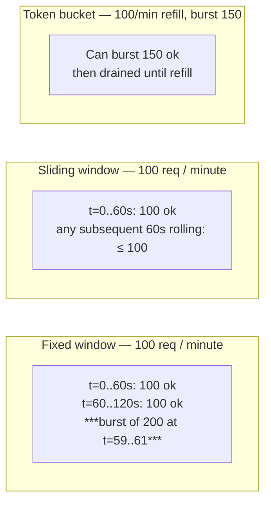
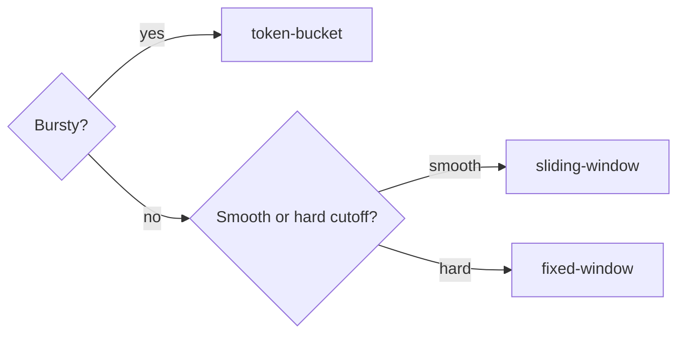

import ModuleBadge from '@site/src/components/ModuleBadge';

# titan-ratelimit

<ModuleBadge origin="official" pkg="@omnitron-dev/titan-ratelimit" status="stable" />

Unified rate limiting with three algorithms (sliding-window,
fixed-window, token-bucket), pluggable storage (in-memory or Redis),
tiered plans, optional queueing for fair processing of excess
requests, per-method `@RateLimit` / `@Throttle` decorators, and
statistics tracking with per-tier breakdown.

```bash
pnpm add @omnitron-dev/titan-ratelimit
```

## Algorithms

| Strategy            | Behaviour                                                                  | Best for                          |
| ------------------- | -------------------------------------------------------------------------- | --------------------------------- |
| `'sliding-window'`  | Continuously rolling window; smooth limits                                 | API per-user / IP throttling      |
| `'fixed-window'`    | Hard-reset at window boundary; simpler / cheaper                           | Per-hour quotas, accounting       |
| `'token-bucket'`    | Tokens refill at a rate; can burst up to bucket size                       | Bursty workloads with smooth refill |

### Fairness comparison



- **Fixed window** is the cheapest to implement (one counter, one
  TTL) but allows a 2× burst around boundaries — 100 requests in
  the last second of one window and 100 in the first second of
  the next looks like 200 in 2 seconds.
- **Sliding window** is the fairest at the cost of one sorted set
  operation per check.
- **Token bucket** lets clients burst above the steady rate up to
  the bucket size — best for "usually quiet, sometimes spikes"
  workloads.

## Quickstart

### In-memory (single-pod)

```typescript
import { TitanRateLimitModule } from '@omnitron-dev/titan-ratelimit';

@Module({
  imports: [
    TitanRateLimitModule.forRoot({
      enabled:         true,
      strategy:        'sliding-window',
      defaultLimit:    100,
      defaultWindowMs: 60_000,
      storageType:     'memory',
    }),
  ],
})
class AppModule {}
```

### Redis-backed (multi-pod)

```typescript
TitanRateLimitModule.forRoot({
  storageType:     'redis',
  strategy:        'token-bucket',
  defaultLimit:    100,
  defaultWindowMs: 60_000,
  burstLimit:      150,
  tokenRefillRate: 100,
  keyPrefix:       'rl',
  queueEnabled:    true,
  maxQueueSize:    1_000,
  queueTimeoutMs:  5_000,
  tiers: {
    free:       { name: 'free',       limit: 10,    windowMs: 60_000 },
    pro:        { name: 'pro',        limit: 1_000, windowMs: 60_000 },
    enterprise: { name: 'enterprise', limit: 10_000, windowMs: 60_000, burst: 5_000 },
  },
})
```

Async config via `forRootAsync({ useFactory, inject?, imports?, isGlobal? })`.

## `IRateLimitModuleOptions`

| Option              | Type                                                              | Default               |
| ------------------- | ----------------------------------------------------------------- | --------------------- |
| `enabled`           | `boolean`                                                         | `true`                |
| `strategy`          | `'sliding-window' \| 'fixed-window' \| 'token-bucket'`            | `'sliding-window'`    |
| `keyPrefix`         | `string`                                                          | `'ratelimit'`         |
| `defaultLimit`      | `number`                                                          | `100`                 |
| `defaultWindowMs`   | `number` (ms)                                                     | `60_000`              |
| `burstLimit`        | `number` (0 disables burst)                                       | `0`                   |
| `tokenRefillRate`   | `number` (tokens / window)                                        | `100`                 |
| `queueEnabled`      | `boolean`                                                         | `false`               |
| `maxQueueSize`      | `number`                                                          | `1_000`               |
| `queueTimeoutMs`    | `number` (ms — max wait in queue)                                 | `5_000`               |
| `storageType`       | `'memory' \| 'redis'`                                             | `'memory'`            |
| `tiers`             | `Record<string, IRateLimitTier>`                                  | —                     |
| `defaultTier`       | `IRateLimitTier`                                                  | —                     |
| `isGlobal`          | `boolean`                                                         | `false`               |

## `IRateLimitTier`

```typescript
interface IRateLimitTier {
  name:      string;
  limit:     number;
  burst?:    number;       // extra allowance above limit
  priority?: number;       // for queue ordering
  windowMs?: number;
}
```

The effective limit for a check is `tier.limit + (tier.burst ??
options.burstLimit)`.

## `RateLimitService` — the API

```typescript
import { RATE_LIMIT_SERVICE_TOKEN, type IRateLimitService }
  from '@omnitron-dev/titan-ratelimit';

@Service('charges@1.0.0')
class ChargesService {
  constructor(@Inject(RATE_LIMIT_SERVICE_TOKEN) private readonly rate: IRateLimitService) {}

  @Public()
  async charge(userId: string, amount: number) {
    const result = await this.rate.consume(`charge:${userId}`, { tier: 'pro' });
    if (!result.allowed) {
      throw Errors.tooManyRequests('too many charge attempts', { retryAfter: result.retryAfter });
    }
    // proceed
  }
}
```

| Method                                                            | Returns                                          |
| ----------------------------------------------------------------- | ------------------------------------------------ |
| `check(options)`                                                  | `Promise<IRateLimitResult>` — full options       |
| `consume(key, options?)`                                          | `Promise<IRateLimitResult>` — convenience: consume = true |
| `enforce(key, options?)`                                          | `Promise<void>` — throws `RateLimitExceededError` on reject |
| `getStatus(key, options?)`                                        | `Promise<IRateLimitResult>` — read-only check (consume = false) |
| `reset(key, tier?)`                                               | `Promise<void>`                                  |
| `getStats()`                                                      | `IRateLimitStats` — overall + per-tier breakdown |

The difference:
- `consume()` returns a result; you inspect `result.allowed`.
- `enforce()` throws `RateLimitExceededError` if rejected — the
  thrown error carries `result` so you can read `retryAfter`,
  `remaining`, `limit`, etc.

Prefer `consume()` when you want to handle the rate-limit case
with a custom response shape; prefer `enforce()` when you want a
single line that "just blocks".

## `IRateLimitResult`

```typescript
interface IRateLimitResult {
  allowed:     boolean;
  remaining:   number;
  limit:       number;       // includes burst (effective limit)
  resetAt:     number;       // epoch ms when window resets
  retryAfter?: number;       // seconds — set only when allowed=false
  tier?:       string;       // set if a tier was used
}
```

Surface to HTTP clients as standard rate-limit headers:

```typescript
const result = await rate.consume(key);
res.setHeader('X-RateLimit-Limit',     result.limit.toString());
res.setHeader('X-RateLimit-Remaining', result.remaining.toString());
res.setHeader('X-RateLimit-Reset',     Math.ceil(result.resetAt / 1000).toString());
if (!result.allowed) {
  res.setHeader('Retry-After', result.retryAfter!.toString());
  return res.status(429).end();
}
```

## Decorators

### `@RateLimit(options?)`

```typescript
import { RateLimit } from '@omnitron-dev/titan-ratelimit';

@Public()
@RateLimit({ limit: 10, windowMs: 60_000 })
async createUser(input: CreateInput) { /* … */ }
```

### `@Throttle(rps)` — convenience

```typescript
import { Throttle } from '@omnitron-dev/titan-ratelimit';

@Public()
@Throttle(10)                                  // ≤ 10 requests / sec
async search(q: string) { /* … */ }
```

`@Throttle(rps)` is equivalent to `@RateLimit({ limit: rps,
windowMs: 1_000 })`.

## Storage backends

| Backend       | Class                          | When                                                    |
| ------------- | ------------------------------ | ------------------------------------------------------- |
| `'memory'`    | `MemoryRateLimitStorage`       | Single-pod; lower latency; counts lost on restart       |
| `'redis'`     | `RedisRateLimitStorage`        | Multi-pod; persisted across restarts; cluster-aware     |

### `IRateLimitStorage` interface

Custom backends implement:

```typescript
interface IRateLimitStorage {
  increment(key: string, ttl?: number): Promise<number>;
  get(key: string): Promise<number | null>;
  set(key: string, value: number, ttl?: number): Promise<void>;
  delete(key: string): Promise<void>;

  // Sliding window primitives
  addToSortedSet(key: string, score: number, member: string, ttl?: number): Promise<void>;
  removeFromSortedSetByScore(key: string, min: number, max: number): Promise<void>;
  countSortedSet(key: string): Promise<number>;
}
```

The Redis backend uses Lua scripts for the
sliding/fixed-window counters (atomic increment + TTL set) and
`INCR`/`EXPIRE` for token bucket — single-roundtrip per check.

## Tiered plans

```typescript
TitanRateLimitModule.forRoot({
  defaultTier: { name: 'free', limit: 10, windowMs: 60_000 },
  tiers: {
    free:       { name: 'free',       limit: 10,     windowMs: 60_000 },
    pro:        { name: 'pro',        limit: 1_000,  windowMs: 60_000 },
    enterprise: { name: 'enterprise', limit: 10_000, windowMs: 60_000, burst: 5_000 },
  },
})
```

The tier is selected per call via the `tier` option to `consume()` /
`enforce()`:

```typescript
const tier = user.plan ?? 'free';
await rate.enforce(`api:${user.id}`, { tier });
```

When a tier is specified, the result includes the tier name and
`getStats()` exposes per-tier checks / allowed / denied counts:

```typescript
const stats = rate.getStats();
// stats.byTier?.get('pro') === { checks, allowed, denied }
```

## Queueing

When `queueEnabled: true`, excess requests **wait** in a queue
instead of immediately rejecting — useful when latency variance is
preferred over rejection.

```typescript
TitanRateLimitModule.forRoot({
  queueEnabled:   true,
  maxQueueSize:   1_000,        // drop after this many waiting
  queueTimeoutMs: 5_000,        // give up if not processed in time
})
```

Queueing semantics:

- **`maxQueueSize` exceeded** → new requests are rejected with
  `RateLimitExceededError` immediately.
- **`queueTimeoutMs` elapsed** → waiting request is rejected with
  the same error (`retryAfter` indicates how long to wait).
- **Tier priority** — when tiers specify `priority`, higher-
  priority tiers are processed first inside the queue.

> **Don't enable queueing on unauthenticated endpoints.** It turns
> rejections into work — an attacker can saturate the queue and
> starve legitimate requests. Use queueing only inside trust
> boundaries (after auth).

## Per-algorithm distributed coordination

When `storageType: 'redis'` and multi-pod, each algorithm uses a
slightly different Redis primitive set:

| Strategy            | Redis primitives                        | Atomicity                            |
| ------------------- | --------------------------------------- | ------------------------------------ |
| `'fixed-window'`    | `INCR` + `EXPIRE` (or single Lua)       | Atomic per-key                       |
| `'sliding-window'`  | `ZADD` + `ZREMRANGEBYSCORE` + `ZCARD`   | Atomic via Lua script                |
| `'token-bucket'`    | `INCR` for counter; refill computed in script | Atomic via Lua script          |

All Lua scripts touch one key, so cluster-mode hash slots are not
an issue for a single check. Across keys (different users) there's
no cross-key coordination — desired for rate limiting.

## Recipes

### Per-IP throttle (behind trusted proxy)

```typescript
@Public()
@RateLimit({ limit: 60, windowMs: 60_000 })
async search(q: string, @Context() ctx: RequestContext) {
  const ip = ctx.headers['x-forwarded-for']?.split(',')[0]?.trim()
           ?? ctx.peerAddress;
  await this.rate.enforce(`ip:${ip}`);
  return this.searchEngine.run(q);
}
```

> Trust the client IP only behind a known trusted proxy chain.
> Otherwise an attacker spoofs `X-Forwarded-For` and bypasses
> per-IP limits.

### Per-user, tier-aware

```typescript
async getReport(@Auth() user: AuthContext) {
  const tier = user.plan ?? 'free';
  const result = await this.rate.consume(`reports:${user.id}`, { tier });

  if (!result.allowed) {
    throw Errors.tooManyRequests(
      `Report quota exceeded on ${tier} plan`,
      { retryAfter: result.retryAfter, upgrade: `https://app/upgrade?from=${tier}` },
    );
  }
  return this.reports.generate(user.id);
}
```

### Per-API-key, burst-tolerant

```typescript
TitanRateLimitModule.forRoot({
  strategy:        'token-bucket',
  defaultLimit:    100,
  burstLimit:      50,           // tolerate spikes up to 150
  tokenRefillRate: 100,          // refills at 100/min
});

// In your service:
await this.rate.enforce(`api-key:${apiKey}`);
```

Bursts up to 150 succeed; sustained rate above 100/min refills
slower than consumption and starts rejecting.

### Per-endpoint compound key

```typescript
@RateLimit({ limit: 5, windowMs: 60_000 })
async resetPassword(@Auth() user: AuthContext) {
  // Effective key under the hood: `ratelimit:resetPassword:${user.id}`
  // (the decorator builds compound keys from method name + auth context)
}
```

## Performance notes

| Cost dimension                       | Memory backend     | Redis backend                       |
| ------------------------------------ | ------------------ | ----------------------------------- |
| Per-check latency                    | sub-μs             | one RTT (~0.5–2 ms LAN)             |
| Per-check Redis ops                  | 0                  | 1 Lua script (atomic)               |
| Memory per active key                | O(window-buckets)  | O(window-buckets) on Redis          |
| Sliding-window storage cost          | O(N) timestamps    | O(N) sorted-set entries             |
| Fixed-window storage cost            | O(1)               | O(1) — single counter               |
| Token-bucket storage cost            | O(1)               | O(1) — counter + timestamp          |

For most workloads:
- **High RPS per pod, lax fairness:** in-memory + fixed-window.
- **Multi-pod, smooth fairness:** Redis + sliding-window.
- **Multi-pod, bursty traffic:** Redis + token-bucket.

## Tokens

| Token                          | Type                          |
| ------------------------------ | ----------------------------- |
| `RATE_LIMIT_SERVICE_TOKEN`     | `IRateLimitService`           |
| `RATE_LIMIT_OPTIONS_TOKEN`     | `IRateLimitModuleOptions`     |
| `RATE_LIMIT_STORAGE_TOKEN`     | `IRateLimitStorage`           |

## Lifecycle

The service uses periodic cleanup intervals on the in-memory
storage (sweeping expired keys); no explicit lifecycle hooks
beyond the standard ones. On module shutdown, `destroy()` clears
the cleanup timer and closes the Redis storage client where
applicable.

## Algorithm selection — what to pick



- **Token bucket** — for bursty traffic where you allow `burstLimit`
  spikes that refill at `tokenRefillRate`.
- **Sliding window** — for smooth, fair rate limiting where you
  don't want users to "save up" allowance.
- **Fixed window** — for accounting-style quotas ("100 requests per
  hour" with hard reset on the hour).

## Integration with `titan-notifications`

`titan-notifications` ships its own per-channel rate limiter
(`NOTIFICATIONS_RATE_LIMITER` / `NOTIFICATIONS_REDIS_RATE_LIMITER`)
built on the same primitives. If you've configured
`titan-ratelimit` already and want notifications to use the same
limiter, override the notifications token:

```typescript
NotificationsModule.forRoot({
  rateLimiter: yourCustomLimiter,    // implements IRateLimiter
})
```

The default is independent per-channel limits with their own
counters — fine for most setups.

## Anti-patterns

- **`@RateLimit` per method without auth context.** Without a per-
  user key, all callers share one bucket. Use a key template that
  includes the user / IP.
- **Tiny window + high limit.** A 1-second window with limit 1_000
  is essentially "no limit". Pick windows that match the workload
  (per-minute or per-hour for human-driven traffic).
- **Redis storage for trivial in-pod limiting.** Each `consume` is
  a Redis call. For per-pod limits, `'memory'` is fine.
- **Trusting `req.ip` without a trusted-proxy chain.** Spoofed
  headers bypass per-IP limits. Configure a trusted proxy list at
  the gateway and pass the verified IP.
- **`queueEnabled: true` on unauthenticated paths.** Queue saturation
  is a DoS amplifier — rejections cost nothing, queue slots cost
  memory and timeouts.
- **Ignoring `retryAfter` on the client.** Clients that retry
  immediately get rejected again immediately. Always respect the
  `retryAfter` value (or the HTTP `Retry-After` header).
- **Storing PII / unbounded values in `keyPrefix`.** The key prefix
  is constant per process. Don't templatise it with per-user data.

## See also

- [Resilience / overview](../resilience/overview.md) — pair with
  retry/backoff on the caller side
- [`titan-redis`](./redis.mdx) — backs the Redis storage
- [`titan-notifications`](./notifications.mdx) — has its own
  channel-level rate limiter built on this module's primitives
- [Tokens & RPC reference](./tokens-reference.mdx#titan-ratelimit) — token inventory
- [Module map](./module-map.mdx#where-redis-sits) — recommended Redis DB split
