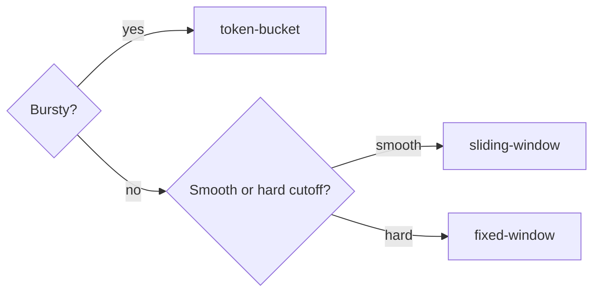

import ModuleBadge from '@site/src/components/ModuleBadge';

# titan-ratelimit

<ModuleBadge origin="official" pkg="@omnitron-dev/titan-ratelimit" status="stable" />

Unified rate limiting with three algorithms (sliding-window,
fixed-window, token-bucket), pluggable storage (in-memory or Redis),
tiered plans, optional queueing for fair processing of excess
requests, per-method decorator, and statistics tracking.

```bash
pnpm add @omnitron-dev/titan-ratelimit
```

## Algorithms

| Strategy            | Behaviour                                                                  | Best for                          |
| ------------------- | -------------------------------------------------------------------------- | --------------------------------- |
| `'sliding-window'`  | Continuously rolling window; smooth limits                                 | API per-user/IP throttling        |
| `'fixed-window'`    | Hard-reset at window boundary; simpler                                     | Per-hour quotas, accounting       |
| `'token-bucket'`    | Tokens refill at a rate; can burst up to bucket size                       | Bursty workloads with smooth refill |

## Quickstart

### In-memory (single-pod)

```typescript
import { TitanRateLimitModule } from '@omnitron-dev/titan-ratelimit';

@Module({
  imports: [
    TitanRateLimitModule.forRoot({
      enabled:         true,
      strategy:        'sliding-window',
      defaultLimit:    100,
      defaultWindowMs: 60_000,
      storageType:     'memory',
    }),
  ],
})
class AppModule {}
```

### Redis-backed (multi-pod)

```typescript
TitanRateLimitModule.forRoot({
  storageType:     'redis',
  strategy:        'token-bucket',
  defaultLimit:    100,
  defaultWindowMs: 60_000,
  burstLimit:      150,
  tokenRefillRate: 100,
  keyPrefix:       'rl',
  queueEnabled:    true,
  maxQueueSize:    1_000,
  queueTimeoutMs:  5_000,
  tiers: {
    free:    { limit: 10,    windowMs: 60_000 },
    pro:     { limit: 1_000, windowMs: 60_000 },
    enterprise: { limit: 10_000, windowMs: 60_000, burstLimit: 15_000 },
  },
})
```

Async config via `forRootAsync({ useFactory, inject?, imports?, isGlobal? })`.

## `IRateLimitModuleOptions`

| Option              | Type                                                              | Default               |
| ------------------- | ----------------------------------------------------------------- | --------------------- |
| `enabled`           | `boolean`                                                         | `true`                |
| `strategy`          | `'sliding-window' \| 'fixed-window' \| 'token-bucket'`            | `'sliding-window'`    |
| `keyPrefix`         | `string`                                                          | (module constant)     |
| `defaultLimit`      | `number`                                                          | `100`                 |
| `defaultWindowMs`   | `number` (ms)                                                     | `60_000`              |
| `burstLimit`        | `number` (0 disables burst)                                       | `0`                   |
| `tokenRefillRate`   | `number` (tokens / window)                                        | `100`                 |
| `queueEnabled`      | `boolean`                                                         | `false`               |
| `maxQueueSize`      | `number`                                                          | `1_000`               |
| `queueTimeoutMs`    | `number` (ms — max wait in queue)                                 | `5_000`               |
| `storageType`       | `'memory' \| 'redis'` (also `'postgres' \| 'sqlite'` per source)  | `'memory'`            |
| `tiers`             | `Record<string, IRateLimitTier>`                                  | —                     |
| `defaultTier`       | `IRateLimitTier`                                                  | —                     |
| `isGlobal`          | `boolean`                                                         | `false`               |

## `RateLimitService` — the API

```typescript
import { RateLimitService, RATE_LIMIT_SERVICE_TOKEN }
  from '@omnitron-dev/titan-ratelimit';

@Service({ name: 'charges' })
class ChargesService {
  constructor(@Inject(RATE_LIMIT_SERVICE_TOKEN) private readonly rate: RateLimitService) {}

  @Public()
  async charge(userId: string, amount: number) {
    const result = await this.rate.consume(`charge:${userId}`, { tier: 'pro' });
    if (!result.allowed) {
      throw Errors.rateLimit('too many charge attempts', { retryAfter: result.retryAfter });
    }
    // proceed
  }
}
```

| Method                                                            | Returns                                          |
| ----------------------------------------------------------------- | ------------------------------------------------ |
| `consume(key, options?)`                                          | `Promise<IRateLimitResult>` — `{ allowed, remaining, resetAt, retryAfter }` |
| `enforce(key, options?)`                                          | `Promise<void>` — throws `RateLimitedError` when over   |
| `getStatus(key, options?)`                                        | `Promise<IRateLimitResult>` — read-only check    |
| `reset(key, tier?)`                                               | `Promise<void>`                                  |
| `getStats()`                                                      | `IRateLimitStats` — overall checks/allowed/denied |
| `getTierStats(tier)`                                              | Per-tier statistics                              |

The difference: `consume()` returns a result you inspect;
`enforce()` throws on rejection. Prefer `consume()` when you want
to handle the rate-limit error with a custom response shape.

## Decorators

### `@RateLimit(key, options?)`

```typescript
import { RateLimit } from '@omnitron-dev/titan-ratelimit';

@Public()
@RateLimit('api:createUser', { limit: 10, windowMs: 60_000 })
async createUser(input: CreateInput) { /* … */ }
```

### `@Throttle(rps)` — convenience

```typescript
import { Throttle } from '@omnitron-dev/titan-ratelimit';

@Public()
@Throttle(10)                                  // ≤ 10 requests / sec
async search(q: string) { /* … */ }
```

## Storage backends

| Backend                       | Class                          | When                                                    |
| ----------------------------- | ------------------------------ | ------------------------------------------------------- |
| `'memory'`                    | `MemoryRateLimitStorage`       | Single-pod; lower latency; counts lost on restart       |
| `'redis'`                     | `RedisRateLimitStorage`        | Multi-pod; persisted across restarts                    |

The Redis storage uses an atomic Lua script for the
sliding/fixed-window counters and `incr`/`expire` for token bucket;
the storage abstraction is `IRateLimitStorage` so additional
backends are pluggable.

## Tiered plans

```typescript
TitanRateLimitModule.forRoot({
  defaultTier: { name: 'free', limit: 10, windowMs: 60_000 },
  tiers: {
    free:       { limit: 10,    windowMs: 60_000 },
    pro:        { limit: 1_000, windowMs: 60_000 },
    enterprise: { limit: 10_000, windowMs: 60_000, burstLimit: 15_000 },
  },
})
```

The tier is selected per call via the `tier` option to `consume()` /
`enforce()`. The decorator picks up the tier from the auth context
(if available) or from explicit option.

## Queueing

When `queueEnabled: true`, excess requests wait in a queue rather
than immediately failing — useful when latency variance is preferred
over rejection.

```typescript
TitanRateLimitModule.forRoot({
  queueEnabled:   true,
  maxQueueSize:   1_000,        // drop after this many waiting
  queueTimeoutMs: 5_000,        // give up if not processed in time
})
```

## Tokens

| Token                          |
| ------------------------------ |
| `RATE_LIMIT_SERVICE_TOKEN`     |
| `RATE_LIMIT_OPTIONS_TOKEN`     |
| `RATE_LIMIT_STORAGE_TOKEN`     |

## Lifecycle

The service uses periodic cleanup intervals on the in-memory
storage; no explicit lifecycle hooks beyond the standard ones.

## Algorithm selection — what to pick



- **Token bucket** — for bursty traffic where you allow `burstLimit`
  spikes that refill at `tokenRefillRate`.
- **Sliding window** — for smooth, fair rate limiting where you
  don't want users to "save up" allowance.
- **Fixed window** — for accounting-style quotas ("100 requests per
  hour" with hard reset on the hour).

## Anti-patterns

- **`@RateLimit` per method without auth context.** Without a per-
  user key, all callers share one bucket. Use a key that includes
  the user / IP.
- **Tiny window + high limit.** A 1-second window with limit 1_000
  is essentially "no limit". Pick windows that match the workload.
- **Redis storage for trivial in-pod limiting.** Each `consume` is
  a Redis call. For per-pod limits, `'memory'` is fine.

## See also

- [Resilience / overview](../resilience/overview.md) — pair with
  retry/backoff on the caller side
- [`titan-redis`](./redis.mdx) — backs the Redis storage
- [`titan-notifications`](./notifications.mdx) — has its own
  channel-level rate limiter built on this module's primitives
