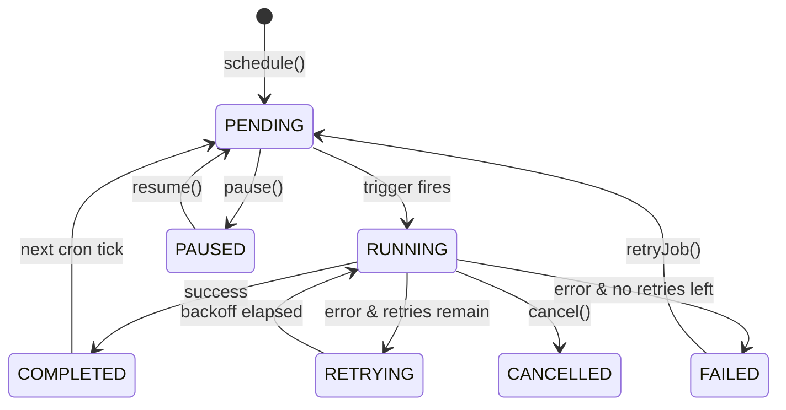

import ModuleBadge from '@site/src/components/ModuleBadge';

# titan-scheduler

<ModuleBadge origin="official" pkg="@omnitron-dev/titan-scheduler" status="stable" />

Cron, interval, and timeout job scheduling with auto-discovery of
decorated methods, pluggable persistence (memory / Redis / database),
optional distributed coordination, per-job retry/backoff, concurrency
limits, listener pattern, and lifecycle-aware graceful shutdown.

```bash
pnpm add @omnitron-dev/titan-scheduler
```

## When you need it

- **Periodic background work.** Cron-style cleanup, hourly reports,
  nightly aggregations.
- **Interval polling.** Poll an external system every N seconds.
- **Delayed actions.** Run something exactly once, N ms after
  registration.
- **Distributed jobs.** Multi-pod fleet where exactly-one execution
  is required (pair with [`titan-lock`](./lock.mdx) or built-in
  distributed coordination).

## Quickstart

```typescript
import { SchedulerModule } from '@omnitron-dev/titan-scheduler';

@Module({
  imports: [
    SchedulerModule.forRoot({
      enabled:         true,
      timezone:        'UTC',
      persistence:     { enabled: true },           // in-memory default
      metrics:         { enabled: true },
      maxConcurrent:   10,
      shutdownTimeout: 30_000,
    }),
  ],
  providers: [TasksService],
})
class AppModule {}
```

### Decorate methods

```typescript
import {
  Schedulable,
  Cron, CronExpression,
  Interval,
  Timeout,
} from '@omnitron-dev/titan-scheduler';

@Injectable()
@Schedulable()
class TasksService {
  @Cron(CronExpression.EVERY_HOUR, { timezone: 'UTC' })
  async hourlySync() { /* … */ }

  @Interval(30_000, { name: 'queue-poll' })
  async pollQueue() { /* … */ }

  @Timeout(5_000)
  async runOnceAfterBoot() { /* … */ }
}
```

The discovery service finds decorated methods at `onInit` and
registers them with the scheduler.

### Async configuration

```typescript
SchedulerModule.forRootAsync({
  imports: [ConfigModule],
  useFactory: (config: ConfigService) => ({
    enabled:       config.get('scheduler.enabled'),
    persistence:   { enabled: true, provider: new RedisPersistenceProvider(redis) },
    distributed:   { enabled: true, lockProvider: 'redis', lockTTL: 60_000 },
    maxConcurrent: config.get('scheduler.concurrency'),
  }),
  inject: [ConfigService],
})
```

## `ISchedulerModuleOptions`

| Option              | Type                                                                          | Default       |
| ------------------- | ----------------------------------------------------------------------------- | ------------- |
| `enabled`           | `boolean`                                                                     | `true`        |
| `timezone`          | `string`                                                                      | —             |
| `persistence`       | `{ enabled, provider?, options? }`                                            | —             |
| `metrics`           | `{ enabled, interval?, includeDetails? }`                                     | —             |
| `distributed`       | `{ enabled, lockProvider?: 'redis' \| 'database', lockTTL?, nodeId? }`        | —             |
| `retry`             | `IRetryOptions` — global retry policy                                         | —             |
| `maxConcurrent`     | `number`                                                                      | —             |
| `queueSize`         | `number`                                                                      | —             |
| `queueTimeout`      | `number` (ms)                                                                 | —             |
| `debug`             | `boolean`                                                                     | —             |
| `shutdownTimeout`   | `number` (ms) — grace window                                                  | `30_000`      |
| `healthCheck`       | `{ enabled, path? }`                                                          | —             |
| `listeners`         | `IJobListener[]` — global listeners                                           | —             |

## Decorators

### `@Cron(expression, options?)`

```typescript
@Cron('0 3 * * *', { timezone: 'UTC', immediate: false })
async nightly() { /* runs at 03:00 UTC daily */ }

@Cron(CronExpression.EVERY_5_MINUTES)
async refresh() { /* … */ }
```

Options:

| Field           | Type                              |
| --------------- | --------------------------------- |
| `timezone?`     | `string`                          |
| `utcOffset?`    | `number`                          |
| `startTime?`    | `Date \| string`                  |
| `endTime?`      | `Date \| string`                  |
| `immediate?`    | `boolean` — run once at start     |
| (and `IBaseJobOptions` — see below) | |

### `@Interval(ms, options?)`

```typescript
@Interval(60_000, { immediate: true })
async heartbeat() { /* runs immediately then every 60s */ }
```

### `@Timeout(ms, options?)`

```typescript
@Timeout(10_000)
async runOnceAfterBoot() { /* fires 10s after registration */ }
```

### `@Schedulable()`

Class-level marker; optional but recommended for clarity. The
discovery service finds `@Cron`/`@Interval`/`@Timeout` methods on
any `@Injectable()` class.

### `IBaseJobOptions` — shared across all job types

| Field             | Type                                                                  |
| ----------------- | --------------------------------------------------------------------- |
| `name?`           | `string` — explicit job name                                          |
| `priority?`       | `JobPriority` — `CRITICAL \| HIGH \| NORMAL \| LOW \| IDLE`           |
| `retry?`          | `{ maxAttempts?, delay?, backoff?, maxDelay?, retryIf? }`             |
| `onError?`        | `(error: Error) => void \| Promise<void>`                             |
| `onSuccess?`      | `(result: any) => void \| Promise<void>`                              |
| `disabled?`       | `boolean` — don't auto-start                                          |
| `timeout?`        | `number` (ms) — max execution time                                    |
| `persist?`        | `boolean` — save to persistence provider                              |
| `metadata?`       | `Record<string, any>`                                                 |
| `preventOverlap?` | `boolean` — reject concurrent executions of the same job              |

## `CronExpression` enum

```typescript
import { CronExpression } from '@omnitron-dev/titan-scheduler';

CronExpression.EVERY_SECOND          // '* * * * * *'
CronExpression.EVERY_5_SECONDS       // '*/5 * * * * *'
CronExpression.EVERY_30_SECONDS      // '*/30 * * * * *'
CronExpression.EVERY_MINUTE          // '*/1 * * * *'
CronExpression.EVERY_5_MINUTES       // '*/5 * * * *'
CronExpression.EVERY_HOUR            // '0 * * * *'
CronExpression.EVERY_DAY_AT_1AM      // '0 1 * * *'
// …through EVERY_YEAR = '0 0 1 1 *'
```

## `SchedulerService`

```typescript
import { SchedulerService, SCHEDULER_SERVICE_TOKEN } from '@omnitron-dev/titan-scheduler';

@Service({ name: 'jobs' })
class JobsService {
  constructor(@Inject(SCHEDULER_SERVICE_TOKEN) private readonly scheduler: SchedulerService) {}

  @Public()
  async scheduleOnce(at: Date, payload: unknown) {
    await this.scheduler.schedule({
      id:       crypto.randomUUID(),
      type:     SchedulerJobType.TIMEOUT,
      runAt:    at,
      handler:  async () => { /* … */ },
      metadata: { payload },
    });
  }
}
```

| Method                                    | Purpose                                          |
| ----------------------------------------- | ------------------------------------------------ |
| `schedule(jobDefinition)`                 | Register and schedule a job                      |
| `cancel(jobId)`                           | Cancel a running job                             |
| `list(filters?)`                          | List jobs with filters                           |
| `getMetrics()`                            | Scheduler metrics                                |
| `getJob(jobId)`                           | Look up a single job                             |
| `pause(jobId)` / `resume(jobId)`          | Pause / resume                                   |
| `retryJob(jobId)`                         | Re-run a failed job                              |

## Persistence providers

| Provider class                  | Persistence                                  |
| ------------------------------- | -------------------------------------------- |
| `InMemoryPersistenceProvider`   | Default — keeps last ~100 executions per job in memory |
| `RedisPersistenceProvider`      | Cross-pod coordination; survives restart     |
| `DatabasePersistenceProvider`   | SQL-backed; durable, transactional history   |

Implement `IPersistenceProvider`:

```typescript
interface IPersistenceProvider {
  saveJob(job: IScheduledJob): Promise<void>;
  loadJob(id: string): Promise<IScheduledJob | null>;
  loadAllJobs(): Promise<IScheduledJob[]>;
  deleteJob(id: string): Promise<void>;
  saveExecutionResult(result: IJobExecutionResult): Promise<void>;
  loadExecutionHistory(jobId: string, limit?: number): Promise<IJobExecutionResult[]>;
  clear(): Promise<void>;
}
```

## Distributed coordination

For multi-pod deployments, two paths:

### A) Module-level distributed config

```typescript
SchedulerModule.forRoot({
  distributed: {
    enabled:      true,
    lockProvider: 'redis',
    lockTTL:      60_000,
    nodeId:       process.env.HOSTNAME,
  },
})
```

### B) Per-job `@WithDistributedLock`

```typescript
import { WithDistributedLock } from '@omnitron-dev/titan-lock';

@Cron(CronExpression.EVERY_HOUR)
@WithDistributedLock('jobs:hourly-report', 10 * 60_000)
async hourlyReport() { /* exactly one pod runs this per hour */ }
```

Per-job locking gives you finer control; module-level coordination
is one config flip.

## Listeners

```typescript
const auditListener: IJobListener = {
  onJobStart:    async (job, ctx) => { /* … */ },
  onJobComplete: async (job, result) => { /* … */ },
  onJobError:    async (job, error, ctx) => { /* … */ },
  onJobRetry:    async (job, attempt, error) => { /* … */ },
  onJobCancelled: async (job, reason) => { /* … */ },
};

SchedulerModule.forRoot({ listeners: [auditListener] });
```

Use for unified observability (metrics, alerting, audit trails)
without coupling each job's body to telemetry concerns.

## Status / priority enums

```typescript
enum JobStatus {
  PENDING, RUNNING, COMPLETED, FAILED, CANCELLED, PAUSED, RETRYING,
}

enum JobPriority {
  CRITICAL = 0,
  HIGH     = 1,
  NORMAL   = 2,
  LOW      = 3,
  IDLE     = 4,
}
```

## Lifecycle

`SchedulerService` implements:

- `async onInit()` — load persisted jobs, run discovery on decorated
  methods, auto-start if `enabled: true`.
- `async onStart()` — activate all registered jobs, emit
  `SCHEDULER_STARTED`.
- `async onStop()` — stop intervals / cron, wait up to
  `shutdownTimeout` for running jobs to finish, persist state.



## Tokens

| Token                                 |
| ------------------------------------- |
| `SCHEDULER_SERVICE_TOKEN`             |
| `SCHEDULER_CONFIG_TOKEN`              |
| `SCHEDULER_REGISTRY_TOKEN`            |
| `SCHEDULER_PERSISTENCE_TOKEN`         |
| `SCHEDULER_METRICS_TOKEN`             |
| `SCHEDULER_LISTENERS_TOKEN`           |

## Anti-patterns

- **Long-running jobs with short intervals.** `@Interval(1_000)`
  with a 5s body queues up. Set `preventOverlap: true` or shorten
  the body.
- **Cron-style polling for low-latency triggers.** Cron has ≥1s
  resolution. For sub-second reactions, use `titan-events` or a
  message queue.
- **Forgetting persistence in production.** Without persistence,
  jobs disappear on restart. Use `RedisPersistenceProvider` or
  `DatabasePersistenceProvider`.
- **Distributed coord without lock TTL tuning.** Lock TTL must
  exceed the job's worst-case duration, or another pod picks it up
  mid-execution.

## See also

- [`titan-lock`](./lock.mdx) — pair with `@WithDistributedLock` per job
- [`titan-metrics`](./metrics.mdx) — picks up scheduler metrics if both modules loaded
- [`titan-health`](./health.mdx) — `SchedulerHealthIndicator` exposed
