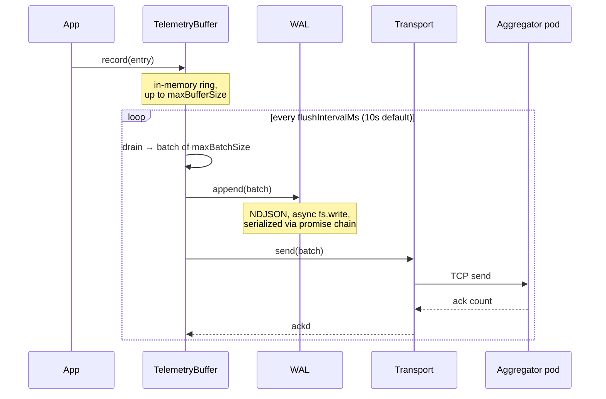
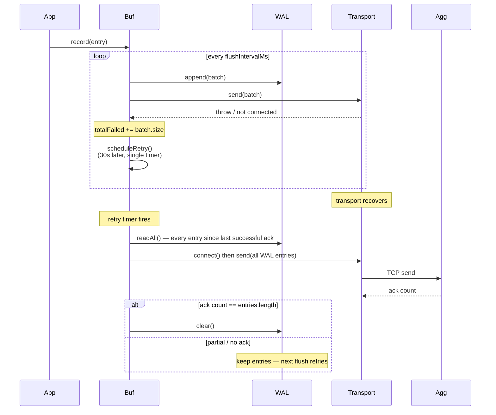

import ModuleBadge from '@site/src/components/ModuleBadge';

# titan-telemetry-relay

<ModuleBadge origin="official" pkg="@omnitron-dev/titan-telemetry-relay" status="stable" />

Store-and-forward telemetry pipeline for distributed Titan
applications. Producers buffer telemetry locally, persist to an
on-disk **WAL** (write-ahead log) for crash safety, and ship to a
remote aggregator over a pluggable transport. On transport failure,
data survives in the WAL and replays on reconnect.

```bash
pnpm add @omnitron-dev/titan-telemetry-relay
```

> **Not a Titan module.** Unlike most ecosystem packages, this one
> doesn't expose `forRoot` / `forRootAsync`. You instantiate
> `TelemetryRelayService` directly because the relay's role
> (producer / aggregator / both) is a deployment concern, not an
> application-level configuration toggle.

## When you need it

- **Services that emit telemetry but shouldn't ship it directly.**
  Producer pods buffer locally; an aggregator pod takes the hit of
  shipping to long-term storage.
- **Network outages without data loss.** Buffer → WAL → retry
  keeps telemetry alive across collector outages, even pod restarts.
- **Sidecar pattern.** Producer in your app pod; aggregator in a
  sidecar; both forward to a canonical sink.
- **Edge / offline-tolerant deployments.** Branch / IoT nodes that
  may be disconnected for hours buffer to disk and drain when
  connectivity returns.

## Three roles

```mermaid
flowchart LR
  subgraph Producer pod
    A1[App] -- record/emit --> Buf1[Buffer<br/>1000 entries / 10s]
    Buf1 -- onDrain --> Wal1[WAL<br/>~/.omnitron/wal]
    Buf1 -- transport --> Net((Netron TCP))
  end
  Net --> AggPod[Aggregator pod]
  subgraph Aggregator pod
    AggPod --> Ingest[ingest&#40;nodeId, entries&#41;]
    Ingest --> Sink[(Backend:<br/>Postgres / OTel /<br/>Loki / S3 / ...)]
  end
```



| Role         | Receives                                              | Forwards to                          |
| ------------ | ----------------------------------------------------- | ------------------------------------ |
| `producer`   | Local app via `record` / `emitLog` / `emitMetric` / `emitHealth` | Aggregator (via transport) |
| `aggregator` | Producers via `receive(nodeId, entries)` Netron RPC   | Persistent sink (via `TelemetryAggregator`) |
| `both`       | Local app + remote producers                          | Persistent sink directly             |

## Quickstart — producer

```typescript
import { TelemetryRelayService } from '@omnitron-dev/titan-telemetry-relay';

const relay = new TelemetryRelayService({
  role:   'producer',
  nodeId: process.env.HOSTNAME,
  buffer: { maxBufferSize: 1_000, flushIntervalMs: 10_000, maxBatchSize: 500 },
  wal:    { directory: '/var/lib/omnitron/wal', maxSizeBytes: 50 * 1024 * 1024, maxSegments: 10 },
});

relay.setTransport(myNetronTransport);
await relay.start();

// In your services:
relay.emitLog('users', 'info', 'user created', { userId: 'u_42' });
relay.emitMetric('users.created.total', 1, { source: 'web' });
relay.emitHealth('users', 'ok');
```

## Quickstart — aggregator

```typescript
const relay = new TelemetryRelayService({
  role: 'aggregator',
});

relay.setAggregator(myPersistenceAggregator);   // writes to long-term sink
await relay.start();

// The Netron RPC handler at this node calls:
//   relay.receive(nodeId, entries)
// which delegates to aggregator.ingest(nodeId, entries).
```

## Quickstart — both (single-node / sidecar)

```typescript
const relay = new TelemetryRelayService({
  role: 'both',
});

// Skip transport — the relay calls the local aggregator directly.
relay.setAggregator(myAggregator);
await relay.start();

relay.emitLog('myApp', 'info', 'starting');     // → aggregator.ingest()
```

When `role: 'both'` and no `transport`, `forwardEntries` calls the
local aggregator's `ingest` directly without going through the
network — useful for single-node leader daemons.

## Constructor options — `TelemetryRelayModuleOptions`

| Option       | Type                                                  | Default                                |
| ------------ | ----------------------------------------------------- | -------------------------------------- |
| `nodeId`     | `string`                                              | `node-{pid}-{base36 timestamp}`        |
| `role`       | `'producer' \| 'aggregator' \| 'both'`                | `'both'`                               |
| `buffer`     | `TelemetryBufferConfig` (see below)                   | defaults below                         |
| `wal`        | `TelemetryWalConfig \| false`                         | defaults below; `false` to disable     |
| `transport`  | `TelemetryTransport`                                  | none (set via `setTransport`)          |

> **`wal: false`** disables WAL persistence entirely. Also auto-
> disabled when `role: 'aggregator'` (the aggregator has no
> outbound transport, so there's nothing to retry).

### `TelemetryBufferConfig`

| Field             | Type    | Default  |
| ----------------- | ------- | -------- |
| `maxBufferSize`   | `number`| `1_000`  |
| `flushIntervalMs` | `number` (ms) | `10_000` |
| `maxBatchSize`    | `number`| `500`    |

### `TelemetryWalConfig`

| Field           | Type    | Default                                        |
| --------------- | ------- | ---------------------------------------------- |
| `directory`     | `string`| `~/.omnitron/wal/`                             |
| `maxSizeBytes`  | `number`| `50 * 1024 * 1024` (50 MB per segment)         |
| `maxSegments`   | `number`| `10` (max ~500 MB total)                       |

Total WAL footprint cap = `maxSizeBytes × maxSegments`.

## `TelemetryEntry` — the universal unit

```typescript
interface TelemetryEntry {
  type:       'log' | 'metric' | 'event' | 'health' | 'alert';
  timestamp:  string;          // ISO 8601
  nodeId:     string;          // injected from relay.nodeId
  app?:       string;
  data:       Record<string, unknown>;
  labels?:    Record<string, string>;
}
```

Five entry types route at the aggregator. The relay itself doesn't
care — it just buffers, persists, and ships.

## Convenience emitters

| Method                                                     | Resulting `type` / `data`                                       |
| ---------------------------------------------------------- | --------------------------------------------------------------- |
| `emitLog(app, level, message, labels?)`                    | `type: 'log'`, `data: { level, message }`                       |
| `emitMetric(name, value, labels?, app?)`                   | `type: 'metric'`, `data: { name, value }`                       |
| `emitHealth(app, status, details?)`                        | `type: 'health'`, `data: { status, ...details }`                |

For `event` / `alert` types or custom payloads, call `record({...})`
directly:

```typescript
relay.record({
  type:   'event',
  app:    'payments',
  data:   { action: 'invoice.paid', invoiceId: 'inv_123', amount: 9900 },
  labels: { region: 'eu-west', tier: 'pro' },
});
```

## Transport contract

```typescript
interface TelemetryTransport {
  send(entries: TelemetryEntry[]): Promise<number>;   // returns ack'd count
  isConnected(): boolean;
  connect():    Promise<void>;
  disconnect(): Promise<void>;
}
```

A transport implementation:
1. Returns an `ack` count from `send()` so the relay knows whether
   to clear the WAL.
2. Reports `isConnected()` honestly — the relay short-circuits
   sends when the transport is offline.
3. Survives `connect()` being called multiple times (idempotent
   semantics expected).

Common transports:

- **Netron TCP** — default for cluster-internal hops. Type-safe,
  multiplexed, automatically reconnects.
- **HTTP POST** — for cross-cluster shipping to a managed
  collector. Implement `send()` as an HTTP call returning ack
  count.
- **Direct local call** (`role: 'both'` with no transport) — the
  relay skips transport and feeds the local aggregator directly.

## Aggregator contract

```typescript
interface TelemetryAggregator {
  ingest(nodeId: string, entries: TelemetryEntry[]): Promise<number>;
  query(filter: TelemetryQueryFilter): Promise<TelemetryEntry[]>;
}

interface TelemetryQueryFilter {
  type?:    TelemetryEntry['type'] | TelemetryEntry['type'][];
  nodeId?:  string;
  app?:     string;
  from?:    string;   // ISO 8601
  to?:      string;
  labels?:  Record<string, string>;
  limit?:   number;
  offset?:  number;
}
```

The aggregator owns persistence — write to Postgres, ClickHouse,
S3, OTLP collector, or whatever backend fits. `ingest` returns the
count of entries successfully persisted (used for ack accounting).

## Data flow — happy path



## Data flow — degraded path



Key invariants:
- **WAL is the source of truth.** Buffer can lose entries on
  overflow; WAL keeps them until acked.
- **Retry uses one timer.** `scheduleRetry()` is no-op while a
  retry timer is already scheduled — no thundering retries.
- **Retry interval is 30 s.** Hard-coded; aligns with typical
  cluster reconnect windows.

## WAL on-disk format

NDJSON — one telemetry entry per line:

```jsonl
{"type":"log","timestamp":"2026-05-16T12:34:56.789Z","nodeId":"node-1234-l7x","app":"users","data":{"level":"info","message":"created"},"labels":{"region":"eu"}}
{"type":"metric","timestamp":"2026-05-16T12:34:56.793Z","nodeId":"node-1234-l7x","app":"users","data":{"name":"users.created.total","value":1}}
```

Segment files are named `000001.wal`, `000002.wal`, …, with the
highest-numbered one being the current write target. When it
exceeds `maxSizeBytes`, a new segment opens; segments past
`maxSegments` are deleted (oldest first).

### Why async writes (and a promise chain)?

The original implementation used `fs.writeSync` on the hot path.
Telemetry at moderate rate produced multi-millisecond event-loop
pauses per batch — bursty writes on a slow disk could push a daemon
past its supervisor liveness deadline.

The current implementation:
- Queues writes via `fs.write` (async).
- Serialises through `private writeChain: Promise<void>` so
  near-simultaneous `append()` calls cannot interleave bytes from
  different batches.
- Returns synchronously to the caller; for caller-side durability
  use `wal.flush()`.

This trade gives smooth ~constant latency at the cost of a tiny
window after a crash where in-flight bytes may not be on disk.

## Crash recovery

On `start()`, if a WAL and transport are both configured:

1. `wal.readAll()` returns every entry written since the last
   successful `clear()`.
2. If the transport is connected, `transport.send(walEntries)` is
   called.
3. If the ack count matches, `wal.clear()` truncates segments.
4. If not, the entries stay in the WAL and the next periodic
   buffer flush will pick them up.

No data loss within WAL capacity. Beyond capacity (sustained
outage longer than `maxSegments × maxSizeBytes / write rate`), the
oldest segment is dropped first.

## Statistics

`relay.stats()` returns a snapshot:

```typescript
{
  nodeId:               string;
  role:                 'producer' | 'aggregator' | 'both';
  buffer:               { size, isStarted, ... };
  wal:                  { currentSegment, currentSize, totalWritten, ... } | null;
  totalEmitted:         number;
  totalSent:            number;
  totalFailed:          number;
  totalReceived:        number;   // aggregator-side
  transportConnected:   boolean;
}
```

Surface these via your existing metrics module — they're the
primary signal for "is the pipeline healthy?".

## Sizing guidance

Pick based on your producer rate and tolerable outage window.

| Producer rate          | Buffer flush  | WAL segment  | Max outage absorbed                    |
| ---------------------- | ------------- | ------------ | -------------------------------------- |
| 100 entries/s           | default (10s) | default (50 MB × 10) | ~5 min (1 KB/entry) to 50 min |
| 1 000 entries/s         | 2s            | 100 MB × 10  | ~10 min (1 KB/entry)                   |
| 10 000 entries/s        | 1s            | 500 MB × 20  | ~30 min (1 KB/entry)                   |
| Bursty (long quiet, fast burst) | longer (30s) flush; large `maxBatchSize` | larger segments | Survives whole-day outage with enough disk |

Rough WAL math: `outage_seconds × producer_rate × avg_entry_bytes
≤ maxSizeBytes × maxSegments`.

## Lifecycle

`TelemetryRelayService` is a plain `EventEmitter` subclass — no
DI lifecycle hooks. Wire it manually if you want DI integration:

```typescript
import { Injectable, OnStart, OnStop } from '@omnitron-dev/titan';
import { TelemetryRelayService } from '@omnitron-dev/titan-telemetry-relay';

@Injectable()
class TelemetryRelayAdapter implements OnStart, OnStop {
  constructor(private readonly relay: TelemetryRelayService) {}
  async onStart() { await this.relay.start(); }
  async onStop()  { await this.relay.stop();  }
}
```

`start()` replays the WAL if a transport is connected; `stop()`
flushes the buffer to WAL, disconnects the transport, and disposes
the WAL (awaits pending writes, closes fds).

## Aggregator-leader election

The package itself does not implement leader election — that's a
deployment concern. Common patterns:

| Pattern                                | How                                                    |
| -------------------------------------- | ------------------------------------------------------ |
| **Static leader by hostname / pod**    | Aggregator pod is named; producers know its address    |
| **Kubernetes service**                 | One headless service points at the aggregator deployment |
| **Discovery-based**                    | Use `titan-discovery` + lock — leader holds a Redis lock; followers query discovery for who has it |
| **HA aggregator**                      | Multiple aggregators, producers fan out to all; aggregators dedupe at the sink |

For HA, prefer pattern (4) — the relay's `transport.send` returns
ack count, so a "fan out to N, succeed if ≥ K" wrapper at the
transport layer is straightforward.

## When to use this vs the built-in logger

| Need                                              | Use                                              |
| ------------------------------------------------- | ------------------------------------------------ |
| Local console output during development           | `@omnitron-dev/titan/module/logger` (built-in)   |
| Single-pod, ship logs via host log shipper        | Built-in logger + stdout                         |
| Multi-pod, one pipeline for logs/metrics/health with at-least-once delivery | This module |
| Sidecar pattern (one collector per host)          | This module with `role: 'both'`                  |
| OTel-compatible sink                              | Build a `TelemetryAggregator` wrapping the OTLP exporter |
| Edge node that may be offline for hours           | This module with large `maxSegments`             |

## Anti-patterns

- **`wal: false` in production.** A crash loses everything in the
  buffer. Always keep WAL on unless you can tolerate gaps.
- **Tiny `flushIntervalMs`.** Flushing every 100 ms with N producers
  saturates the aggregator. Defaults (10 s) are tuned for typical
  loads.
- **Tiny `maxBufferSize` with high produce rate.** Buffer keeps
  overflowing to WAL, defeating the in-memory batching.
- **Producer with no transport.** Without `setTransport`, every
  flush fails and accumulates in WAL until disk fills. Set a
  transport before `start()` (or use `role: 'both'` with a local
  aggregator).
- **Aggregator without aggregator.** Symmetric — without
  `setAggregator`, received entries pile in the buffer and are
  never persisted.
- **WAL directory on tmpfs.** Defeats the durability guarantee
  across restarts. Use a real disk volume; verify on PV in k8s.
- **Per-entry `app` strings with high cardinality.** `app` ends up
  in indexes at the aggregator — keep it to bounded service names,
  not per-request identifiers.

## See also

- [`titan-metrics`](./metrics.mdx) — emit metrics that this relay
  can ship
- [Best Practices / Observability](../best-practices/observability.md)
- [Module map](./module-map.mdx) — where the relay sits in the
  observability stack
