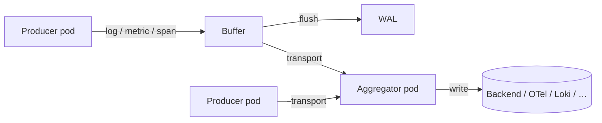

import ModuleBadge from '@site/src/components/ModuleBadge';

# titan-telemetry-relay

<ModuleBadge origin="official" pkg="@omnitron-dev/titan-telemetry-relay" status="stable" />

Store-and-forward telemetry pipeline for distributed Titan
applications. Three operational roles — **producer**, **aggregator**,
**both** — with a circular in-memory buffer, optional write-ahead
log for crash safety, Netron RPC transport between roles, and
optional compression.

```bash
pnpm add @omnitron-dev/titan-telemetry-relay
```

> **Not a Titan module.** Unlike most ecosystem packages, this one
> doesn't expose `forRoot`. You instantiate `TelemetryRelayService`
> directly because the relay's role (producer / aggregator / both)
> is a deployment concern, not application-level configuration.

## When you need it

- **Services that emit telemetry but shouldn't ship it directly.**
  Producer pods buffer locally; aggregator pods take the hit of
  shipping to the long-term backend.
- **Network outages without data loss.** Buffer + WAL keep
  telemetry alive across collector outages.
- **Sidecar pattern.** Producer in your app pod; aggregator in a
  sidecar; both forward to the canonical sink.

## Three roles



| Role        | Receives                                           | Forwards to                   |
| ----------- | -------------------------------------------------- | ----------------------------- |
| `producer`  | Local app via `emitLog` / `emitMetric` / `emitTrace` | Aggregator (via transport)  |
| `aggregator`| Producers via `receive()` Netron RPC               | Persistent sink (via aggregator) |
| `both`      | Local app + remote producers                       | Persistent sink                |

## Quickstart — producer

```typescript
import { TelemetryRelayService } from '@omnitron-dev/titan-telemetry-relay';

const relay = new TelemetryRelayService({
  role:   'producer',
  nodeId: process.env.HOSTNAME,
  bufferConfig: { maxSize: 10_000, flushInterval: 5_000, compressionEnabled: true },
  walConfig:    { enabled: true,  directory: './.wal', maxFileSize: 10 * 1024 * 1024, retentionDays: 7 },
});

relay.setTransport(myNetronTransport);   // Netron transport to aggregator
await relay.start();

// Then in your services:
relay.emitLog('users', 'info', 'user created', { userId: 'u_42' });
relay.emitMetric('users.created.total', 1, { source: 'web' });
relay.emitTrace(traceId, spanId, parentSpanId, 'users.create');
```

## Quickstart — aggregator

```typescript
const relay = new TelemetryRelayService({
  role: 'aggregator',
});

relay.setAggregator(myPersistenceAggregator);   // writes to your long-term sink
await relay.start();

// Netron RPC entry point (called by producers):
// relay.receive(nodeId, entries)
```

## Quickstart — both (sidecar)

```typescript
const relay = new TelemetryRelayService({
  role: 'both',
  // …
});

relay.setTransport(/* optional — forward to another aggregator */);
relay.setAggregator(myAggregator);
await relay.start();
```

## Constructor options — `TelemetryRelayModuleOptions`

| Option         | Type                                              |
| -------------- | ------------------------------------------------- |
| `role`         | `'producer' \| 'aggregator' \| 'both'`            |
| `nodeId`       | `string` (producers)                              |
| `bufferConfig` | `TelemetryBufferConfig`                           |
| `walConfig`    | `TelemetryWalConfig`                              |

### `TelemetryBufferConfig`

| Field                | Type    | Default       |
| -------------------- | ------- | ------------- |
| `maxSize`            | `number`| `10_000`      |
| `flushInterval`      | `number` (ms) | `5_000` |
| `compressionEnabled` | `boolean` | `true`      |

### `TelemetryWalConfig`

| Field          | Type    | Default          |
| -------------- | ------- | ---------------- |
| `enabled`      | `boolean` | `true`         |
| `directory`    | `string` | `'./.wal'`      |
| `maxFileSize`  | `number` (bytes) | 10 MB   |
| `retentionDays`| `number` | `7`             |

## Public API

### `TelemetryRelayService`

| Method                                                                 | Purpose                                          |
| ---------------------------------------------------------------------- | ------------------------------------------------ |
| `setTransport(transport)`                                              | Producer → aggregator transport                  |
| `setAggregator(aggregator)`                                            | Aggregator → sink writer                         |
| `start()`                                                              | Start buffers / pollers / RPC                    |
| `stop()`                                                               | Drain + shutdown                                 |
| `emitLog(app, level, message, metadata?)`                              | Push a log entry                                 |
| `emitMetric(name, value, labels?)`                                     | Push a metric sample                             |
| `emitTrace(traceId, spanId, parentSpanId?, name?, metadata?)`          | Push a span                                      |
| `receive(nodeId, entries[])`                                           | Aggregator: accept entries from a producer       |

### Interfaces

```typescript
interface TelemetryTransport {
  send(nodeId: string, entries: TelemetryEntry[]): Promise<void>;
}

interface TelemetryAggregator {
  write(entries: TelemetryEntry[]): Promise<void>;
  query(filter: TelemetryQueryFilter): Promise<TelemetryEntry[]>;
}

interface TelemetryEntry {
  id:         string;
  timestamp:  number;
  type:       'log' | 'metric' | 'trace';
  app:        string;
  nodeId?:    string;
  data:       any;
  metadata?:  Record<string, any>;
}
```

Implement these interfaces to connect to your specific transport
(Netron, gRPC, HTTP) and your specific sink (OTLP collector, Loki,
Tempo, ClickHouse, S3, …).

## Buffer + WAL semantics

The buffer is a bounded ring; on overflow, oldest entries are
written to the WAL before being dropped from memory.

- **Buffer flush** (`flushInterval`) sends in batches over the
  transport.
- **WAL** (when enabled) writes any unsent entry to disk so a crash
  does not lose them; on restart, the WAL is replayed before
  resuming normal operation.
- **Retention** removes WAL files older than `retentionDays`.

## When to use this vs the built-in logger

| Need                                              | Use                                              |
| ------------------------------------------------- | ------------------------------------------------ |
| Local console output during development           | `@omnitron-dev/titan/module/logger` (built-in)   |
| Single-pod, ship logs via host log shipper        | Built-in logger + stdout                         |
| Multi-pod, want one pipeline for logs/metrics/traces with at-least-once delivery | This module |
| Sidecar pattern (one collector per host)          | This module with `role: 'both'`                  |
| OTel-compatible sink                              | Build a `TelemetryAggregator` wrapping the OTLP exporter |

## Anti-patterns

- **Tiny `flushInterval`.** Flushing every 100 ms with N producer
  pods saturates the aggregator. Defaults are tuned for typical
  loads.
- **No WAL in production.** Without `walConfig.enabled: true`, a
  crash loses everything in the buffer.
- **Producer with no transport.** Without `setTransport`, the
  buffer fills, then drops to WAL until disk fills. Set a transport
  before `start()`.
- **Aggregator without aggregator.** Symmetric — without
  `setAggregator`, received entries pile in the buffer.

## See also

- [`titan-metrics`](./metrics.mdx) — emit metrics that this relay
  can ship
- [Best Practices / Observability](../best-practices/observability.md)
