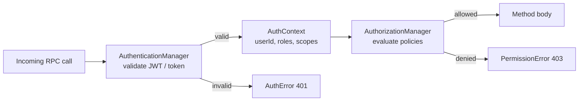

# Authentication

:::info
This page is the Netron-layer reference for `AuthConfig`,
PolicyEngine, and the `BuiltInPolicies` library. For the
end-to-end authorisation surface (permission grammar,
per-user overrides, RLS bridge, audit), start at
[Authentication & Authorisation](../../auth/index.md). For
the higher-level façade decorators that compile to the
`@Auth({policies})` form below, see [Permissions →
Scopes](../../auth/permissions.md#scopes).
:::

Netron separates **authentication** (who is the caller?) from
**authorisation** (is this caller allowed to do this?). Two
managers, one shared policy engine, composable policies.

Import path:

```typescript
import {
  AuthenticationManager,
  AuthorizationManager,
  PolicyEngine,
  BuiltInPolicies,
} from '@omnitron-dev/titan/netron/auth';
```

## The two managers

| Manager                  | Job                                                         |
| ------------------------ | ----------------------------------------------------------- |
| `AuthenticationManager`  | Validate credentials, produce an auth context               |
| `AuthorizationManager`   | Evaluate policies against the auth context                  |



These are wired by the `titan-auth` ecosystem module (or by your own
integration). You rarely construct them directly.

## Auth context

Every authenticated call carries an auth context with:

```typescript
{
  userId:      string;
  roles:       string[];
  permissions: string[];
  scopes:      string[];
  // …integration-specific extras
}
```

This is what `AuthConfig` policies match against.

## `@Auth(config)` — configuring a method

`AuthConfig` (from `@omnitron-dev/titan/decorators`):

```typescript
interface AuthConfig {
  roles?:        string[];     // ANY role grants access
  permissions?:  string[];     // ALL required
  scopes?:       string[];     // ALL OAuth2 scopes required
  policies?:     string[] | { all: string[] } | { any: string[] } | PolicyExpression;
  allowAnonymous?: boolean;
  inherit?:      boolean;      // inherit class-level policies
  override?:     boolean;      // override class-level policies
}
```

Usage:

```typescript
import { Public, Auth } from '@omnitron-dev/titan/decorators';

@Service('orders@1.0.0')
class OrdersService {
  @Public()
  @Auth({ scopes: ['orders:read'] })
  async list() { /* … */ }

  @Public()
  @Auth({ roles: ['admin'] })
  async deleteAll() { /* … */ }

  @Public()
  @Auth({ allowAnonymous: true })          // explicit anonymous
  async ping() { /* … */ }

  @Public()
  @Auth({ policies: { any: ['policy:admin', 'policy:resource-owner'] } })
  async modifyResource(id: string) { /* … */ }
}
```

The same configuration is also accepted inline through `@Public`:

```typescript
@Public({ auth: { scopes: ['orders:read'] } })
async list() { /* … */ }
```

Pick one style per project.

## `BuiltInPolicies` — reusable policy definitions

The `BuiltInPolicies` namespace produces policy definitions you can
register with the policy engine:

```typescript
import { BuiltInPolicies } from '@omnitron-dev/titan/netron/auth';

const policies = [
  BuiltInPolicies.requireRole('admin'),
  BuiltInPolicies.requireAnyRole(['admin', 'support']),
  BuiltInPolicies.requireAllRoles(['user', 'verified']),
  BuiltInPolicies.requirePermission('users:read'),
  // …additional helpers in the source
];

// Register them with the engine:
policyEngine.register(policies);
```

Reference by name in `AuthConfig`:

```typescript
@Auth({ policies: ['role:admin'] })
async deleteAll() { /* … */ }
```

The policy name follows the convention shown in the helper
(`role:admin`, `role:any:admin,support`, etc.) — the registration
sets the name based on the helper's logic.

## Custom policies

A policy is a `PolicyDefinition`:

```typescript
import type { PolicyDefinition } from '@omnitron-dev/titan/netron/auth';

const IsResourceOwner: PolicyDefinition = {
  name:        'resource:owner',
  description: 'Caller must own the resource referenced by the first argument',
  evaluate: async (context) => {
    const resourceId = context.args?.[0];
    const resource   = await context.deps.resolve('OrdersRepo').findById(resourceId);
    const allowed    = resource?.userId === context.auth?.userId;
    return {
      allowed,
      reason: allowed ? 'Owner' : 'Not owner',
    };
  },
};

policyEngine.register([IsResourceOwner]);

// Then in your service:
@Public()
@Auth({ policies: ['resource:owner'] })
async getOrder(orderId: string) { /* … */ }
```

The exact `PolicyContext` and helper APIs live in
`netron/auth/policy-engine.ts` and `netron/auth/types.ts`.

## Class-level vs method-level

Both work; method-level overrides class-level for that method:

```typescript
@Service('orders@1.0.0')
@Auth({ scopes: ['orders:*'] })                     // class-level default
class OrdersService {
  @Public()                                          // inherits class-level
  async list() { /* … */ }

  @Public()
  @Auth({ allowAnonymous: true })                    // override
  async listPublic() { /* … */ }

  @Public()
  @Auth({ roles: ['admin'] })                        // override
  async deleteAll() { /* … */ }
}
```

Use `inherit` / `override` flags in `AuthConfig` to control
combination semantics for fine-grained cases.

## Failure semantics

| Failure                            | TitanError type                              | Status |
| ---------------------------------- | -------------------------------------------- | ------ |
| No credentials                     | `AuthError`                                  | 401    |
| Invalid token                      | `AuthError`                                  | 401    |
| Authenticated but policy denied    | `PermissionError`                            | 403    |

Both classes extend `HttpError` extends `TitanError`. The client
can `instanceof AuthError` vs `instanceof PermissionError` to
discriminate.

## Anti-patterns

- **Auth checks in method bodies.** Defeats the policy framework.
  Use `@Auth(...)`. Inline checks duplicate the policy and drift
  from the rest of the codebase.
- **Single super-scope (`'admin'`).** A flat scope model collapses
  under growth. Prefer hierarchical scopes (`orders:*`,
  `orders:read`, `orders:write`) so you can grant least privilege.
- **Auth as the only check.** Auth says *who* can call. It does
  not say *whether the input is valid* or *whether the resource is
  in the right state*. Combine with `@Validate` and domain checks.

→ Next: [Streaming](./streaming.md).
