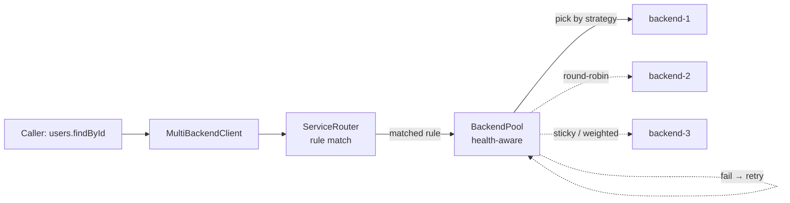

# Multi-Backend

A `MultiBackendClient` is a Netron client that fans out to multiple
servers. It exposes the same interface as a single-backend client;
the backend selection is internal.



Use when you have:

- **Read replicas.** Round-robin reads across replicas; writes go
  to the primary.
- **Sharded backends.** Route by request key (user ID, tenant ID).
- **Failover targets.** Healthy backends serve traffic; unhealthy
  ones drop out, then come back when probes succeed.

## The minimal example

```typescript
import { MultiBackendClient } from '@omnitron-dev/netron-browser';

const client = new MultiBackendClient({
  backends: [
    { url: 'http://api-1.internal' },
    { url: 'http://api-2.internal' },
    { url: 'http://api-3.internal' },
  ],
  strategy: 'round-robin',
});

const users = await client.queryInterface<UsersService>('users@1.0.0');
const user  = await users.findById('u_42');     // call goes to one of the three
```

The client picks a backend per call (round-robin, here) and routes
the call to it. If the call fails on a transient error, the client
retries on a different backend.

## Strategies

| Strategy        | Behaviour                                                   |
| --------------- | ----------------------------------------------------------- |
| `round-robin`   | Cycle through backends evenly                               |
| `least-busy`    | Send to the backend with the fewest in-flight calls         |
| `sticky`        | Hash the request to a backend (same key → same backend)     |
| `primary`       | First backend serves all traffic; failover to others         |
| `weighted`      | Weighted round-robin per backend's `weight` field           |

```typescript
strategy: 'sticky',
stickyKey: (service, method, args) => args[0],   // hash by first arg
```

## Method-level routing rules

Some methods should always go to the primary (writes), even when
reads are spread across replicas:

```typescript
new MultiBackendClient({
  backends: [
    { url: '…primary',  role: 'primary' },
    { url: '…replica1', role: 'replica' },
    { url: '…replica2', role: 'replica' },
  ],
  routing: [
    { match: { method: /^create|update|delete/ },  role: 'primary' },
    { match: { method: /^find|list|get/ },         role: 'replica' },
  ],
});
```

The first matching rule wins. Calls without a matching rule use the
default strategy.

## Health monitoring

The client polls each backend's health endpoint:

```typescript
new MultiBackendClient({
  backends: [...],
  health: {
    intervalMs:        5_000,         // check every 5s
    unhealthyAfter:    3,             // 3 consecutive failures = unhealthy
    healthyAfter:      2,             // 2 consecutive successes = healthy again
    timeoutMs:         2_000,         // single check timeout
  },
});
```

Unhealthy backends are removed from the rotation. They keep being
polled; when they recover, they re-enter.

The Omnitron orchestrator's `MultiBackendClient` consumes
`titan-discovery` data instead of a static list — backends register
themselves; the client picks them up automatically.

## Failover

When a call fails on a backend, the client decides:

- **Retry on another backend?** Yes if the error is classified as
  transient (`ServiceUnavailable`, `TimeoutError`, network error).
  No otherwise.
- **Mark this backend unhealthy?** Yes if the failure looks
  infrastructure-level (connection refused, TLS error, 503).
  No for application-level errors (404, 422).

Configurable:

```typescript
failover: {
  retriableErrors: (e) => isOperationalError(e),
  maxRetries:      2,                 // try up to 3 backends total
}
```

## Connection pooling

For each backend, a connection pool is maintained:

```typescript
backends: [
  {
    url: '…',
    pool: {
      min:           1,
      max:           10,
      idleTimeoutMs: 30_000,
    },
  },
],
```

Connection reuse is essential for performance. The default pool size
(10 per backend) is appropriate for most services.

## Observability

The client emits per-call metrics including the chosen backend:

```typescript
metrics.histogram('rpc.duration_ms', {
  service: 'users@1.0.0',
  method:  'findById',
  backend: 'api-2.internal',
}).observe(duration);
```

Useful for catching imbalanced traffic, slow backends, or
overlooked failover events.

## When not to use MultiBackend

- **One backend.** Use a regular `NetronClient` — simpler.
- **Cross-region routing.** A client in one region routing across
  regions adds round-trip latency that a regional load balancer
  hides better. Put the multi-backend logic at the LB.
- **Stateful sessions.** WebSocket connections carry session state.
  A multi-backend client can re-route mid-session, which breaks
  state. For stateful sessions, pin to a backend.

## Anti-patterns

- **Sticky routing on a small key space.** Sticky-by-tenant-ID
  with one large tenant routes all traffic for that tenant to one
  backend. Use sticky only when the key space is large enough to
  spread.
- **Aggressive `unhealthyAfter`.** Marking a backend unhealthy
  after one failure is fragile to noise. Three is a good default;
  five for very flaky networks.
- **Failover on every error.** Application errors should not
  trigger failover — they are not the backend's fault. Use
  classifier-based filters.

→ Next: [Serialization](./serialization.md).
