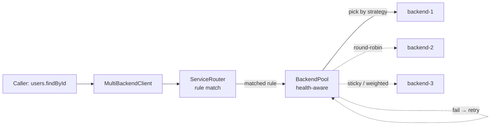

# Multi-Backend

A `MultiBackendClient` is a Netron client that fans out to multiple
servers. It exposes the same interface as a single-backend client; the
backend selection is internal. It is exported from
`@omnitron-dev/titan/netron/multi-backend`, and its option shape is the
`MultiBackendClientOptions` interface in
`packages/titan/src/netron/multi-backend/types.ts`.


```mermaid
flowchart LR
  Caller[Caller: users.findById]
  Client[MultiBackendClient]
  Router[ServiceRouter<br/>rule match]
  Pool[BackendPool<br/>health-aware]
  B1[backend-1]
  B2[backend-2]
  B3[backend-3]

  Caller --> Client --> Router
  Router -->|matched rule| Pool
  Pool -->|pick by strategy| B1
  Pool -.->|round-robin| B2
  Pool -.->|sticky / weighted| B3
  Pool -.->|fail → retry| Pool
```

Use when you have:

- **Read replicas.** Round-robin reads across replicas; writes go
  to the primary.
- **Sharded backends.** Route by request key (user ID, tenant ID).
- **Failover targets.** Healthy backends serve traffic; unhealthy
  ones drop out, then come back when probes succeed.

## The minimal example

Every backend needs a unique `id` and a `url`:

```typescript
import { MultiBackendClient } from '@omnitron-dev/titan/netron/multi-backend';

const client = new MultiBackendClient({
  backends: [
    { id: 'api-1', url: 'http://api-1.internal' },
    { id: 'api-2', url: 'http://api-2.internal' },
    { id: 'api-3', url: 'http://api-3.internal' },
  ],
  // strategy is set per-route (see below), not at the top level.
});

const users = await client.queryInterface<UsersService>('users@1.0.0');
const user  = await users.findById('u_42');     // routed to one of the three
```

If the call fails and `failover` is on (the default), the client
retries on another backend (up to `maxFailoverAttempts`, default 2).

## Strategies

The load-balancing strategy is a `LoadBalancingStrategy` (`LoadBalancingStrategy` in `types.ts`),
set on a route (`router.routes[].strategy`) or as
`router.defaultStrategy` (default `round-robin`). The router dispatches
on it in `ServiceRouter.selectBackend`:

| Strategy             | Behaviour                                              |
| -------------------- | ------------------------------------------------------ |
| `round-robin`        | Cycle through backends evenly (default)                |
| `random`             | Pick a backend at random                               |
| `least-connections`  | Send to the backend with the fewest active connections |
| `weighted`           | Intended to weight by `BackendConfig.weight`, but **currently falls back to random** — `selectWeighted` delegates to `selectRandom` (`selectWeighted`) because `weight` is not carried on the per-backend status it selects from |

Those four are the only values the type and the dispatch allow. There
is no `sticky`, `least-busy`, or `primary` strategy, and no
`stickyKey`/`sessionAffinity` hook. "Primary/fallback" semantics are
expressed through a route's `backends` vs `fallback` lists
(the route's `backends`/`fallback` handling in `ServiceRouter`), not a strategy name.

## Service-level routing rules

Routing matches on the **service name** (with `*` wildcards) — not on
method. Configure it under `router.routes`:

```typescript
new MultiBackendClient({
  backends: [
    { id: 'primary',  url: '…primary'  },
    { id: 'replica1', url: '…replica1' },
    { id: 'replica2', url: '…replica2' },
  ],
  router: {
    routes: [
      { service: 'orders@*', backends: ['primary'], fallback: ['replica1', 'replica2'] },
      { service: 'reports@*', backends: ['replica1', 'replica2'], strategy: 'round-robin' },
    ],
    defaultBackends: ['primary'],
    defaultStrategy: 'round-robin',
  },
});
```

A route targets backend **ids**. `fallback` ids are tried when the
primary `backends` are unavailable. To split reads vs writes by
method, expose them as separate services (e.g. `orders` and
`orders-read`) and route per service.

## Health monitoring

Health-check options are **flat** top-level fields (`MultiBackendClientOptions` in `types.ts`),
not a nested `health` object:

```typescript
new MultiBackendClient({
  backends: [...],
  healthChecks:        true,          // default true
  healthCheckInterval: 30_000,        // default 30s
  unhealthyThreshold:  3,             // consecutive failures → unhealthy (default 3)
  healthyThreshold:    2,             // consecutive successes → healthy (default 2)
});
```

There is no per-check `timeoutMs` field. The router filters out any
backend whose `health` is `'unhealthy'` before selecting
(in `ServiceRouter`, before selection), so unhealthy backends drop out of the
rotation; the pool keeps polling them and they re-enter once the
`healthyThreshold` of consecutive successes is met.

## Failover

`failover` is a **boolean** (default `true`), not an options object,
and `maxFailoverAttempts` (default 2) caps the retries:

```typescript
new MultiBackendClient({
  backends: [...],
  failover:            true,
  maxFailoverAttempts: 2,             // up to 2 extra backends tried
});
```

The failover loop (the catch in `MultiBackendClient`'s failover loop) retries on **any**
thrown error — there is no `retriableErrors` classifier hook, so the
catch block does not inspect the error before retrying. It will,
however, skip a candidate whose circuit breaker is open
(`isCircuitClosed`). A single call can opt out of failover
entirely via a per-request `hints.noFailover` (`hints.noFailover`).

For failure *isolation*, configure the **circuit breaker** (`circuitBreaker` in `types.ts`)
— this is the real mechanism for shedding a bad backend. It tracks
per-backend failures and transitions closed → open → half-open
(`recordFailure` / `isCircuitClosed`):

```typescript
circuitBreaker: {
  enabled:      true,
  threshold:    5,                    // failures before opening (default 5)
  resetTimeout: 30_000,               // wait before half-open (default 30s)
}
```

`window` is accepted by the type and read by nothing. The failure count
is cumulative: `recordFailure()` increments it and only a success
resets it, so failures hours apart count the same as failures
milliseconds apart, and a backend that fails once a day eventually
trips a threshold of 5. Do not rely on it to scope failures to a
period.

## Connection model

There is no sized connection pool. The `BackendPool` holds one
`BackendClient` per backend id (`BackendPool`), and each
`BackendClient` holds at most one transport — a single
`HttpTransportClient` *or* a single `WebSocketConnection`
(`BackendClient`), chosen by the backend's `transport` field.
Per-backend `pool: { min, max, idleTimeoutMs }` is not a real option.

## Observability

Track per-call latency and the chosen backend (the exact metric shape
is up to your metrics layer — illustrative):

```typescript
metrics.histogram('rpc.duration_ms', {
  service: 'users@1.0.0',
  method:  'findById',
  backend: 'api-2',
}).observe(duration);
```

Useful for catching imbalanced traffic, slow backends, or
overlooked failover events.

## When not to use MultiBackend

- **One backend.** Connect a single peer
  (`netron.connect(url)` → `queryInterface`) — simpler.
- **Cross-region routing.** A client in one region routing across
  regions adds round-trip latency that a regional load balancer
  hides better. Put the multi-backend logic at the LB.
- **Stateful sessions.** WebSocket connections carry session state.
  A multi-backend client can re-route mid-session, which breaks
  state. For stateful sessions, pin to a backend.

## Anti-patterns

- **Routing a whole hot service to one backend.** A route that pins a
  high-traffic service to a single backend id forfeits spreading. Give
  busy services multiple backends with `round-robin` /
  `least-connections`.
- **Aggressive `unhealthyThreshold`.** Marking a backend unhealthy
  after one failure is fragile to noise. Three (the default) is a good
  baseline; raise it for very flaky networks.
- **Relying on failover to mask app errors.** Failover currently
  retries on any error, so a deterministic application error will be
  retried against every backend and still fail. Prefer the circuit
  breaker for infrastructure faults, and don't lean on failover to
  paper over 4xx-class errors.

→ Next: [Serialization](./serialization.md).
