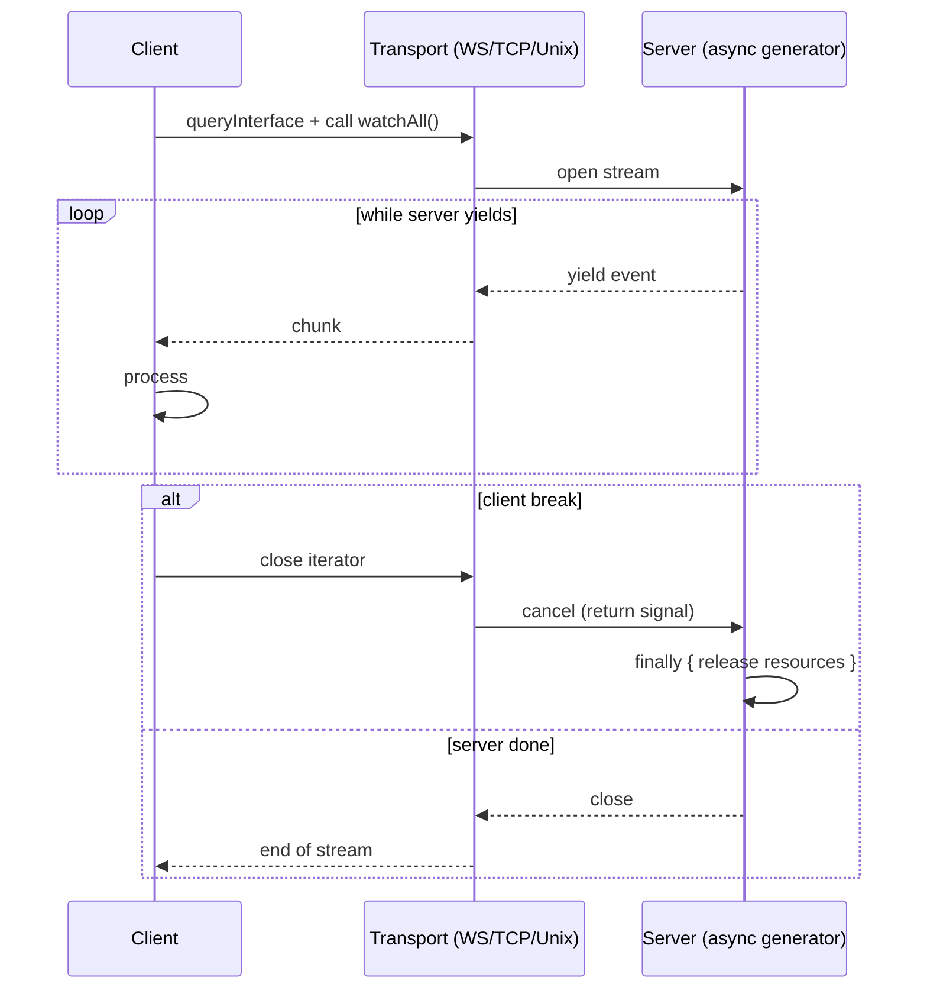

# Streaming

Netron supports server-streaming methods — methods that return
`AsyncIterable<T>` instead of `Promise<T>`. The client iterates the
stream as values arrive.



Streaming requires WebSocket, TCP, or Unix transport. HTTP cannot
stream Netron values (HTTP/1.1 chunked is a stream of bytes, not of
typed objects).

## Defining a streaming method

```typescript
@Service('orders@1.0.0')
class OrdersService {
  @Public()
  async *watchAll(): AsyncIterable<Order> {
    for await (const event of this.queue.subscribe('orders.*')) {
      yield event.order;
    }
  }
}
```

The method is an async generator (`async *`). Each `yield` becomes a
value sent to the client.

## Consuming a stream

```typescript
const orders = await client.queryInterface<OrdersService>('orders@1.0.0');

for await (const order of orders.watchAll()) {
  console.log(order);
}
```

The `for await` loop runs as long as the server yields. When the
server's generator returns, the loop ends. If the server throws,
the loop throws.

## Backpressure

The transport applies backpressure automatically. If the client is
slow to consume, the server's generator pauses on `yield` until the
transport drains. There is no buffer to overflow.

This means a slow client can slow down a fast producer. If you need
producer-side draining (for example, the producer is a queue that
will overflow), implement explicit drop-or-disconnect logic:

```typescript
@Public()
async *watchAll(): AsyncIterable<Order> {
  for await (const event of this.queue.subscribe('orders.*')) {
    if (this.queue.depth() > 10_000) {
      // Disconnect slow client; let them reconnect with a checkpoint.
      throw Errors.unavailable('client too slow; reconnect with cursor');
    }
    yield event.order;
  }
}
```

## Cancellation

The client can cancel the stream by `break`-ing out of the loop or
calling `.return()` on the iterator:

```typescript
for await (const order of orders.watchAll()) {
  if (order.id === target) break;     // server's generator receives a return signal
}
```

The server's generator runs its `finally` block:

```typescript
@Public()
async *watchAll(): AsyncIterable<Order> {
  const sub = this.queue.subscribe('orders.*');
  try {
    for await (const event of sub) {
      yield event.order;
    }
  } finally {
    await sub.unsubscribe();          // always runs on cancellation
  }
}
```

Always release stream resources in `finally`. Otherwise a cancelled
stream leaks subscriptions.

## Reconnection

WebSocket reconnects automatically (configurable via the client). On
reconnect, **streams do not resume** — the client must re-subscribe.
This is intentional: the server cannot know what the client missed.

For resumable streams, your contract should accept a checkpoint:

```typescript
@Public()
async *watchAll(since?: string): AsyncIterable<Order> {
  // Replay from `since`, then live-tail.
  if (since) {
    for await (const o of this.repo.findAfter(since)) yield o;
  }
  for await (const event of this.queue.subscribe('orders.*')) {
    yield event.order;
  }
}
```

The client passes the last-seen ID to resume:

```typescript
let lastSeen: string | undefined;
while (true) {
  try {
    for await (const order of orders.watchAll(lastSeen)) {
      lastSeen = order.id;
      handle(order);
    }
  } catch (e) {
    if (isReconnectable(e)) continue;
    throw e;
  }
}
```

## Bidirectional streaming

Bidirectional streaming (client and server both stream) is **not** in
the current Netron model. A method takes argument values and returns
either a single value or a server-side stream.

For protocols that need full duplex (collaborative editing,
multi-party games), use multiple unidirectional streams.

## Performance

Each stream has:

- A persistent connection (WS / TCP / Unix).
- A per-stream message correlation ID.
- An async iterator on each side.

The cost per yield is the same as a unary call — msgpack encode +
write. Throughput is bounded by the transport.

## Anti-patterns

- **Returning a stream of trivial values.** A stream of strings,
  one per yield, is wasteful — the per-message overhead exceeds
  the payload. Batch into arrays where possible.
- **No `finally` for resource release.** Every stream must clean up
  on cancellation. Forgetting causes leaks that compound over
  reconnects.
- **Unbounded buffers.** Don't buffer values without backpressure.
  Yield directly from the source iterator and let the transport
  apply backpressure.
- **Streaming where polling would do.** A stream that yields
  every 30 seconds is just polling, with more state. Use a unary
  method called on a timer.

→ Next: [Multi-backend](./multi-backend.md).
