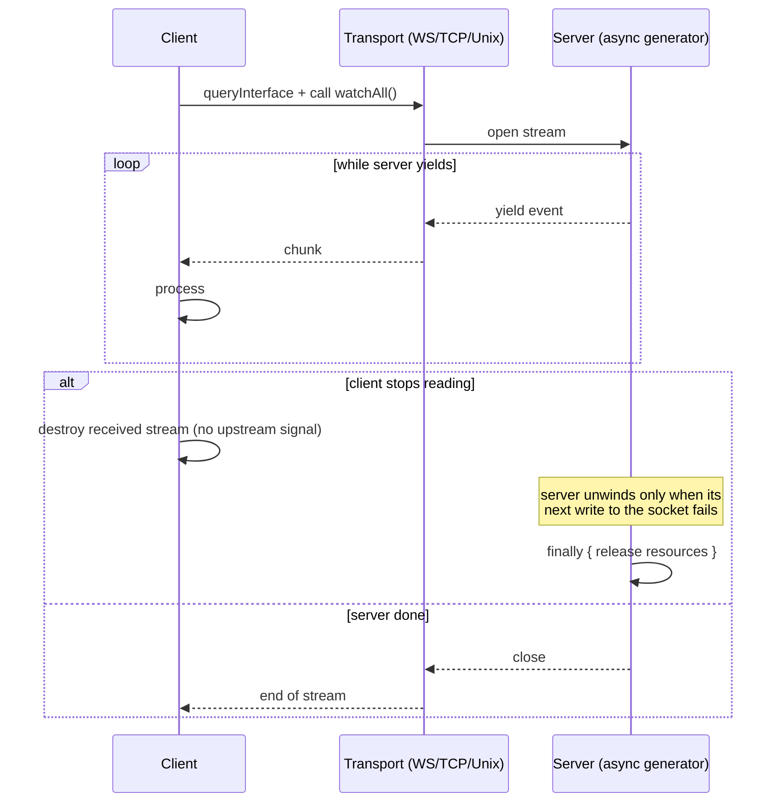

# Streaming

Netron supports server-streaming methods. On the server you write an
`async *` generator (or return a `NetronReadableStream` directly). When
a method returns an async generator and the caller is remote, the
service stub wraps the generator in a `NetronWritableStream` and pipes
it (`stream.pipeFrom(generator)`), returning a `StreamReference` over
the wire (the `isAsyncGenerator` branch of `ServiceStub.call`). The receiving peer rebuilds
the other half as a `NetronReadableStream` (`TYPE_STREAM` in `RemotePeer.handlePacket`).

The stream primitives are built on the **`readable-stream` package**
(the userland Node.js streams implementation), not the WHATWG Web
Streams API and not native async iterables: `NetronReadableStream
extends Readable` and `NetronWritableStream extends Writable`, both in
`objectMode` (`netron/streams/readable-stream.ts`,
`netron/streams/writable-stream.ts`). Because the received stream is
a `Readable`, you can consume it either with stream events
(`.on('data')` / `.on('end')`) or with `for await` — a `Readable` is
async-iterable. The examples below use `for await` for brevity.


```mermaid
sequenceDiagram
  participant C as Client
  participant T as Transport (WS/TCP/Unix)
  participant S as Server (async generator)

  C->>T: queryInterface + call watchAll()
  T->>S: open stream
  loop while server yields
    S-->>T: yield event
    T-->>C: chunk
    C->>C: process
  end
  alt client stops reading
    C->>C: destroy received stream (no upstream signal)
    Note over S: server unwinds only when its<br/>next write to the socket fails
    S->>S: finally { release resources }
  else server done
    S-->>T: close
    T-->>C: end of stream
  end
```

Streaming requires WebSocket, TCP, or Unix transport. The HTTP
transport does not open a streaming channel — instead it **collects an
`async *` generator into an array** before sending the response
(`collectAsyncGeneratorValues` in `netron/transport/http/server.ts`).
Collection is bounded by `maxAsyncGeneratorItems` (a server option,
default `10000`, the constant `DEFAULT_MAX_ASYNC_GENERATOR_ITEMS`). When the generator exceeds that
limit the server throws a `TitanError` with code `PAYLOAD_TOO_LARGE`
(from that same method); other (non-`TitanError`) iteration failures return
the partial results collected so far rather than failing the whole
request. So over HTTP you get a bounded batch, not a live stream — use
WS/TCP/Unix for true streaming, or paginate.

## Defining a streaming method

```typescript
@Service('orders@1.0.0')
class OrdersService {
  @Public()
  async *watchAll(): AsyncIterable<Order> {
    for await (const event of this.queue.subscribe('orders.*')) {
      yield event.order;
    }
  }
}
```

The method is an async generator (`async *`). Each `yield` becomes a
value sent to the client.

## Consuming a stream

```typescript
const orders = await client.queryInterface<OrdersService>('orders@1.0.0');

for await (const order of orders.watchAll()) {
  console.log(order);
}
```

The `for await` loop runs as long as the server yields. When the
server's generator returns, the loop ends. If the server throws,
the loop throws.

## Backpressure

Backpressure is real. The producer is wrapped in a `NetronWritableStream`,
which uses the standard `write()` → `await once('drain')` loop; because
`sendPacket` awaits the socket-send callback for stream packets too
(fixed in T#43), the producer feels genuine socket congestion and the
`async *` generator effectively pauses at `yield`.

There *are* bounded buffers, though: the readable side keeps a
reorder buffer (`MAX_BUFFER_SIZE`, 10 000 chunks) and **destroys the
stream** with a backpressure error if it overflows, and there are
per-peer stream-count caps. So overflow is a handled failure mode, not
an impossibility.

This means a slow client can slow down a fast producer. If you need
producer-side draining (for example, the producer is a queue that
will overflow), implement explicit drop-or-disconnect logic:

```typescript
@Public()
async *watchAll(): AsyncIterable<Order> {
  for await (const event of this.queue.subscribe('orders.*')) {
    if (this.queue.depth() > 10_000) {
      // Disconnect slow client; let them reconnect with a checkpoint.
      throw Errors.unavailable('client too slow; reconnect with cursor');
    }
    yield event.order;
  }
}
```

## Cancellation

Cancellation is **one-directional on the wire**, and the direction
matters.

The **producer → consumer** direction is wired. When the server's
`NetronWritableStream` finishes (`end()`) it sends an end-of-stream
final chunk; when it is `destroy()`ed it sends an explicit
`TYPE_STREAM_CLOSE` packet (`NetronWritableStream.finalizing`),
and the consumer's readable reacts by force-closing
(`TYPE_STREAM_CLOSE` in `RemotePeer.handlePacket` → `stream.forceClose(reason)`). The two
are mutually exclusive — a graceful end uses the EOS chunk, a destroy
uses the close packet (the `finalizing` guard in `writable-stream.ts`
prevents emitting both).

The **consumer → producer** direction is *not* wired. The received
stream is a `NetronReadableStream`, and its `destroy()`
(`NetronReadableStream.destroy`) only tears down locally — it
sends **no** packet back to the producer. There is no code path where a
broken/destroyed readable notifies the writable upstream. So a clean
client `break` out of the `for await` loop does **not** signal the
server: the generator keeps being pulled until the next
`sendStreamChunk` write fails against the dead socket (or the
connection drops), at which point `pipeFrom` catches the error and
destroys the writable. Don't rely on prompt server-side teardown from a
client `break` — treat teardown as eventual, driven by the failed
write, not immediate.

Because the generator *does* unwind when the write side fails (or the
connection drops), always release resources in a `finally`:

```typescript
@Public()
async *watchAll(): AsyncIterable<Order> {
  const sub = this.queue.subscribe('orders.*');
  try {
    for await (const event of sub) {
      yield event.order;
    }
  } finally {
    await sub.unsubscribe();          // runs when the generator unwinds
  }
}
```

For deterministic cancellation, give the client an explicit
"unsubscribe"/"stop" method on the service rather than relying on
iterator teardown.

## Reconnection

WebSocket reconnects automatically (configurable via the client). On
reconnect, **streams do not resume** — the client must re-subscribe.
This is intentional: the server cannot know what the client missed.

For resumable streams, your contract should accept a checkpoint:

```typescript
@Public()
async *watchAll(since?: string): AsyncIterable<Order> {
  // Replay from `since`, then live-tail.
  if (since) {
    for await (const o of this.repo.findAfter(since)) yield o;
  }
  for await (const event of this.queue.subscribe('orders.*')) {
    yield event.order;
  }
}
```

The client passes the last-seen ID to resume:

```typescript
let lastSeen: string | undefined;
while (true) {
  try {
    for await (const order of orders.watchAll(lastSeen)) {
      lastSeen = order.id;
      handle(order);
    }
  } catch (e) {
    if (isReconnectable(e)) continue;
    throw e;
  }
}
```

## Bidirectional streaming

There is no single-method *duplex* sugar — a method doesn't return one
two-way channel. But the primitives for full duplex exist: a
`NetronWritableStream` streams **client→server**, and a stream
(readable or writable) can be **passed as a method argument** —
Netron serialises it as a stream reference and rebuilds a live stream
on the far side.

So for full-duplex protocols (collaborative editing, multi-party
games) you compose unidirectional streams: return a server→client
stream and/or pass a client→server stream as an argument.

## Performance

Each stream has:

- A persistent connection (WS / TCP / Unix).
- A per-stream message correlation ID.
- An async iterator on each side.

The cost per yield is the same as a unary call — msgpack encode +
write. Throughput is bounded by the transport.

## Anti-patterns

- **Returning a stream of trivial values.** A stream of strings,
  one per yield, is wasteful — the per-message overhead exceeds
  the payload. Batch into arrays where possible.
- **No `finally` for resource release.** Every stream must clean up
  on cancellation. Forgetting causes leaks that compound over
  reconnects.
- **Unbounded buffers.** Don't buffer values without backpressure.
  Yield directly from the source iterator and let the transport
  apply backpressure.
- **Streaming where polling would do.** A stream that yields
  every 30 seconds is just polling, with more state. Use a unary
  method called on a timer.

→ Next: [Multi-backend](./multi-backend.md).
