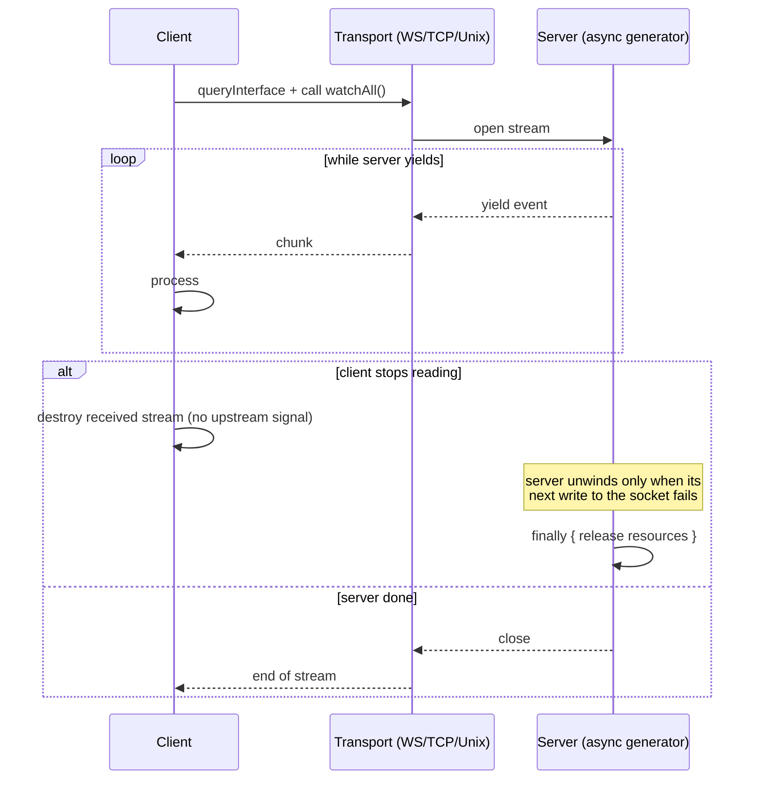

# Streaming

Netron supports server-streaming methods. On the server you can write
an `async *` generator (or return a `NetronReadableStream`); for a
remote caller Netron auto-wraps the generator into a
`NetronWritableStream` and sends a stream reference over the wire. The
underlying primitives are **Node Web Streams**
(`NetronReadableStream extends Readable`,
`NetronWritableStream extends Writable`), not native async iterables —
so the *received* stream is consumed with stream events
(`.on('data')` / `.on('end')`), though a `Readable` is also
`for await`-iterable.

:::note
The "define with `async *`" pattern below is real and works. The
consumption examples in this page show `for await` for brevity, but
the demonstrated/tested API consumes the received stream via Node
stream events. See `netron/streams/` for the concrete classes.
:::


```mermaid
sequenceDiagram
  participant C as Client
  participant T as Transport (WS/TCP/Unix)
  participant S as Server (async generator)

  C->>T: queryInterface + call watchAll()
  T->>S: open stream
  loop while server yields
    S-->>T: yield event
    T-->>C: chunk
    C->>C: process
  end
  alt client stops reading
    C->>C: destroy received stream (no upstream signal)
    Note over S: server unwinds only when its<br/>next write to the socket fails
    S->>S: finally { release resources }
  else server done
    S-->>T: close
    T-->>C: end of stream
  end
```

Streaming requires WebSocket, TCP, or Unix transport. The HTTP
transport does not open a streaming channel — instead it **collects an
`async *` generator into an array** (capped by `maxAsyncGeneratorItems`,
default 10000; over that it throws `PAYLOAD_TOO_LARGE`). So over HTTP
you get a bounded batch, not a live stream; use WS/TCP/Unix for true
streaming.

## Defining a streaming method

```typescript
@Service('orders@1.0.0')
class OrdersService {
  @Public()
  async *watchAll(): AsyncIterable<Order> {
    for await (const event of this.queue.subscribe('orders.*')) {
      yield event.order;
    }
  }
}
```

The method is an async generator (`async *`). Each `yield` becomes a
value sent to the client.

## Consuming a stream

```typescript
const orders = await client.queryInterface<OrdersService>('orders@1.0.0');

for await (const order of orders.watchAll()) {
  console.log(order);
}
```

The `for await` loop runs as long as the server yields. When the
server's generator returns, the loop ends. If the server throws,
the loop throws.

## Backpressure

Backpressure is real. The producer is wrapped in a `NetronWritableStream`,
which uses the standard `write()` → `await once('drain')` loop; because
`sendPacket` awaits the socket-send callback for stream packets too
(fixed in T#43), the producer feels genuine socket congestion and the
`async *` generator effectively pauses at `yield`.

There *are* bounded buffers, though: the readable side keeps a
reorder buffer (`MAX_BUFFER_SIZE`, 10 000 chunks) and **destroys the
stream** with a backpressure error if it overflows, and there are
per-peer stream-count caps. So overflow is a handled failure mode, not
an impossibility.

This means a slow client can slow down a fast producer. If you need
producer-side draining (for example, the producer is a queue that
will overflow), implement explicit drop-or-disconnect logic:

```typescript
@Public()
async *watchAll(): AsyncIterable<Order> {
  for await (const event of this.queue.subscribe('orders.*')) {
    if (this.queue.depth() > 10_000) {
      // Disconnect slow client; let them reconnect with a checkpoint.
      throw Errors.unavailable('client too slow; reconnect with cursor');
    }
    yield event.order;
  }
}
```

## Cancellation

:::warning Consumer-initiated cancellation does not signal the server
The server→consumer direction sends a close packet when the producer
ends or is destroyed. But the **consumer** destroying its received
stream does *not* currently send a close signal upstream — so a clean
client `break` does **not** reliably trigger the server generator's
`finally`. The server keeps pulling its source until it errors writing
to the now-dead socket. Don't rely on prompt server-side teardown from
a client `break`.
:::

You should still release resources in a `finally`, since the generator
*does* unwind when the write side fails (or the connection drops):

```typescript
@Public()
async *watchAll(): AsyncIterable<Order> {
  const sub = this.queue.subscribe('orders.*');
  try {
    for await (const event of sub) {
      yield event.order;
    }
  } finally {
    await sub.unsubscribe();          // runs when the generator unwinds
  }
}
```

For deterministic cancellation, give the client an explicit
"unsubscribe"/"stop" method on the service rather than relying on
iterator teardown.

## Reconnection

WebSocket reconnects automatically (configurable via the client). On
reconnect, **streams do not resume** — the client must re-subscribe.
This is intentional: the server cannot know what the client missed.

For resumable streams, your contract should accept a checkpoint:

```typescript
@Public()
async *watchAll(since?: string): AsyncIterable<Order> {
  // Replay from `since`, then live-tail.
  if (since) {
    for await (const o of this.repo.findAfter(since)) yield o;
  }
  for await (const event of this.queue.subscribe('orders.*')) {
    yield event.order;
  }
}
```

The client passes the last-seen ID to resume:

```typescript
let lastSeen: string | undefined;
while (true) {
  try {
    for await (const order of orders.watchAll(lastSeen)) {
      lastSeen = order.id;
      handle(order);
    }
  } catch (e) {
    if (isReconnectable(e)) continue;
    throw e;
  }
}
```

## Bidirectional streaming

There is no single-method *duplex* sugar — a method doesn't return one
two-way channel. But the primitives for full duplex exist: a
`NetronWritableStream` streams **client→server**, and a stream
(readable or writable) can be **passed as a method argument** —
Netron serialises it as a stream reference and rebuilds a live stream
on the far side.

So for full-duplex protocols (collaborative editing, multi-party
games) you compose unidirectional streams: return a server→client
stream and/or pass a client→server stream as an argument.

## Performance

Each stream has:

- A persistent connection (WS / TCP / Unix).
- A per-stream message correlation ID.
- An async iterator on each side.

The cost per yield is the same as a unary call — msgpack encode +
write. Throughput is bounded by the transport.

## Anti-patterns

- **Returning a stream of trivial values.** A stream of strings,
  one per yield, is wasteful — the per-message overhead exceeds
  the payload. Batch into arrays where possible.
- **No `finally` for resource release.** Every stream must clean up
  on cancellation. Forgetting causes leaks that compound over
  reconnects.
- **Unbounded buffers.** Don't buffer values without backpressure.
  Yield directly from the source iterator and let the transport
  apply backpressure.
- **Streaming where polling would do.** A stream that yields
  every 30 seconds is just polling, with more state. Use a unary
  method called on a timer.

→ Next: [Multi-backend](./multi-backend.md).
