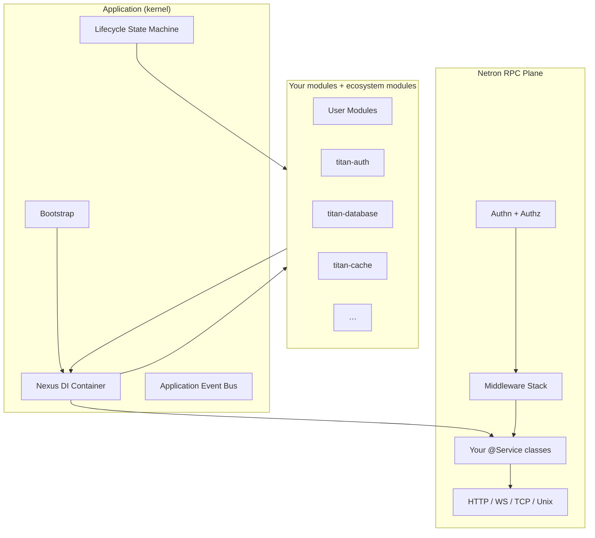

# Titan Framework

Titan is the backend framework at the heart of Omnitron. It is intentionally
small at its core and large at its surface — a focused application kernel
plus a deep catalogue of opt-in modules.

## What Titan is

A backend framework gives you four things you would otherwise build by hand:

1. **A way to declare structure** — what services exist, how they depend on
   each other, when they start and stop.
2. **A way to expose them** — over the network, behind authentication,
   with observability built in.
3. **A way to operate** — configuration, logging, health, metrics,
   traces, scheduled work.
4. **A way to recover** — typed errors, graceful shutdown, retries,
   circuit breakers, locks.

Titan provides all four with a deliberately minimal core (the
`Application`, the `Container`, the `Lifecycle`) and a library of modules
that compose into the runtime you actually want.

## What Titan is not

- **Not a "do everything" runtime.** Modules are independently versioned
  packages. You can run a Titan app with one of them.
- **Not opinion-free.** Titan has strong opinions about explicitness:
  no ambient state, no thread-locals, no auto-discovery from the
  filesystem. Every dependency is declared.
- **Not a NestJS clone.** Titan shares the decorator-driven aesthetic
  with NestJS, but the underlying container (Nexus) is a different
  design — multi-token providers, contextual injection, middleware
  pipelines, runtime-portable across Node/Bun/Deno/browser.

## The mental model

The Application kernel owns the container, the lifecycle, and the event
bus. Modules register providers in the container. Services are providers
that also register themselves with Netron. Netron exposes them over
transports. Middleware wraps every call.

That is it. Everything else — the 14 ecosystem modules, the validation
decorators, the resilience helpers — is built on top of these four
primitives.

## What this section covers

This is the reference section for Titan itself. It is dense, technical,
and assumes you have read the
[introduction](../intro.md) and worked through the
[quickstart](../getting-started/quickstart.md).

| Area                                                          | When to read                                          |
| ------------------------------------------------------------- | ----------------------------------------------------- |
| [Concepts](./concepts/design-principles.md)                   | Before designing a new Titan-based system             |
| [Application](./application/bootstrap.md)                     | When you start, stop, or supervise an app             |
| [Modules](./modules-system/defining-modules.md)               | When you organise services into reusable units        |
| [Dependency Injection](./di/overview.md)                      | When you need to control how things are constructed   |
| [Decorators](./decorators/index.md)                           | Reference for every decorator the framework ships     |
| [Validation](./validation/overview.md)                        | When inputs cross a trust boundary                    |
| [Errors](./errors/overview.md)                                | When you need typed, classifiable failures            |
| [Netron RPC](./netron.md)                                     | When you expose services over the network             |
| [Configuration](./configuration/overview.md)                  | When the runtime needs to read settings               |
| [Logging](./logging/overview.md)                              | When you need structured, context-aware logs          |
| [Tracing](./tracing.md)                                       | When you correlate work across services               |
| [Resilience](./resilience/overview.md)                        | When you defend against partial failure               |
| [Testing](./testing/overview.md)                              | When you write fast, deterministic tests              |
| [Best Practices](./best-practices/structuring-services.md)    | When you want the team to converge on conventions     |
| [Modules Catalogue](./modules/index.md)                       | The 14 ecosystem modules in detail                    |

## Versioning and stability

Titan follows semver. Every public API is annotated in source with a
stability marker:

| Marker          | Meaning                                                     |
| --------------- | ----------------------------------------------------------- |
| `@stable`       | Public API. Breaking changes are major-version only.        |
| `@experimental` | Public API but may change in minor versions. Opt in.        |
| `@internal`     | Not part of the public API. Do not import.                  |
| `@deprecated`   | Slated for removal. Documented migration path provided.     |

Internal subpaths (`@omnitron-dev/titan/internal/*`) are explicitly
unstable and reserved for the framework itself.

Read on: [Design Principles](./concepts/design-principles.md).
