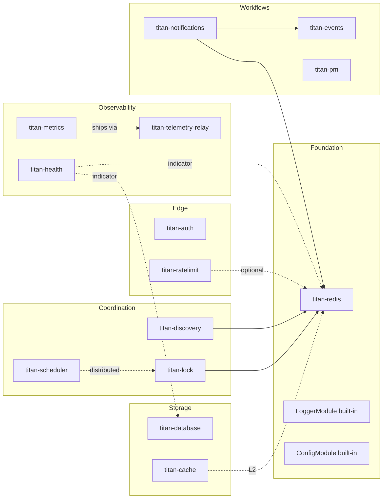

# Recipes

The per-module pages cover what each module does. This section
shows how they **compose** — real stacks for the most common
backend shapes, with full `forRoot` configs and the cross-module
wiring that makes them work together.

Each recipe is read top to bottom: pick the one matching your
workload, copy the `AppModule`, replace the env values, ship.

## Recipes

| Recipe                                                                       | Use case                                                              |
| ---------------------------------------------------------------------------- | --------------------------------------------------------------------- |
| [API service stack](./api-service.md)                                        | Public HTTP / WS API: auth, database, cache, rate limiting, health, metrics |
| [Worker fleet](./worker-fleet.md)                                            | Background jobs across pods: process manager, distributed lock, scheduler, metrics |
| [Observability stack](./observability-stack.md)                              | Logs / metrics / traces / health, shipped via the relay              |
| [Notifications pipeline](./notifications-pipeline.md)                        | Producer → queue → worker → channels, with rate limit + preferences |
| [Multi-tenant SaaS](./multi-tenant-saas.md)                                  | RLS-isolated database, contextual injection, tenant-scoped rate limits |

## How to read a recipe

Every recipe has the same shape:

1. **Shape** — what kind of backend this is and when to reach for it.
2. **Architecture diagram** — the modules involved and how they pass data.
3. **`AppModule`** — the canonical root module with every `forRoot`
   you need.
4. **Cross-module wiring notes** — the non-obvious bits: which
   token from module A is consumed by module B, what order
   matters, what config values must agree.
5. **Production checklist** — what to verify before shipping.

## Module dependency map

Use this map to plan your stack: start at the workload (API /
worker / notifications) and trace dependencies.
