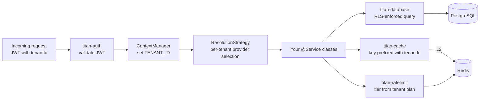

# Multi-tenant SaaS

A SaaS backend where one process serves many tenants and **must
not** leak data between them. Three load-bearing primitives make
this safe and ergonomic:

1. **Row-level security on the database.** Every query
   automatically constrained to the current tenant.
2. **Contextual injection in the DI container.** The same
   service token can resolve different per-tenant providers
   without your code knowing.
3. **Tenant-scoped rate limits.** Free / pro / enterprise tiers
   per tenant, not per process.

This recipe extends the [API service stack](./api-service.md) —
read that first; the differences here are tenant-isolation
patterns layered on top.

## Shape

- **Identity → tenant.** JWT carries `tenantId`; auth middleware
  sets it on the request context.
- **RLS at every query.** `@Policy`, `@Filter`, `@Allow`, `@Deny`
  on repositories constrain results by `tenantId`.
- **Per-tenant resolution.** A `STORAGE` token resolves to S3
  for enterprise tenants, local disk for the free tier — same
  code, different backend.
- **Tiered limits.** Each tenant's rate limit reflects their plan.
- **Per-tenant cache keys.** Cache keys include the tenant prefix
  so reads never cross tenants.

## Architecture



## Setting the tenant context

Custom auth-middleware step that, after JWT verify, stamps the
`tenantId` onto the request context:

```typescript
import { Injectable, Inject } from '@omnitron-dev/titan';
import { ContextManager, createContextKey }
  from '@omnitron-dev/titan/nexus';
import { JWTService, JWT_SERVICE_TOKEN } from '@omnitron-dev/titan-auth';

export const TENANT_ID = createContextKey<string>('tenant.id');
export const USER_TIER = createContextKey<string>('user.tier');

@Injectable()
class TenantContextMiddleware {
  constructor(
    @Inject(JWT_SERVICE_TOKEN) private readonly jwt:     JWTService,
    private readonly context:                            ContextManager,
  ) {}

  async handle(request: IRequestLike, next: () => Promise<unknown>) {
    const token = request.headers['authorization']?.replace(/^Bearer /, '');
    if (token) {
      const claims = await this.jwt.verify(token);
      this.context.set(TENANT_ID, claims.tenantId);
      this.context.set(USER_TIER, claims.tier);
    }
    return next();
  }
}
```

Wire as a Netron middleware (or in your transport adapter), so it
runs before every `@Service` method.

## Per-tenant DI — contextual providers

```typescript
import {
  createContextAwareProvider,
  TenantStrategy,
  createToken,
  Scope,
} from '@omnitron-dev/titan/nexus';

const STORAGE = createToken<IStorage>('Storage');

const storageProvider = createContextAwareProvider({
  strategy:  TenantStrategy,                  // reads TENANT_ID from context
  providers: {
    enterprise: { useClass: S3Storage },      // enterprise tenants → S3
    pro:        { useClass: S3Storage },
    free:       { useClass: LocalDiskStorage },
    default:    { useClass: LocalDiskStorage },
  },
  scope: Scope.Request,                       // resolved per request
});

container.register(STORAGE, storageProvider);
```

Now `@Inject(STORAGE)` returns S3 for enterprise tenants and local
disk for free tenants — same service code, different backend, no
`if` statements in your business logic.

## RLS on every repository

```typescript
import { TransactionAwareRepository, Repository, Policy, Filter, BypassRLS }
  from '@omnitron-dev/titan-database';

@Repository('orders')
@Policy({ skipFor: ['admin', 'service_role'] })
class OrdersRepository extends TransactionAwareRepository<Database, 'orders'> {
  @Filter({ operations: ['select', 'update', 'delete'] })
  tenantFilter(ctx: ExecutionContext) {
    return { tenant_id: ctx.context.get(TENANT_ID) };
  }

  @BypassRLS()
  async adminListAllAcrossTenants() {
    // Reserved for admin / system flows
    return this.executor.selectFrom('orders').selectAll().execute();
  }
}
```

Every regular query through `OrdersRepository` is constrained to
the tenant in the active context. `@BypassRLS` is the explicit
escape hatch for cross-tenant operations — every use should be
audited.

## Tenant-scoped cache keys

```typescript
import { Cacheable, CacheInvalidate } from '@omnitron-dev/titan-cache';

@Service('users@1.0.0')
class UsersService {
  @Public()
  @Cacheable({
    cacheName:    'users',
    keyGenerator: (ctx, id) => `${ctx.context.get(TENANT_ID)}:u:${id}`,
    ttl:          60,
    tags:         (ctx, id) => [`tenant:${ctx.context.get(TENANT_ID)}:user:${id}`],
  })
  async findById(ctx: ExecutionContext, id: string) {
    return this.repo.find(id);            // RLS applies inside the repo
  }

  @CacheInvalidate({
    cacheName: 'users',
    tags:      (ctx, input) => [`tenant:${ctx.context.get(TENANT_ID)}:user:${input.id}`],
  })
  async update(ctx: ExecutionContext, input: { id: string; patch: Partial<User> }) {
    return this.repo.update(input.id, input.patch);
  }
}
```

Cache keys are prefixed with `tenantId`; a cache hit for tenant A
**cannot** be returned to tenant B.

## Tenant-tier rate limits

```typescript
TitanRateLimitModule.forRoot({
  storageType: 'redis',
  strategy:    'sliding-window',
  defaultTier: { name: 'free', limit: 100, windowMs: 60_000 },
  tiers: {
    free:       { limit: 100,     windowMs: 60_000 },
    pro:        { limit: 1_000,   windowMs: 60_000 },
    enterprise: { limit: 100_000, windowMs: 60_000 },
  },
})
```

In your service:

```typescript
@Public()
@RateLimit((ctx) => `tenant:${ctx.context.get(TENANT_ID)}`, {
  // tier inferred from USER_TIER in context, or pass explicit:
  tier: (ctx) => ctx.context.get(USER_TIER),
})
async create(ctx: ExecutionContext, input: CreateInput) { /* … */ }
```

## Cross-module wiring notes

| Concern                          | Wiring detail                                                                                       |
| -------------------------------- | --------------------------------------------------------------------------------------------------- |
| Context propagation              | `ContextManager` set in middleware; read by `ResolutionStrategy`, RLS filters, cache keys, rate-limit keys |
| RLS bypass                       | `@BypassRLS` is structural — every use case needs a written justification; pair with an audit log    |
| Cache key prefix                 | Always include `TENANT_ID` in `keyGenerator` — never a raw id                                       |
| Per-tenant database (advanced)   | For physical isolation, register multiple named connections (`TitanDatabaseModule.forRoot({ connections: { tenantA, tenantB }})`) + contextual provider picks the right one |
| Rate-limit key                   | Tenant-scoped key prevents one tenant from exhausting another's allowance                            |
| JWT claims                       | `tenantId` and `tier` must be signed claims on the JWT — they cannot be supplied by the client      |
| Strategy purity                  | `ResolutionStrategy.selectProvider` must be a pure function of the context — side effects make it untestable |

## Production checklist

- [ ] **JWT carries `tenantId` and `tier` as signed claims** (not header-supplied)
- [ ] **Every repository has `@Filter` for tenant scope** OR `@BypassRLS` justified
- [ ] **Every cache key includes the tenant prefix** — no exceptions
- [ ] **Rate-limit keys include the tenant prefix** — same
- [ ] **`STORAGE` (or other tenant-conditional providers) registered with `Scope.Request`** — `Singleton` would cache the first tenant's instance for everyone
- [ ] **Cross-tenant queries (admin flows) audited** — every `@BypassRLS` call logged
- [ ] **`TENANT_ID` and `USER_TIER` context keys defined in one place** and imported everywhere — typos in keys silently break isolation
- [ ] **Integration tests cover cross-tenant attempts** — assert leakage attempts get empty results, not access

## Anti-patterns specific to multi-tenant

- **Caching without tenant prefix.** Cache hit for tenant A returned
  to tenant B. Easy to miss in code review; catch with a lint rule
  that requires `keyGenerator` on `@Cacheable`.
- **`Singleton` contextual providers.** First tenant's instance
  cached forever. Always `Scope.Request`.
- **Per-tenant database connections without pool limits.** A pod
  with 100 tenants × pool max 20 = 2_000 connections; Postgres
  rejects after a few hundred.
- **`@BypassRLS` without an audit trail.** Use a per-method audit
  decorator that logs every bypass call.
- **`tenantId` from a header.** Easily spoofed. Always derive from
  signed JWT claims.

## See also

- [API service stack](./api-service.md) — the base this recipe extends
- [DI / Contextual Injection](../di/contextual-injection.md) — the underlying pattern
- [`titan-database` RLS](../modules/database.mdx#row-level-security) — `@Policy`, `@Filter`, `@Allow`, `@Deny`, `@BypassRLS`
- [`titan-cache`](../modules/cache.mdx) — `keyGenerator` for per-tenant keys
- [`titan-ratelimit`](../modules/ratelimit.mdx) — tiered plans
