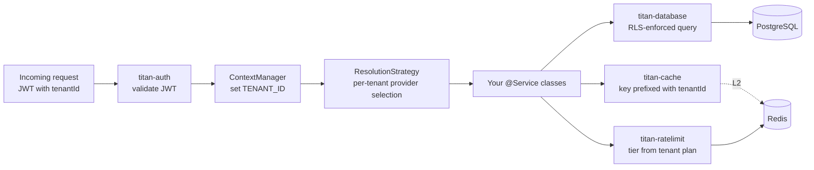

# Multi-tenant SaaS

A SaaS backend where one process serves many tenants and **must
not** leak data between them. Three load-bearing primitives make
this safe and ergonomic:

1. **Row-level security on the database.** Every query
   automatically constrained to the current tenant.
2. **Contextual injection in the DI container.** The same
   service token can resolve different per-tenant providers
   without your code knowing.
3. **Tenant-scoped rate limits.** Free / pro / enterprise tiers
   per tenant, not per process.

This recipe extends the [API service stack](./api-service.md) —
read that first; the differences here are tenant-isolation
patterns layered on top.

## Shape

- **Identity → tenant.** JWT carries `tenantId`; auth middleware
  sets it on the request context.
- **RLS at every query.** `@Policy`, `@Filter`, `@Allow`, `@Deny`
  on repositories constrain results by `tenantId`.
- **Per-tenant resolution.** A `STORAGE` token resolves to S3
  for enterprise tenants, local disk for the free tier — same
  code, different backend.
- **Tiered limits.** Each tenant's rate limit reflects their plan.
- **Per-tenant cache keys.** Cache keys include the tenant prefix
  so reads never cross tenants.

## Architecture


```mermaid
flowchart LR
  Req[Incoming request<br/>JWT with tenantId]
  Req --> Auth[titan-auth<br/>validate JWT]
  Auth --> Ctx[ContextManager<br/>set TENANT_ID]
  Ctx --> Strat[ResolutionStrategy<br/>per-tenant provider selection]
  Strat --> Service[Your @Service classes]
  Service --> RLS[titan-database<br/>RLS-enforced query]
  Service --> Cache[titan-cache<br/>key prefixed with tenantId]
  Service --> RL[titan-ratelimit<br/>tier from tenant plan]
  RLS --> PG[(PostgreSQL)]
  Cache -.L2.-> Redis[(Redis)]
  RL --> Redis
```

## Setting the tenant context

Custom auth-middleware step that, after JWT verify, stamps the
`tenantId` onto the request context:

```typescript
import { Injectable, Inject } from '@omnitron-dev/titan';
import { ContextManager, createContextKey }
  from '@omnitron-dev/titan/nexus';
import { JWTService, JWT_SERVICE_TOKEN } from '@omnitron-dev/titan-auth';

export const TENANT_ID = createContextKey<string>('tenant.id');
export const USER_TIER = createContextKey<string>('user.tier');

@Injectable()
class TenantContextMiddleware {
  constructor(
    @Inject(JWT_SERVICE_TOKEN) private readonly jwt:     JWTService,
    private readonly context:                            ContextManager,
  ) {}

  async handle(request: { headers: Record<string, string> }, next: () => Promise<unknown>) {
    const token = request.headers['authorization']?.replace(/^Bearer /, '');
    if (token) {
      // IJWTPayload uses snake_case `tenant_id`; `tier` is a custom claim.
      const claims = await this.jwt.verify(token);
      // `set` lives on the ContextProvider, not on the manager: the manager
      // selects and scopes providers, the provider holds the values.
      const ctx = this.context.getCurrentContext();
      ctx.set(TENANT_ID, claims.tenant_id as string);
      ctx.set(USER_TIER, claims.tier as string);
    }
    return next();
  }
}
```

Wire as a Netron middleware (or in your transport adapter), so it
runs before every `@Service` method.

## Per-tenant DI — contextual providers

The intent: a single `STORAGE` token resolves to S3 for enterprise
tenants and local disk for the free tier — same service code, different
backend, no `if` statements leaking into business logic.

`createContextAwareProvider` is an identity helper over the
`ContextAwareProvider` interface — a single object with a
`provide(context)` method and an optional `canProvide(context)` guard
(`createContextAwareProvider` in `packages/titan/src/nexus/context.ts`). There is **no**
`strategies` array and **no** `factory` key; the branching lives inside
`provide`, and the tenant is read from the resolution context's
`metadata`:

```typescript
import { createContextAwareProvider, createToken }
  from '@omnitron-dev/titan/nexus';

const STORAGE = createToken<IStorage>('Storage');

const storageProvider = createContextAwareProvider<IStorage>({
  // `context` is the active ResolutionContext; read tenant from its metadata.
  provide(context) {
    const tenant = context.metadata?.['tenant'] as { id: string; tier: string } | undefined;
    return tenant?.tier === 'enterprise' ? new S3Storage() : new LocalDiskStorage();
  },
});
```

The tenant lands in `context.metadata` because
`ContextManager.createResolutionContext` folds the active
`ContextProvider` into `metadata` (so the `TENANT_ID` your middleware
set, plus the built-in `ContextKeys.Tenant`, are visible there). The
built-in `ResolutionStrategy` classes (`TenantStrategy`, etc.) are a
**separate** mechanism — `ContextManager.selectProvider()` uses them to
pick among *several* registered providers; they are not passed into
`createContextAwareProvider`.

Resolve `storageProvider` in **`Scope.Request`** so the `provide`
callback re-runs per request (a `Singleton` would cache the first
tenant's backend for everyone). See
[DI / Contextual Injection](../di/contextual-injection.md) for the full
contextual-provider model, `@InjectContext`, and writing a custom
`ResolutionStrategy`.

## RLS on every repository

```typescript
import { BaseRepository, Repository, Policy, Filter, BypassRLS }
  from '@omnitron-dev/titan-database';
import { rlsContext } from '@kysera/rls';

@Repository<Order>({ table: 'orders' })
@Policy({ skipFor: ['admin', 'service_role'] })       // these roles bypass RLS
class OrdersRepository extends BaseRepository<Database, 'orders', Order> {
  // Filter: auto-adds a WHERE clause to reads. The context is the
  // @kysera/rls auth context (ctx.auth), NOT the DI ContextManager.
  @Filter({ operations: ['select', 'update', 'delete'] })
  tenantFilter(ctx: { auth: { tenantId: string } }) {
    return { tenant_id: ctx.auth.tenantId };
  }

  @BypassRLS()
  async adminListAllAcrossTenants() {
    // Reserved for admin / system flows
    return this.findAll();
  }
}
```

The RLS context is established with `rlsContext.runAsync(...)` (from
`@kysera/rls`) around the query — wire it from your auth middleware so
every request runs inside its tenant's context:

```typescript
import { rlsContext } from '@kysera/rls';

return rlsContext.runAsync(
  { auth: { userId, tenantId, roles, isSystem: false }, timestamp: new Date() },
  async () => this.ordersRepo.findAll(),   // automatically filtered by tenant_id
);
```

Every regular query through `OrdersRepository` is then constrained to
the tenant in the active RLS context. `@BypassRLS` is the explicit
escape hatch for cross-tenant operations — every use should be
audited.

> RLS enforcement requires the Kysera `rlsPlugin` to be active on the
> connection (add it to `kysera.plugins`). The `@Policy`/`@Filter`/
> `@Allow`/`@Deny` decorators declare the rules; the plugin enforces them.

## Tenant-scoped cache keys

`@Cacheable`'s `keyGenerator`/`tags` callbacks receive the **method
arguments** (`(...args)`), not an ambient context. So the `tenantId`
the key is prefixed with must be reachable from the args — the simplest
contract is to pass it explicitly:

```typescript
import { Cacheable, CacheInvalidate } from '@omnitron-dev/titan-cache';

@Service('users@1.0.0')
class UsersService {
  @Public()
  @Cacheable({
    cacheName:    'users',
    keyGenerator: (tenantId: string, id: string) => `${tenantId}:u:${id}`,
    ttl:          60,
    tags:         (tenantId: string, id: string) => [`tenant:${tenantId}:user:${id}`],
  })
  async findById(tenantId: string, id: string) {
    return this.repo.find(id);            // RLS applies inside the repo
  }

  @CacheInvalidate({
    cacheName: 'users',
    tags:      (tenantId: string, input: { id: string }) => [`tenant:${tenantId}:user:${input.id}`],
  })
  async update(tenantId: string, input: { id: string; patch: Partial<User> }) {
    return this.repo.update(input.id, input.patch);
  }
}
```

Cache keys are prefixed with `tenantId`; a cache hit for tenant A
**cannot** be returned to tenant B. (If you prefer to derive the
tenant from the request context instead of a parameter, read it from
the nexus `ContextManager` inside the method body and build the key
with `keyPrefix` + a per-call cache handle rather than `keyGenerator`.)

## Tenant-tier rate limits

```typescript
TitanRateLimitModule.forRoot({
  storageType: 'redis',
  strategy:    'sliding-window',
  defaultTier: { name: 'free', limit: 100, windowMs: 60_000 },
  tiers: {                                          // each tier needs a `name`
    free:       { name: 'free',       limit: 100,     windowMs: 60_000 },
    pro:        { name: 'pro',        limit: 1_000,   windowMs: 60_000 },
    enterprise: { name: 'enterprise', limit: 100_000, windowMs: 60_000 },
  },
})
```

In your service. `@RateLimit` takes an options object only; `keyGenerator`
receives the method args (not a context), and `tier` is a tier-name
string. Pass the tenant (and its resolved tier) as arguments:

```typescript
@Public()
@RateLimit({
  tier:         'pro',                              // tier name from this tenant's plan
  keyGenerator: (tenantId: string) => `tenant:${tenantId}`,
})
async create(tenantId: string, input: CreateInput) { /* … */ }
```

> The decorator also needs the limiter injected as `__rateLimitService__`
> (`@Inject(RATE_LIMIT_SERVICE_TOKEN)`) — see the API service stack — or it
> silently allows every request.

## Cross-module wiring notes

| Concern                          | Wiring detail                                                                                       |
| -------------------------------- | --------------------------------------------------------------------------------------------------- |
| Context propagation              | Two distinct contexts: the nexus `ContextManager` (set in middleware) feeds `ResolutionStrategy` + per-tenant DI; the `@kysera/rls` auth context (set via `rlsContext.runAsync`) feeds RLS `@Filter`/`@Allow` rules. Cache/rate-limit keys come from method args |
| RLS bypass                       | `@BypassRLS` is structural — every use case needs a written justification; pair with an audit log    |
| Cache key prefix                 | Always fold the tenant into the `keyGenerator` (from a method arg) — never key on a raw id           |
| Per-tenant database (advanced)   | For physical isolation, register multiple named connections (`TitanDatabaseModule.forRoot({ connections: { tenantA, tenantB }})`) + contextual provider picks the right one |
| Rate-limit key                   | Tenant-scoped key prevents one tenant from exhausting another's allowance                            |
| JWT claims                       | `tenantId` and `tier` must be signed claims on the JWT — they cannot be supplied by the client      |
| Strategy purity                  | A `ResolutionStrategy`'s `applies`/`select` (and a provider's `provide`) must be pure functions of the context — side effects make them untestable and order-dependent |

## Production checklist

- [ ] **JWT carries `tenantId` and `tier` as signed claims** (not header-supplied)
- [ ] **Every repository has `@Filter` for tenant scope** OR `@BypassRLS` justified
- [ ] **Every cache key includes the tenant prefix** — no exceptions
- [ ] **Rate-limit keys include the tenant prefix** — same
- [ ] **`STORAGE` (or other tenant-conditional providers) resolved per request** (per-request scope) — a `Singleton` would cache the first tenant's instance for everyone
- [ ] **Cross-tenant queries (admin flows) audited** — every `@BypassRLS` call logged
- [ ] **`TENANT_ID` and `USER_TIER` context keys defined in one place** and imported everywhere — typos in keys silently break isolation
- [ ] **Integration tests cover cross-tenant attempts** — assert leakage attempts get empty results, not access

## Anti-patterns specific to multi-tenant

- **Caching without tenant prefix.** Cache hit for tenant A returned
  to tenant B. Easy to miss in code review; catch with a lint rule
  that requires `keyGenerator` on `@Cacheable`.
- **`Singleton` contextual providers.** First tenant's instance
  cached forever. Always `Scope.Request`.
- **Per-tenant database connections without pool limits.** A pod
  with 100 tenants × pool max 20 = 2_000 connections; Postgres
  rejects after a few hundred.
- **`@BypassRLS` without an audit trail.** Use a per-method audit
  decorator that logs every bypass call.
- **`tenantId` from a header.** Easily spoofed. Always derive from
  signed JWT claims.

## See also

- [API service stack](./api-service.md) — the base this recipe extends
- [DI / Contextual Injection](../di/contextual-injection.md) — the underlying pattern
- [`titan-database` RLS](../modules/database.mdx#row-level-security) — `@Policy`, `@Filter`, `@Allow`, `@Deny`, `@BypassRLS`
- [`titan-cache`](../modules/cache.mdx) — `keyGenerator` for per-tenant keys
- [`titan-ratelimit`](../modules/ratelimit.mdx) — tiered plans
