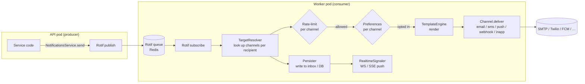

# Notifications pipeline

The shape for a notifications system that respects user preferences,
rate-limits per channel, isolates flaky delivery providers from the
request path, and runs on a worker fleet — so an SMS provider outage
doesn't slow down API responses.

## Shape

- **Producer.** API pods emit notification events; return
  immediately without waiting for delivery.
- **Queue.** Rotif (Redis-backed) carries events to workers,
  decoupling the request path from delivery.
- **Worker.** A separate pod consumes events, resolves channel
  targets per recipient, persists the notification, renders the
  template, calls the channel.
- **Rate-limited.** Per-user / per-channel limits prevent runaway
  loops from spamming users.
- **Preferences.** Per-user opt-in/out per channel.
- **Templates.** One payload renders to N channels with
  per-channel transformations.

## Architecture



## `AppModule` — producer (API pod)

```typescript
import { Module } from '@omnitron-dev/titan';
import { ConfigModule } from '@omnitron-dev/titan/module/config';
import { LoggerModule } from '@omnitron-dev/titan/module/logger';

import { TitanRedisModule } from '@omnitron-dev/titan-redis';
import { TitanEventsModule } from '@omnitron-dev/titan-events';
import { NotificationsModule } from '@omnitron-dev/titan-notifications';

@Module({
  imports: [
    ConfigModule.forRoot({/* … */}),
    LoggerModule.forRoot({ level: 'info' }),

    TitanRedisModule.forRoot({
      config: { url: process.env.REDIS_URL, db: 0 },
    }),

    TitanEventsModule.forRoot({
      wildcard:     true,
      maxListeners: 100,
      history:      { enabled: false },
    }),

    NotificationsModule.forRoot({
      redis: process.env.REDIS_URL,

      // Optional: route through Rotif for cross-pod delivery
      transport: {
        rotif: { /* rotif transport options */ },
      },

      defaultChannels: ['inapp', 'email'],
      enableInApp:     true,
      enableWebhook:   true,

      templates: {
        enabled:      true,
        cacheEnabled: true,
        cacheTTL:     60_000,
      },

      rateLimiterConfig: {
        defaultLimits: { perMinute: 10, perHour: 100, perDay: 1_000 },
        channelLimits: { sms: { perMinute: 1, perHour: 10 } },
        enableBurstDetection: true,
      },

      preferenceStoreConfig: {
        defaultPreferences: {
          channels: { email: true, sms: false, push: true, inapp: true },
        },
      },
    }),

    UsersModule,
  ],
})
export class AppModule {}
```

## Producer side — emitting a notification

```typescript
import { Service, Public, Inject } from '@omnitron-dev/titan';
import {
  NOTIFICATIONS_SERVICE,
  type NotificationsService,
} from '@omnitron-dev/titan-notifications';

@Service({ name: 'users' })
class UsersService {
  constructor(
    @Inject(NOTIFICATIONS_SERVICE) private readonly notify: NotificationsService,
  ) {}

  @Public()
  async create(input: CreateInput) {
    const user = await this.repo.create(input);

    // Returns immediately — actual delivery happens on a worker pod.
    await this.notify.send(
      { userId: user.id, email: user.email },
      { template: 'welcome', data: { name: user.name } },
      { channels: ['email', 'inapp'] },
    );

    return user;
  }
}
```

## Worker pod — consuming and delivering

```typescript
import { Module } from '@omnitron-dev/titan';
import { NotificationsModule } from '@omnitron-dev/titan-notifications';

const USER_TARGET_RESOLVER_TOKEN = createToken<INotificationTargetResolver>('UserTargetResolver');
const NOTIFICATION_PERSISTER_TOKEN = createToken<INotificationPersister>('NotificationPersister');
const REALTIME_SIGNALER_TOKEN = createToken<INotificationRealtimeSignaler>('RealtimeSignaler');

@Module({
  imports: [
    ConfigModule.forRoot({/* … */}),
    LoggerModule.forRoot({ level: 'info' }),
    TitanRedisModule.forRoot({ config: { url: process.env.REDIS_URL } }),

    NotificationsModule.forWorker({
      targetResolver:   USER_TARGET_RESOLVER_TOKEN,
      persister:        NOTIFICATION_PERSISTER_TOKEN,
      realtimeSignaler: REALTIME_SIGNALER_TOKEN,
      workerOptions: {
        concurrency: 8,
      },
    }),
  ],
  providers: [
    { provide: USER_TARGET_RESOLVER_TOKEN, useClass: MyUserResolver },
    { provide: NOTIFICATION_PERSISTER_TOKEN, useClass: MyPersister },
    { provide: REALTIME_SIGNALER_TOKEN, useClass: MyRealtimeSignaler },
  ],
})
export class WorkerModule {}
```

`MyUserResolver`, `MyPersister`, `MyRealtimeSignaler` are the
three integration points you implement once per project. They
wire the abstract worker to your concrete user store, your
inbox storage, and your realtime channel.

## A custom channel — e.g. SMTP email

```typescript
import { AbstractEmailChannel } from '@omnitron-dev/titan-notifications';
import nodemailer from 'nodemailer';

class SmtpEmailChannel extends AbstractEmailChannel {
  name = 'email-smtp';

  private readonly transport = nodemailer.createTransport({/* … */});

  async deliver(recipient, rendered, options) {
    return this.transport.sendMail({
      to:      recipient.email,
      subject: rendered.subject,
      html:    rendered.body,
    });
  }
}
```

Register it via `forRoot({ channels: [new SmtpEmailChannel()] })`.

## Cross-module wiring notes

| Concern                          | Wiring detail                                                                                          |
| -------------------------------- | ------------------------------------------------------------------------------------------------------ |
| Producer vs worker mode          | `NotificationsModule.forRoot` for producers, `NotificationsModule.forWorker` for workers — different DI shapes |
| Rotif transport                  | Configured under `transport.rotif` on the producer side; worker consumes via the same Redis instance    |
| Rate-limiter location            | `RedisRateLimiter` runs on the worker side, before each channel delivery                                |
| Preference enforcement           | `RedisPreferenceStore` checked on the worker — producer doesn't know per-user prefs                     |
| Template caching                 | `templates.cacheEnabled: true` + `cacheTTL` avoid re-fetching template definitions on every send       |
| Realtime + in-app                | `RealtimeSignaler` pushes to WS/SSE; in-app channel persists the notification to the inbox             |
| Webhook signature                | `webhookConfig.signatureSecret` + `signatureHeader` for HMAC-signed delivery                            |
| DLQ                              | Failed deliveries land in a Rotif dead-letter queue (see Rotif config)                                  |

## Production checklist

- [ ] **Producer + worker pods deployed separately** — independent scaling
- [ ] **`rateLimiterConfig.channelLimits.sms` set** — SMS is expensive and rate-limited by providers
- [ ] **`preferenceStoreConfig.defaultPreferences` set** — compliance with user opt-outs
- [ ] **Templates registered** at boot, not at first use
- [ ] **DLQ monitored** — repeated failures should alert
- [ ] **Channel-specific timeouts** — e.g. `webhookConfig.timeout: 5_000`
- [ ] **Realtime signaler graceful degradation** — if WS gateway is down, notification is still persisted
- [ ] **Persistence backend backed up** — in-app inbox should survive redis loss
- [ ] **Test channels** in staging — `MockEmailChannel` etc. for end-to-end verification

## See also

- [`titan-notifications`](../modules/notifications.mdx) — full reference
- [`titan-events`](../modules/events.mdx) — in-process events the producer emits
- [`titan-ratelimit`](../modules/ratelimit.mdx) — alternative rate-limit backing
- [`titan-redis`](../modules/redis.mdx) — Rotif transport runs on this
