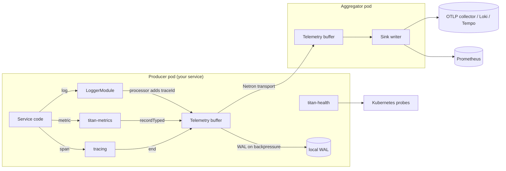

# Observability stack

End-to-end observability without external SDKs: structured logs
with trace correlation, native counters / gauges / histograms,
W3C trace propagation across RPC calls, and a store-and-forward
relay that ships everything to your sink even through network
outages.

## Shape

- **Logs.** Structured JSON via `LoggerModule`, with `traceId` /
  `spanId` attached automatically.
- **Metrics.** Counters / histograms via `titan-metrics`, with
  Prometheus exposition + persistent storage.
- **Traces.** W3C `traceparent` carried through async scopes via
  `@omnitron-dev/titan/tracing`.
- **Health.** Standard probes via `titan-health`.
- **Shipping.** All three pillars buffered locally and shipped via
  `titan-telemetry-relay` — survives collector outages without
  data loss.

## Architecture



## `AppModule` — producer side

```typescript
import { Module } from '@omnitron-dev/titan';
import { ConfigModule } from '@omnitron-dev/titan/module/config';
import {
  LoggerModule,
  ConsoleTransport,
  RedactionProcessor,
  type ILogProcessor,
} from '@omnitron-dev/titan/module/logger';
import { currentTrace } from '@omnitron-dev/titan/tracing';

import { TitanMetricsModule } from '@omnitron-dev/titan-metrics';
import { TitanHealthModule }  from '@omnitron-dev/titan-health';

// Custom processor: stamp traceId/spanId on every log line
const TraceContextProcessor: ILogProcessor = {
  process(record) {
    const trace = currentTrace();
    if (trace) {
      record.traceId = trace.traceId;
      record.spanId  = trace.spanId;
    }
    return record;
  },
};

@Module({
  imports: [
    ConfigModule.forRoot({/* ... */}),

    // ── Logging with redaction + trace correlation ─────────────────────
    LoggerModule.forRoot({
      level: process.env.NODE_ENV === 'production' ? 'info' : 'debug',
      transports: [new ConsoleTransport({ pretty: process.env.NODE_ENV !== 'production' })],
      processors: [
        new RedactionProcessor({
          paths: ['password', 'token', 'headers.authorization'],
        }),
        TraceContextProcessor,
      ],
    }),

    // ── Metrics (with auto RPC instrumentation) ────────────────────────
    TitanMetricsModule.forRoot({
      appName: 'my-service',
      collection: {
        enabled:  true,
        interval: 10_000,
        process:  true,      // CPU / RSS / heap
        system:   true,      // load, free mem
        rpc:      true,      // every Netron call auto-counted
        custom:   true,
      },
      storage:   { type: 'memory', batchSize: 500, flushInterval: 10_000 },
      retention: { maxAge: '24h', cleanupInterval: 600_000 },
    }),

    // ── Health probes ──────────────────────────────────────────────────
    TitanHealthModule.forRoot({
      enableMemoryIndicator:    true,
      enableEventLoopIndicator: true,
      memoryThresholds:         { heapDegradedThreshold: 0.8, heapUnhealthyThreshold: 0.95 },
      eventLoopThresholds:      { degradedThreshold: 50, unhealthyThreshold: 200 },
      timeout:                  3_000,
      enableCaching:            true,
      cacheTtl:                 1_000,
      enableRpcService:         true,
      version:                  process.env.APP_VERSION,
    }),

    // ── Your feature modules ───────────────────────────────────────────
    UsersModule,
  ],
})
export class AppModule {}
```

## Wiring the telemetry relay

The relay is **not** a Titan module — instantiate it in your
bootstrap and wire it as a clientModule or via your DI container:

```typescript
import { TelemetryRelayService } from '@omnitron-dev/titan-telemetry-relay';
import { Application } from '@omnitron-dev/titan';

const relay = new TelemetryRelayService({
  role:         'producer',
  nodeId:       process.env.HOSTNAME ?? 'unknown',
  bufferConfig: { maxSize: 10_000, flushInterval: 5_000, compressionEnabled: true },
  walConfig:    { enabled: true, directory: './.wal', maxFileSize: 10 * 1024 * 1024, retentionDays: 7 },
});

relay.setTransport(buildNetronTransportToAggregator());
await relay.start();

const app = await Application.create({ modules: [AppModule] });
await app.start();

// Bridge: pipe LoggerService outputs into the relay
// Bridge: pipe MetricsService periodic snapshots into the relay
// (project-specific glue — implement once per app)

process.on('SIGTERM', async () => {
  await app.stop();
  await relay.stop();
});
```

## Aggregator pod

```typescript
const relay = new TelemetryRelayService({
  role: 'aggregator',
});

relay.setAggregator({
  async write(entries) {
    // Ship to your backend(s): OTLP, Loki, Tempo, Prometheus remote-write, etc.
    await Promise.all([
      shipLogs(entries.filter(e => e.type === 'log')),
      shipMetrics(entries.filter(e => e.type === 'metric')),
      shipTraces(entries.filter(e => e.type === 'trace')),
    ]);
  },
  async query(filter) { /* … */ return []; },
});

await relay.start();

// Expose a Netron RPC endpoint so producer pods can call relay.receive(nodeId, entries)
const app = await Application.create({ modules: [AggregatorModule] });
await app.start();
```

## Trace propagation in your code

```typescript
import { startSpan, currentTrace } from '@omnitron-dev/titan';

@Public()
async findById(id: string) {
  const { traceContext, end } = startSpan('repo.find', { resource: 'users' });
  try {
    return await this.repo.find(id);
  } finally {
    end('ok');
  }
}
```

Netron propagates the `traceparent` across RPC calls automatically;
log lines inside the span automatically carry `traceId` / `spanId`
through the `TraceContextProcessor` above.

## A typical instrumented service

```typescript
import { Service, Public } from '@omnitron-dev/titan';
import { startSpan } from '@omnitron-dev/titan';
import { Metrics } from '@omnitron-dev/titan-metrics';

@Service('users@1.0.0')
class UsersService {
  constructor(
    private readonly logger: LoggerService,
    private readonly metrics: MetricsService,
  ) {}

  @Public()
  @Metrics({ counter: { name: 'users.findById.total' }, histogram: { name: 'users.findById.ms' } })
  async findById(id: string) {
    this.logger.info('findById', { id });                       // gets traceId/spanId via processor
    const { end } = startSpan('repo.find');
    try {
      return await this.repo.find(id);
    } finally {
      end('ok');
    }
  }
}
```

## Cross-module wiring notes

| Concern                       | Wiring detail                                                                                       |
| ----------------------------- | --------------------------------------------------------------------------------------------------- |
| Trace → log correlation       | `TraceContextProcessor` reads `currentTrace()` and stamps `traceId` / `spanId` on every log record   |
| Auto-RPC metrics              | `collection.rpc: true` auto-counts Netron calls — no per-method `@Metrics` needed                    |
| Health → readiness            | `/readyz` returns `200` only when every indicator is `healthy` or `degraded` — not `unhealthy`       |
| Relay producer vs aggregator  | Producer pods buffer + ship via transport; aggregator receives + writes to sink. Either or both.    |
| WAL crash safety              | `walConfig.enabled: true` writes buffer to disk on overflow; replayed on next start                  |
| Metrics retention             | `retention.maxAge` is the in-storage window; ship metrics to long-term backend before that elapses   |

## Production checklist

- [ ] **Logs**: `RedactionProcessor` includes every sensitive header / field
- [ ] **Logs**: `TraceContextProcessor` (or equivalent) attached — without it, trace correlation breaks
- [ ] **Metrics**: `appName` set; otherwise cross-pod metrics pile together
- [ ] **Metrics**: storage backend chosen — `'memory'` is lost on restart
- [ ] **Metrics**: scraped by Prometheus (`/metrics`) OR shipped via relay (pick one)
- [ ] **Traces**: trace context propagated across worker thread boundaries via `withTrace`
- [ ] **Health**: `enableRpcService: true` so the orchestrator can poll via Netron
- [ ] **Relay**: `walConfig.enabled: true` in production
- [ ] **Relay**: producer / aggregator topology mirrors your deployment shape
- [ ] **Relay**: aggregator's `write()` is idempotent (handles retries from buffer re-enqueue)
- [ ] **K8s**: `terminationGracePeriodSeconds` ≥ relay's flush interval + buffer drain time

## See also

- [Logging / Overview](../logging/overview.md) and per-page references
- [Tracing](../tracing.md) — full tracing primitive reference
- [`titan-metrics`](../modules/metrics.mdx) — full metrics reference
- [`titan-health`](../modules/health.mdx) — full health reference
- [`titan-telemetry-relay`](../modules/telemetry-relay.mdx) — relay reference
- [Best Practices / Observability](../best-practices/observability.md)
