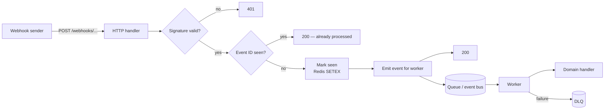

# Webhook receiver

Receiving webhooks from a third party (Stripe, GitHub, payment
processor, etc.) seems trivial — but it has subtle requirements
that go wrong in production: signatures, replay protection,
idempotency, and isolating slow downstream work from the
acknowledgement window.

## Shape

- **Signature verification.** Reject anything not signed by the
  expected sender — usually HMAC with a shared secret.
- **Idempotency.** Webhook senders retry on timeout. Process each
  event ID at most once.
- **Fast 2xx response.** Senders treat slow ack as failure and
  retry. Acknowledge quickly; process asynchronously.
- **Dead-letter on failure.** Failures persist somewhere for
  inspection / manual retry — not lost.

## Architecture



## Setup

```typescript
import { Module } from '@omnitron-dev/titan';
import { ConfigModule } from '@omnitron-dev/titan/module/config';
import { LoggerModule } from '@omnitron-dev/titan/module/logger';

import { TitanRedisModule } from '@omnitron-dev/titan-redis';
import { TitanRateLimitModule } from '@omnitron-dev/titan-ratelimit';
import { TitanEventsModule } from '@omnitron-dev/titan-events';
import { TitanMetricsModule } from '@omnitron-dev/titan-metrics';

@Module({
  imports: [
    ConfigModule.forRoot({/* … */}),
    LoggerModule.forRoot({ level: 'info' }),
    TitanRedisModule.forRoot({ config: { url: env.REDIS_URL } }),
    TitanRateLimitModule.forRoot({
      enabled:         true,
      storageType:     'redis',
      strategy:        'sliding-window',
      defaultLimit:    500,
      defaultWindowMs: 60_000,
    }),
    TitanEventsModule.forRoot({ wildcard: true, maxListeners: 50 }),
    TitanMetricsModule.forRoot({ appName: 'webhooks' }),
    WebhooksModule,                          // your handlers
  ],
})
export class AppModule {}
```

## Handler — verify, deduplicate, enqueue

```typescript
import { Service, Public, Inject } from '@omnitron-dev/titan';
import { Errors } from '@omnitron-dev/titan/errors';
import { RateLimit } from '@omnitron-dev/titan-ratelimit';
import { EVENTS_SERVICE_TOKEN, type EventsService }
  from '@omnitron-dev/titan-events';
import { createHmac, timingSafeEqual } from 'node:crypto';

const SIGNING_SECRET = process.env.WEBHOOK_SIGNING_SECRET!;
const DEDUP_TTL_S    = 7 * 24 * 60 * 60;     // 7 days

@Service({ name: 'webhooks' })
class WebhooksService {
  constructor(
    @InjectRedis() private readonly redis: IRedisClient,
    @Inject(EVENTS_SERVICE_TOKEN) private readonly events: EventsService,
    private readonly logger: LoggerService,
  ) {}

  @Public()
  @RateLimit('webhooks:receive', { limit: 1_000, windowMs: 60_000 })
  async receive(
    body:      string,                       // raw body for signature verification
    signature: string,
    eventId:   string,
    eventType: string,
  ) {
    // 1. Verify signature — constant-time comparison
    const expected = createHmac('sha256', SIGNING_SECRET).update(body).digest('hex');
    const ok = signature.length === expected.length &&
               timingSafeEqual(Buffer.from(signature), Buffer.from(expected));
    if (!ok) throw Errors.unauthorized('invalid webhook signature');

    // 2. Deduplicate — SETEX returns OK on first set, nil on existing key
    const key = `webhook:seen:${eventId}`;
    const wasSet = await this.redis.set(key, '1', 'EX', DEDUP_TTL_S, 'NX');
    if (wasSet === null) {
      this.logger.info('webhook duplicate', { eventId, eventType });
      return { status: 'duplicate' };          // 200 — already processed
    }

    // 3. Enqueue for async processing — acknowledge fast
    await this.events.emitAsync(`webhook.${eventType}`, { eventId, body: JSON.parse(body) });

    return { status: 'accepted', eventId };
  }
}
```

> **Always verify on the RAW body**, before any JSON parsing. JSON
> serialisation isn't byte-stable; even round-tripping
> `JSON.parse → JSON.stringify` can change a single byte and break
> the HMAC.

## Handler — async processing

```typescript
import { Injectable } from '@omnitron-dev/titan';
import { OnEvent } from '@omnitron-dev/titan-events';
import { Retry } from '@omnitron-dev/titan/decorators';

@Injectable()
class StripePaymentHandler {
  @OnEvent({ event: 'webhook.charge.succeeded', async: true })
  @Retry({ attempts: 3, delay: 500 })
  async onChargeSucceeded(payload: { eventId: string; body: any }) {
    try {
      await this.applyPayment(payload.body);
    } catch (e) {
      // Failure persisted to DLQ by the metrics + logger combo
      this.logger.error('payment processing failed', { eventId: payload.eventId, error: e });
      throw e;
    }
  }
}
```

## Cross-module wiring notes

| Concern                  | Wiring detail                                                                                       |
| ------------------------ | --------------------------------------------------------------------------------------------------- |
| Signature on raw body    | Read the raw request body *before* JSON parsing — `@Validate(Schema)` runs after deserialise        |
| Deduplication key TTL    | Match or exceed the sender's max retry window (e.g. Stripe = 3 days, GitHub = 8 hours)              |
| Rate limit per sender    | Use a key that includes the sender ID — otherwise one sender saturates the bucket for all of them   |
| Idempotency on writes    | Downstream handlers should also be idempotent — webhooks at-least-once even with dedup              |
| Event bus vs queue       | In-process `EventsService` is sufficient for single-pod; for multi-pod use [`titan-notifications`](../modules/notifications.mdx) over Rotif |
| DLQ                      | If using `titan-notifications` worker mode, failed deliveries auto-route to the Rotif DLQ           |
| Metric per event-type    | `metrics.recordTyped('counter', 'webhook.received.total', { type: eventType, status }, 1)`         |

## Production checklist

- [ ] **Raw body** captured before JSON parse — required for HMAC
- [ ] **Constant-time signature comparison** (`timingSafeEqual`) — never `===` on secrets
- [ ] **Dedup TTL** ≥ sender's max retry window
- [ ] **Dedup uses `SET NX EX`** — atomic check-and-set
- [ ] **Fast ack** — return 2xx within sender's timeout (typically 5-10 s)
- [ ] **Async processing** via event bus or queue — never block the ack
- [ ] **Handler `@Retry`** for transient failures
- [ ] **DLQ for non-retryable failures** — inspectable, replayable
- [ ] **Rate limit per-sender** if you receive from many sources
- [ ] **Metrics on every step**: received, deduplicated, accepted, processed, failed
- [ ] **Replay test in staging** — re-send the same event, assert it's deduplicated

## See also

- [`titan-events`](../modules/events.mdx) — async dispatch
- [`titan-notifications`](../modules/notifications.mdx) — for cross-pod queueing + DLQ
- [`titan-ratelimit`](../modules/ratelimit.mdx) — per-sender throttling
- [Resilience / Retry](../resilience/retry.md) — transient failure handling
