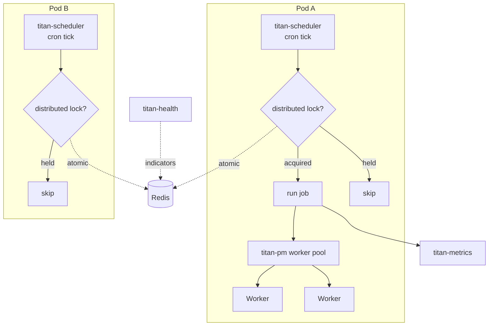

# Worker fleet

The canonical shape for **background work** at scale: scheduled
jobs that should run exactly-once across a fleet, CPU-bound work
isolated from the main event loop, and per-job retry / circuit-
breaking / metrics — all coordinated through Redis.

## Shape

- **Scheduled jobs.** Cron and intervals via `titan-scheduler`,
  auto-discovered by decorator.
- **Exactly-once across pods.** Distributed locks via
  `titan-lock`, so the same scheduled job doesn't run on every
  pod.
- **CPU isolation.** Heavy work in worker processes via
  `titan-pm`, with pools / restart policies.
- **Persistence.** Job state survives restarts (Redis-backed
  scheduler).
- **Metrics + health.** Per-job execution counts, durations,
  failures.

## Architecture



## `AppModule`

```typescript
import { Module } from '@omnitron-dev/titan';
import { z } from '@omnitron-dev/titan/validation';
import { ConfigModule } from '@omnitron-dev/titan/module/config';
import { LoggerModule, ConsoleTransport } from '@omnitron-dev/titan/module/logger';

import { TitanRedisModule } from '@omnitron-dev/titan-redis';
import { TitanLockModule } from '@omnitron-dev/titan-lock';
import { SchedulerModule, RedisPersistenceProvider } from '@omnitron-dev/titan-scheduler';
import { ProcessManagerModule } from '@omnitron-dev/titan-pm';
import { TitanMetricsModule } from '@omnitron-dev/titan-metrics';
import { TitanHealthModule } from '@omnitron-dev/titan-health';

const WorkerConfigSchema = z.object({
  env:   z.enum(['development', 'staging', 'production']),
  redis: z.object({ url: z.string().url() }),
  pm:    z.object({
    maxRestarts:    z.number().int(),
    maxMemory:      z.string(),
    poolMinWorkers: z.number().int(),
    poolMaxWorkers: z.number().int(),
  }),
});

@Module({
  imports: [
    ConfigModule.forRoot({
      schema:  WorkerConfigSchema,
      sources: [
        { type: 'file', path: 'config/default.yaml' },
        { type: 'env',  prefix: 'WORKER_' },
      ],
      validateOnStartup: true,
    }),

    LoggerModule.forRoot({
      level:      'info',
      transports: [new ConsoleTransport({ pretty: false })],   // JSON in prod
    }),

    // ── Foundation ─────────────────────────────────────────────────────
    TitanRedisModule.forRootAsync({
      useFactory: (config: ConfigService) => ({
        clients: [
          { namespace: 'default', url: config.get('redis.url'), db: 0 },
          { namespace: 'lock',    url: config.get('redis.url'), db: 5 },
          { namespace: 'sched',   url: config.get('redis.url'), db: 6 },
        ],
      }),
      inject: [ConfigService],
    }),

    // ── Distributed locks (used by scheduler + decorators) ─────────────
    TitanLockModule.forRoot({
      defaultTtl:        60_000,                     // 1 min default
      keyPrefix:         'lock',
      defaultRetries:    3,
      defaultRetryDelay: 200,
      redisClientName:   'lock',
    }),

    // ── Scheduler with Redis persistence ───────────────────────────────
    SchedulerModule.forRootAsync({
      useFactory: (redis: RedisService) => ({
        enabled:         true,
        timezone:        'UTC',
        persistence:     {
          enabled:  true,
          provider: new RedisPersistenceProvider(redis.getClient('sched')),
        },
        metrics:         { enabled: true, interval: 5_000 },
        maxConcurrent:   10,
        shutdownTimeout: 30_000,
      }),
      inject: [RedisService],
    }),

    // ── Process manager for CPU work ───────────────────────────────────
    ProcessManagerModule.forRootAsync({
      useFactory: (config: ConfigService) => ({
        isolation: 'worker',
        transport: 'unix',
        restartPolicy: {
          enabled:     true,
          maxRestarts: config.get('pm.maxRestarts'),
          window:      60_000,
          delay:       1_000,
          backoff: { type: 'exponential', initial: 1_000, max: 30_000, factor: 2 },
        },
        resources: {
          maxMemory: config.get('pm.maxMemory'),
          maxCpu:    1.0,
          timeout:   60_000,
        },
        monitoring: {
          healthCheck: { interval: 5_000, timeout: 2_000 },
          metrics:     true,
          tracing:     false,
        },
        advanced: { gracefulShutdownTimeout: 30_000 },
      }),
      inject: [ConfigService],
    }),

    // ── Metrics ────────────────────────────────────────────────────────
    TitanMetricsModule.forRoot({
      appName:    'worker-fleet',
      collection: { enabled: true, interval: 10_000, process: true, system: true, custom: true },
      storage:    { type: 'sqlite', batchSize: 200, flushInterval: 10_000 },
      retention:  { maxAge: '14d', cleanupInterval: 3_600_000 },
    }),

    // ── Health ─────────────────────────────────────────────────────────
    TitanHealthModule.forRootAsync({
      useFactory: (redis: RedisService) => ({
        enableMemoryIndicator:    true,
        enableEventLoopIndicator: true,
        enableRedisIndicator:     true,
        redisClient:              redis.getClient('default'),
        timeout:                  2_000,
        enableCaching:            true,
        version:                  process.env.APP_VERSION,
      }),
      inject: [RedisService],
    }),

    // ── Your task / worker modules ─────────────────────────────────────
    TasksModule,
    ReportsModule,
  ],
})
export class AppModule {}
```

## A scheduled task (exactly-once)

```typescript
import { Injectable } from '@omnitron-dev/titan';
import { Schedulable, Cron, CronExpression } from '@omnitron-dev/titan-scheduler';
import { WithDistributedLock } from '@omnitron-dev/titan-lock';
import { LOCK_SERVICE_TOKEN } from '@omnitron-dev/titan-lock';
import { LOGGER_SERVICE_TOKEN } from '@omnitron-dev/titan/module/logger';

@Injectable()
@Schedulable()
class CleanupTasks {
  constructor(
    @Inject(LOCK_SERVICE_TOKEN)   private readonly __lockService__: IDistributedLockService,
    @Inject(LOGGER_SERVICE_TOKEN) private readonly loggerModule:    ILoggerModule,
  ) {}

  @Cron(CronExpression.EVERY_HOUR, { timezone: 'UTC' })
  @WithDistributedLock('cleanup:hourly', 30 * 60_000)     // up to 30 min
  async hourlyCleanup() {
    // Runs on exactly one pod per hour.
    await this.deleteExpired();
  }

  @Cron('0 3 * * *')
  @WithDistributedLock('cleanup:nightly', 60 * 60_000)   // up to 1 hour
  async nightlyCleanup() {
    await this.archiveOldRecords();
  }
}
```

## A CPU-bound worker pool

```typescript
import {
  Process, Public, OnShutdown, Trace, Metric, CircuitBreaker, Idempotent,
} from '@omnitron-dev/titan-pm';

@Process({ name: 'image-worker' })
class ImageWorker {
  @Public()
  @Trace()
  @Metric({ counter: 'images.resized', histogram: 'images.resize.ms' })
  @CircuitBreaker({ failureThreshold: 5, timeout: 30_000 })
  @Idempotent({ keyFn: (input, w) => `${hash(input)}:${w}` })
  async resize(input: Buffer, width: number): Promise<Buffer> {
    return sharp(input).resize(width).toBuffer();
  }

  @OnShutdown()
  async cleanup() {
    // Drain pending tasks before exit
  }
}

@Service({ name: 'media' })
class MediaService {
  constructor(@Inject(PM_MANAGER_TOKEN) private readonly pm: ProcessManager) {}

  @Public()
  async resize(input: Buffer, width: number) {
    const pool = this.pm.createPool(ImageWorker, { min: 2, max: 8 });
    return pool.invoke('resize', [input, width]);
  }
}
```

## Cross-module wiring notes

| Concern                        | Wiring detail                                                                                          |
| ------------------------------ | ------------------------------------------------------------------------------------------------------ |
| Redis namespaces               | `default`, `lock` (db 5), `sched` (db 6) — separate DBs prevent key collisions and ease debugging       |
| `@WithDistributedLock` wiring  | Decorator looks up the lock service on the instance under `__lockService__`; inject it there explicitly |
| Lock TTL > job duration        | `WithDistributedLock('key', ttl)` — `ttl` must exceed the worst-case duration or another pod takes over mid-execution |
| Scheduler persistence          | `RedisPersistenceProvider` lets jobs resume after pod restart; without it, scheduled state is lost      |
| PM restart backoff             | `restartPolicy.backoff` with `type: 'exponential'` prevents crash-loop flooding; cap with `max`         |
| Worker resource limits         | `resources.maxMemory` + `resources.maxCpu` enforce limits; without them, runaway workers can starve peers |
| Liveness sweep                 | PM's defense-in-depth — even if a worker dies without exit signal, the sweep notices and restarts       |

## Production checklist

- [ ] `SchedulerModule.persistence.enabled: true` — without it, jobs lost on restart
- [ ] Every scheduled job that mutates shared state uses `@WithDistributedLock`
- [ ] Lock `ttl` ≥ worst-case job duration × 2
- [ ] `PM.restartPolicy.backoff` configured to prevent crash-loops
- [ ] Worker `resources.maxMemory` set — otherwise leaks bring down the pod
- [ ] `monitoring.metrics: true` on PM — without metrics you can't see worker health
- [ ] `MetricsModule.storage: 'sqlite'` or `'postgres'` — `'memory'` is lost on restart
- [ ] Logs shipped off-host — workers crash, logs need to survive
- [ ] Kubernetes worker pods use `terminationGracePeriodSeconds` ≥ `shutdownTimeout`
- [ ] Scheduler `shutdownTimeout` ≥ longest job's expected duration

## See also

- [`titan-scheduler`](../modules/scheduler.mdx) — full scheduler reference
- [`titan-lock`](../modules/lock.mdx) — distributed lock semantics
- [`titan-pm`](../modules/pm.mdx) — process manager full reference
- [Resilience / Retry](../resilience/retry.md) — pair with retry for transient failures
