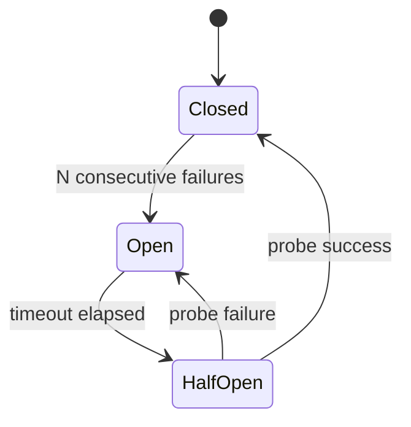

# Circuit Breaker

`CircuitBreaker` is a class from `@omnitron-dev/titan/utils`. There is
no `@CircuitBreaker` decorator — instantiate the class and use
`.execute()` around the work you want to protect.

## States

```typescript
enum CircuitState {
  Closed   = 'closed',
  Open     = 'open',
  HalfOpen = 'half-open',
}
```

| State        | Behaviour                                                       |
| ------------ | --------------------------------------------------------------- |
| **Closed**   | Calls pass through. Failures count toward the threshold.        |
| **Open**     | Calls fail immediately. No backend hit.                         |
| **HalfOpen** | One probe call goes through. Success → Closed. Failure → Open.  |

Transitions:



## Basic usage

```typescript
import { CircuitBreaker, CircuitState } from '@omnitron-dev/titan/utils';

const breaker = new CircuitBreaker({
  failureThreshold: 5,             // 5 failures opens the circuit
  resetTimeout:     60_000,        // ms in Open before allowing a probe
  // …additional knobs in CircuitBreakerConfig
});

// Use it to wrap calls.
try {
  const result = await breaker.execute(() => callStripe(req));
} catch (e) {
  // If the circuit is open, .execute throws immediately.
}
```

The full `CircuitBreakerConfig` shape lives in
`utils/resilience.ts`. Common knobs (consult the source for the
canonical list):

- `failureThreshold` — failures before opening (default `5`).
- `resetTimeout` — ms in `Open` before transitioning to `HalfOpen`
  (default `30000`).
- `successThreshold` — successful probes in `HalfOpen` before
  returning to `Closed` (default `1`).
- `volumeThreshold` — minimum number of calls before the failure
  threshold takes effect (default `10`; avoids tripping on a single
  bad sample).
- `failureRateThreshold` — open when the failure *rate* (0–100)
  over the sliding window exceeds this, instead of an absolute count.
- `requestTimeout` — optional per-call timeout (ms) applied inside
  `execute()`.

## Per-instance state

Each `CircuitBreaker` instance has its own state. Use one instance
per dependency you want to protect:

```typescript
@Service({ name: 'Payments' })
class PaymentsService {
  private readonly stripeBreaker  = new CircuitBreaker({ failureThreshold: 5, resetTimeout: 60_000 });
  private readonly paypalBreaker  = new CircuitBreaker({ failureThreshold: 3, resetTimeout: 30_000 });

  @Public()
  async chargeStripe(req: ChargeRequest) {
    return this.stripeBreaker.execute(() => this.stripe.charge(req));
  }

  @Public()
  async chargePaypal(req: ChargeRequest) {
    return this.paypalBreaker.execute(() => this.paypal.charge(req));
  }
}
```

A failure in `chargeStripe` opens *only* the Stripe circuit;
PayPal stays available.

## Observability

`CircuitBreaker` extends `EventEmitter`. The emitted events are
`stateChange`, `success`, `failure`, `rejected`, and `reset` — there
are no separate `open` / `close` / `halfOpen` events. Watch
`stateChange` and branch on the new state:

```typescript
breaker.on('stateChange', ({ previousState, newState }) => {
  if (newState === CircuitState.Open)     metrics.counter('breaker.open').inc();
  if (newState === CircuitState.Closed)   metrics.counter('breaker.close').inc();
  if (newState === CircuitState.HalfOpen) log.info('probing recovery');
});

breaker.on('rejected', () => metrics.counter('breaker.rejected').inc());
```

## Reading state

```typescript
breaker.getState()             // CircuitState (state is private — use the getter)
breaker.getMetrics()           // CircuitBreakerMetrics — total calls, failures, etc.
```

For imperative gating without `execute()`, the breaker also exposes
`isOpen()`, `recordSuccess()`, and `recordFailure()`.

## Composing with retry

```typescript
import { CircuitBreaker, retry, isOperationalError } from '@omnitron-dev/titan/utils';

const breaker = new CircuitBreaker({ failureThreshold: 5, resetTimeout: 60_000 });

await breaker.execute(() =>
  retry(() => callBackend(), { maxRetries: 3, shouldRetry: isOperationalError }),
);
```

Breaker outside, retry inside. When the circuit is open, retries
don't run — the breaker rejects before `retry()` is called.

## Anti-patterns

- **Threshold too low.** A breaker that opens on the first failure
  flaps constantly. Pair `failureThreshold` with `volumeThreshold`
  (or per-window counts).
- **`timeout` too short.** The dependency hasn't recovered; the
  probe fails; the circuit re-opens. Real recovery takes seconds
  to minutes.
- **Same breaker for unrelated dependencies.** A failure in one
  service opens the circuit for another. Use one breaker per
  dependency.
- **No fallback.** Every breaker should have a "what do we do when
  the circuit is open" plan. Cached value? Default? Error to the
  user? Decide explicitly.

→ Next: [Timeout](./timeout.md).
