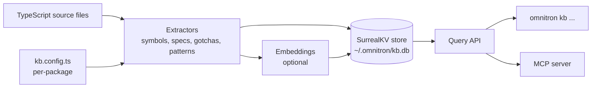
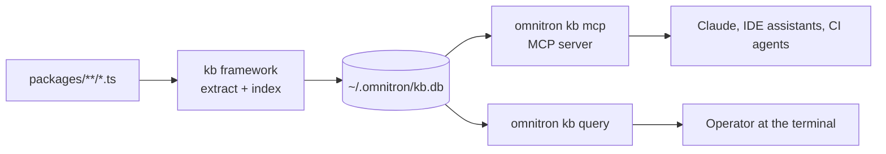

# @omnitron-dev/kb

```bash
pnpm add @omnitron-dev/kb
```

A knowledge-base framework for extracting, indexing, and
querying structured intelligence from TypeScript codebases.
Powers Omnitron's MCP server (`omnitron kb mcp`) so agents can
reason about the codebase using the same primitives the rest of
the stack uses.

Verified against `packages/kb/src/`.

## What it does

- **Extracts** structured knowledge (symbols, modules, patterns,
  gotchas, docs) from TypeScript packages.
- **Indexes** the extracts into a hybrid full-text + semantic
  store.
- **Queries** with natural-language questions and precise
  symbol/pattern lookups.

End-to-end: from `.ts` files on disk to "find the canonical way
to do X" answers in milliseconds.

## Architecture



## Entry types

| Type | What | Example |
| ---- | ---- | ------- |
| **Symbol** | Class, interface, type, function, enum | `TitanError`, `IUserService`, `cuid()` |
| **Module** | Package or feature module | `titan-auth`, `omnitron/orchestrator` |
| **Pattern** | Canonical development recipe | "service-rpc-module", "preset-infrastructure" |
| **Gotcha** | Known pitfall + critical warning | "Don't await inside @PostConstruct" |
| **Spec** | Specification document | "Payments engine spec v0.2" |
| **Doc** | Long-form markdown | README, CONTRIBUTING, design docs |

Each entry has: id, type, name, summary, body, related (cross-
references), source-location (file + line).

## Per-package configuration — `kb.config.ts`

Each package contributes its own extraction rules:

```typescript
// packages/titan/kb.config.ts
import { defineKbConfig } from '@omnitron-dev/kb';

export default defineKbConfig({
  scope: 'titan',
  extract: {
    symbols: { include: ['src/**/*.ts'], exclude: ['**/*.test.ts'] },
    modules: { paths: ['src/modules/*'] },
    gotchas: { file: 'kb/gotchas.md' },
    patterns: { file: 'kb/patterns.md' },
  },
  dependencies: ['common', 'eventemitter', 'msgpack'],
});
```

The `kb extract` command runs every package's config and merges
the results into the central store.

## CLI

```bash
# Build / rebuild the index:
omnitron kb index --full        # ignore cached manifests; reindex everything
omnitron kb index --watch       # incremental + watch for file changes

# Inspect the index:
omnitron kb status

# Test a query (hybrid full-text + semantic):
omnitron kb query "how do I expose a service over Netron with auth"

# Start the MCP server:
omnitron kb mcp                 # stdio MCP for AI agents
```

→ [Omnitron MCP page](../omnitron/mcp.md) covers the agent
integration in full.

## Programmatic API

```typescript
import { KnowledgeBase, SurrealKbStore } from '@omnitron-dev/kb';

const store = new SurrealKbStore({ url: 'surrealkv://./.omnitron/kb.db' });
const kb    = new KnowledgeBase({ store, root: process.cwd() });
await kb.initialize();

// Build:
await kb.indexAll({ full: false });

// Query:
const results = await kb.query({
  question:   'how do I make a service stream events to the browser',
  maxResults: 10,
  scope:      'titan',
});

// Direct lookups:
const api      = await kb.getApi('TitanAuthModule');
const moduleEntry = await kb.getModule('titan-auth');
const gotchas  = await kb.getGotchas({ module: 'titan-events' });
const pattern  = await kb.getPattern('service-rpc-module');
const repoMap  = await kb.getRepoMap({ scope: 'titan', detail: 'signatures' });
```

The return shapes mirror the MCP tool responses one-to-one — see
[Omnitron MCP](../omnitron/mcp.md#kb-tools).

## Store backends

| Backend | When | Notes |
| ------- | ---- | ----- |
| **SurrealKV** (default) | Local single-user | File-based; survives restarts |
| **SurrealDB** (remote) | Shared team index | Requires a running SurrealDB instance |
| **In-memory** | CI / tests | Volatile |

The store interface is pluggable:

```typescript
interface KbStore {
  upsert(entry: KbEntry): Promise<void>;
  get(id: string):       Promise<KbEntry | null>;
  query(filter: KbFilter): Promise<KbEntry[]>;
  search(text: string, opts?: SearchOpts): Promise<KbEntry[]>;
  delete(id: string):    Promise<void>;
  clear():               Promise<void>;
}
```

Implement to point kb at any backing store you prefer.

## Hybrid search

Two indexes per entry:

| Index | Driver | Use case |
| ----- | ------ | -------- |
| **BM25 full-text** | SurrealKV native | Exact / partial name matches; keyword queries |
| **Semantic embeddings** | Optional (depends on configured model) | Open-ended questions, paraphrases |

The default query runs both and ranks-combined. Pure-keyword
queries work without embeddings; semantic-aware queries need an
embedding model wired up.

### Embedding model setup

```typescript
import { KnowledgeBase, OnnxEmbeddings } from '@omnitron-dev/kb';

const embeddings = new OnnxEmbeddings({
  model:    'all-MiniLM-L6-v2',
  cacheDir: './.omnitron/models',
});

const kb = new KnowledgeBase({ store, root, embeddings });
```

Without embeddings, semantic search is a no-op — full-text
still works.

## Discovery

```typescript
import { KbDiscovery } from '@omnitron-dev/kb';

const discovery = new KbDiscovery({
  root:       process.cwd(),
  configFile: 'kb.config.ts',
});

const packages = await discovery.findConfigs();
// → [{ path: 'packages/titan/kb.config.ts', scope: 'titan', ... }, ...]
```

The CLI uses this to find every `kb.config.ts` in the monorepo
without you listing them manually.

## When you'd use this directly

- **Building a custom MCP server** with project-specific tools
  on top of the standard kb base.
- **Generating documentation** programmatically from KB entries.
- **Internal search UI** — pipe kb queries into a search box.
- **Architectural reports** — query "what depends on titan-auth"
  to generate dependency graphs.

For most users, the `omnitron kb mcp` CLI is enough.

## Performance

| Op | Time |
| -- | ---- |
| Index 1 000 source files (full) | ~10–30 s |
| Incremental reindex of 1 changed file | ~50–200 ms |
| Full-text query | sub-10 ms |
| Semantic query (with embeddings) | ~50–200 ms cold; sub-50 ms warm |
| MCP server boot (cold) | ~1–3 s |
| MCP tool call (warm) | ~10–50 ms |

Embedding model is the dominant cost; the rest is near-free.

## Where it sits in the stack



The store is the same artefact serving both human and agent
queries — no separate "agent API".

## See also

- [Omnitron / MCP](../omnitron/mcp.md) — agent integration
  built on top of this package
- [Omnitron / CLI knowledge base](../omnitron/cli.md#knowledge-base-mcp) —
  `omnitron kb ...` commands
- [common](./common.md) — utility primitives kb uses internally
