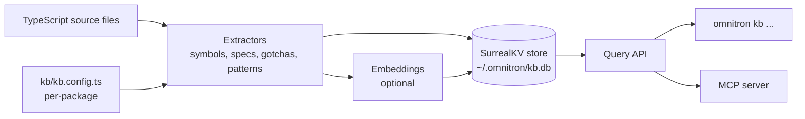
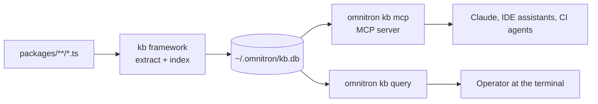

# @omnitron-dev/kb

```bash
pnpm add @omnitron-dev/kb
```

A knowledge-base framework for extracting, indexing, and
querying structured intelligence from TypeScript codebases.
Powers Omnitron's MCP server (`omnitron kb mcp`) so agents can
reason about the codebase using the same primitives the rest of
the stack uses.

Verified against `packages/kb/src/`.

## What it does

- **Extracts** structured knowledge (symbols, modules, patterns,
  gotchas, docs) from TypeScript packages.
- **Indexes** the extracts into a hybrid full-text + semantic
  store.
- **Queries** with natural-language questions and precise
  symbol/pattern lookups.

End-to-end: from `.ts` files on disk to "find the canonical way
to do X" answers in milliseconds.

## Architecture


```mermaid
flowchart LR
  TS[TypeScript source files]
  Manifest[kb/kb.config.ts<br/>per-package]
  Extr[Extractors<br/>symbols, specs, gotchas, patterns]
  Embed[Embeddings<br/>optional]
  Store[(SurrealKV store<br/>~/.omnitron/kb.db)]
  Q[Query API]
  CLI[omnitron kb ...]
  MCP[MCP server]

  TS --> Extr
  Manifest --> Extr
  Extr --> Embed
  Extr --> Store
  Embed --> Store
  Store --> Q
  Q --> CLI
  Q --> MCP
```

## Entry types

| Type | What | Example |
| ---- | ---- | ------- |
| **Symbol** | Class, interface, type, function, enum | `TitanError`, `IUserService`, `cuid()` |
| **Module** | Package or feature module | `titan-auth`, `omnitron/orchestrator` |
| **Pattern** | Canonical development recipe | "service-rpc-module", "preset-infrastructure" |
| **Gotcha** | Known pitfall + critical warning | "Don't await inside @PostConstruct" |
| **Spec** | Specification document | "Payments engine spec v0.2" |
| **Doc** | Long-form markdown | README, CONTRIBUTING, design docs |

Each entry has: id, type, name, summary, body, related (cross-
references), source-location (file + line).

## Per-package configuration — `kb/kb.config.ts`

Each package contributes its own extraction rules from a
`kb/kb.config.ts` file:

```typescript
// packages/titan/kb/kb.config.ts
import { defineKnowledge } from '@omnitron-dev/kb';

export default defineKnowledge({
  module: 'titan',
  name: 'Titan Framework',
  tags: ['di', 'modules', 'lifecycle'],
  extract: {
    symbols: true,                                   // or an array of entry points
    decorators: ['Injectable', 'Module', 'Inject'],
    entryPoints: ['src/index.ts'],
  },
  specs: './specs',
  relationships: {
    extends: ['titan/nexus'],
    integrates: ['titan/netron'],
  },
});
```

`defineKnowledge` fills in sensible defaults (`symbols: true`, a
standard decorator set, `entryPoints: ['src/index.ts']`,
`specs: './specs'`). Discovery walks the workspace for every
`kb/kb.config.ts` and the indexer merges the results into the
central store.

## CLI

```bash
# Build / rebuild the index:
omnitron kb index --full        # ignore cached manifests; reindex everything
omnitron kb index --watch       # incremental + watch for file changes

# Inspect the index:
omnitron kb status

# Test a query (hybrid full-text + semantic):
omnitron kb query "how do I expose a service over Netron with auth"

# Start the MCP server:
omnitron kb mcp                 # stdio MCP for AI agents
```

→ [Omnitron MCP page](../omnitron/mcp.md) covers the agent
integration in full.

## Programmatic API

```typescript
import { KnowledgeBase } from '@omnitron-dev/kb';
import { SurrealKbStore } from '@omnitron-dev/kb/surreal';   // store lives on a subpath

const store = new SurrealKbStore({ url: 'surrealkv://./.omnitron/kb.db' });
const kb    = new KnowledgeBase({ store, root: process.cwd() });
await kb.initialize();

// Build:
await kb.reindex({ full: false });   // { indexed, skipped }

// Query (question is a positional string; options are optional):
const results = await kb.query(
  'how do I make a service stream events to the browser',
  { maxResults: 10, scope: 'titan' },
);

// Direct lookups:
const api        = await kb.getApi('TitanAuthModule');     // ISymbolDoc | null
const moduleInfo = await kb.getModule('packages/titan-auth');
const gotchas    = await kb.getGotchas('titan-events');    // module is a positional arg
const pattern    = await kb.getPattern('service-rpc-module');
const patterns   = await kb.listPatterns();
const repoMap    = await kb.getRepoMap({ scope: 'titan', detail: 'signatures' });
const stats      = await kb.status();
await kb.close();
```

The return shapes mirror the MCP tool responses — see
[Omnitron MCP](../omnitron/mcp.md#kb-tools).

## Store backends

| Backend | When | Notes |
| ------- | ---- | ----- |
| **SurrealKV** (default) | Local single-user | File-based; survives restarts |
| **SurrealDB** (remote) | Shared team index | Requires a running SurrealDB instance |
| **In-memory** | CI / tests | Volatile |

The store interface (`IKbStore`) is pluggable — type-specific
upsert methods plus a hybrid `query`:

```typescript
interface IKbStore {
  initialize(): Promise<void>;
  upsertModule(m: IModuleInfo): Promise<void>;
  upsertSymbols(s: ISymbolDoc[]): Promise<void>;
  upsertSpecs(s: ISpecDoc[]): Promise<void>;
  upsertChunks(c: ICodeChunk[]): Promise<void>;
  upsertGotchas(g: IGotchaDoc[]): Promise<void>;
  upsertPatterns(p: IPatternDoc[]): Promise<void>;
  upsertDependencies(d: IDependency[]): Promise<void>;
  query(question: string, embedding: number[] | null, options: IQueryOptions): Promise<IQueryResult>;
  getSymbol(name: string): Promise<ISymbolDoc | null>;
  getModule(path: string): Promise<IModuleInfo | null>;
  getGotchas(modulePath?: string): Promise<IGotchaDoc[]>;
  getPattern(name: string): Promise<IPatternDoc | null>;
  searchSymbols(query: string, kind?: SymbolKind | SymbolKind[]): Promise<ISymbolDoc[]>;
  getStats(): Promise<IKbStats>;
  close(): Promise<void>;
  // …plus getModuleSpecs / getDependencies / getDependents / manifest helpers
}
```

`SurrealKbStore` (from `@omnitron-dev/kb/surreal`) is the only
shipped implementation; implement `IKbStore` to point kb at any
backing store you prefer.

## Hybrid search

Two indexes per entry:

| Index | Driver | Use case |
| ----- | ------ | -------- |
| **BM25 full-text** | SurrealKV native | Exact / partial name matches; keyword queries |
| **Semantic embeddings** | Optional (depends on configured model) | Open-ended questions, paraphrases |

The default query runs both and ranks-combined. Pure-keyword
queries work without embeddings; semantic-aware queries need an
embedding model wired up.

### Embedding model setup

`KnowledgeBase` defaults to `NullEmbeddingProvider` (no semantic
vectors). To enable semantic search, pass a real provider — the
embedding providers live on the `@omnitron-dev/kb/embeddings`
subpath:

```typescript
import { KnowledgeBase } from '@omnitron-dev/kb';
import { OllamaEmbeddingProvider } from '@omnitron-dev/kb/embeddings';

const embeddings = new OllamaEmbeddingProvider({
  model: 'nomic-embed-text',          // local, free; 768-dim by default
  url:   'http://localhost:11434',
});

const kb = new KnowledgeBase({ store, root, embeddings });
```

Shipped providers: `NullEmbeddingProvider` (default, also exported
from the package root), `OllamaEmbeddingProvider`,
`OpenAIEmbeddingProvider`, and `VoyageEmbeddingProvider`. Without a
real provider, semantic search is a no-op — full-text still works.

## Discovery

```typescript
import { KnowledgeDiscovery } from '@omnitron-dev/kb';

const discovery = new KnowledgeDiscovery('/path/to/builtin/specs');
const sources   = await discovery.discover(process.cwd());
// → IKbSource[] — every package with a kb/kb.config.ts, plus built-in specs
```

`KnowledgeBase` runs this internally during `reindex()`. The
constructor takes the path to the built-in cross-cutting specs; the
`discover(workspaceRoot)` method finds every `kb/kb.config.ts` in
the workspace without you listing them manually.

## When you'd use this directly

- **Building a custom MCP server** with project-specific tools
  on top of the standard kb base.
- **Generating documentation** programmatically from KB entries.
- **Internal search UI** — pipe kb queries into a search box.
- **Architectural reports** — query "what depends on titan-auth"
  to generate dependency graphs.

For most users, the `omnitron kb mcp` CLI is enough.

## Performance

| Op | Time |
| -- | ---- |
| Index 1 000 source files (full) | ~10–30 s |
| Incremental reindex of 1 changed file | ~50–200 ms |
| Full-text query | sub-10 ms |
| Semantic query (with embeddings) | ~50–200 ms cold; sub-50 ms warm |
| MCP server boot (cold) | ~1–3 s |
| MCP tool call (warm) | ~10–50 ms |

Embedding model is the dominant cost; the rest is near-free.

## Where it sits in the stack


```mermaid
flowchart LR
  Source[packages/**/*.ts]
  Source --> Kb[kb framework<br/>extract + index]
  Kb --> Store[(~/.omnitron/kb.db)]
  Store --> Mcp[omnitron kb mcp<br/>MCP server]
  Store --> CLI[omnitron kb query]
  Mcp --> Agents[Claude, IDE assistants, CI agents]
  CLI --> Operator[Operator at the terminal]
```

The store is the same artefact serving both human and agent
queries — no separate "agent API".

## See also

- [Omnitron / MCP](../omnitron/mcp.md) — agent integration
  built on top of this package
- [Omnitron / CLI knowledge base](../omnitron/cli.md#knowledge-base-mcp) —
  `omnitron kb ...` commands
- [common](./common.md) — utility primitives kb uses internally
